# Exploratory Data Analysis and Machine Learning with Jupyter Notebook
## Getting Started

Before we dive into the analysis, let's set up our environment by importing some essential libraries. These libraries will help us manipulate data, visualize patterns, and build machine learning models efficiently.

## 1 - Reading, Cleaning, Organizing, and Exploring Data


```python
# Importing Some Libraries and Packages Important for Tasks
### we only import 3 machine learning models that in my experience and the community work very well ###
import pandas as pd
import numpy as np
import matplotlib.pyplot as plt
import seaborn as sns
from sklearn.model_selection import train_test_split
from sklearn.preprocessing import StandardScaler, MinMaxScaler
from sklearn.decomposition import PCA
from sklearn.linear_model import LinearRegression
from sklearn.ensemble import RandomForestRegressor, GradientBoostingRegressor ### we don't use from xgboost package to facilitate
from keras.models import Sequential
from keras.layers import Dense, Dropout
from keras import regularizers
from keras.optimizers import Adam
from sklearn.metrics import r2_score, mean_absolute_error, mean_squared_error
import joblib

data = pd.read_csv("FC_Mixer_MO.csv")
```


```python
### verifing na data ###
data.isna().sum()
```


    site              0
    division          0
    category          0
    line              0
    model_name        0
    recipe_group      0
    uniqueid          0
    product_code      0
    model_complete    0
    char_name         0
    char_time         0
    char_value        0
    dtype: int64


```python
data.isnull().sum()
```


    site              0
    division          0
    category          0
    line              0
    model_name        0
    recipe_group      0
    uniqueid          0
    product_code      0
    model_complete    0
    char_name         0
    char_time         0
    char_value        0
    dtype: int64


```python
### We need know that columns that is relevant to analysis and machine learning. 
### Columns with unique values it is not important to machine learning, unless you want to change some column to put any new information
### I think this is not a case now, so we're gonna filter this column
unique = data.nunique()
unique
```


    site                 1
    division             1
    category             1
    line                 1
    model_name           1
    recipe_group         1
    uniqueid           164
    product_code         1
    model_complete       2
    char_name           10
    char_time          619
    char_value        1154
    dtype: int64


```python
variables_major_than_one = unique[unique > 1].index.tolist()
variables_equal_than_one = unique[unique == 1].index.tolist()
```


```python
### before we only use variables with unique values more than one, we need look carefully observations in each columns
### observing a metadata. Maybe we took some informative columns in future to send to data analyst or for analysis.
data.loc[0:1, variables_equal_than_one]
```


<div>
<style scoped>
    .dataframe tbody tr th:only-of-type {
        vertical-align: middle;
    }

    .dataframe tbody tr th {
        vertical-align: top;
    }

    .dataframe thead th {
        text-align: right;
    }
</style>
<table border="1" class="dataframe">
  <thead>
    <tr style="text-align: right;">
      <th></th>
      <th>site</th>
      <th>division</th>
      <th>category</th>
      <th>line</th>
      <th>model_name</th>
      <th>recipe_group</th>
      <th>product_code</th>
    </tr>
  </thead>
  <tbody>
    <tr>
      <th>0</th>
      <td>Amera</td>
      <td>HomeEssentials</td>
      <td>FabricConditioner</td>
      <td>MX-FB-03</td>
      <td>MX-FB-Visc_pred_v0.14</td>
      <td>UNDEFINED</td>
      <td>None</td>
    </tr>
    <tr>
      <th>1</th>
      <td>Amera</td>
      <td>HomeEssentials</td>
      <td>FabricConditioner</td>
      <td>MX-FB-03</td>
      <td>MX-FB-Visc_pred_v0.14</td>
      <td>UNDEFINED</td>
      <td>None</td>
    </tr>
  </tbody>
</table>
</div>


```python
sub_data = data.loc[:, variables_major_than_one]
sub_data.head()
```


<div>
<style scoped>
    .dataframe tbody tr th:only-of-type {
        vertical-align: middle;
    }

    .dataframe tbody tr th {
        vertical-align: top;
    }

    .dataframe thead th {
        text-align: right;
    }
</style>
<table border="1" class="dataframe">
  <thead>
    <tr style="text-align: right;">
      <th></th>
      <th>uniqueid</th>
      <th>model_complete</th>
      <th>char_name</th>
      <th>char_time</th>
      <th>char_value</th>
    </tr>
  </thead>
  <tbody>
    <tr>
      <th>0</th>
      <td>44168</td>
      <td>COMPLETE</td>
      <td>non_value_operating_time</td>
      <td>2023-02-11 10:19:25</td>
      <td>3560.0</td>
    </tr>
    <tr>
      <th>1</th>
      <td>44168</td>
      <td>COMPLETE</td>
      <td>non_value_operating_time</td>
      <td>2023-02-11 20:49:30</td>
      <td>300.0</td>
    </tr>
    <tr>
      <th>2</th>
      <td>44168</td>
      <td>COMPLETE</td>
      <td>non_value_operating_time</td>
      <td>2023-02-12 04:28:05</td>
      <td>190.0</td>
    </tr>
    <tr>
      <th>3</th>
      <td>44168</td>
      <td>COMPLETE</td>
      <td>non_value_operating_time</td>
      <td>2023-02-12 07:41:10</td>
      <td>140.0</td>
    </tr>
    <tr>
      <th>4</th>
      <td>44168</td>
      <td>COMPLETE</td>
      <td>non_value_operating_time</td>
      <td>2023-02-12 15:19:00</td>
      <td>640.0</td>
    </tr>
  </tbody>
</table>
</div>


```python
sub_data.describe()
```


<div>
<style scoped>
    .dataframe tbody tr th:only-of-type {
        vertical-align: middle;
    }

    .dataframe tbody tr th {
        vertical-align: top;
    }

    .dataframe thead th {
        text-align: right;
    }
</style>
<table border="1" class="dataframe">
  <thead>
    <tr style="text-align: right;">
      <th></th>
      <th>uniqueid</th>
      <th>char_value</th>
    </tr>
  </thead>
  <tbody>
    <tr>
      <th>count</th>
      <td>3646.000000</td>
      <td>3646.000000</td>
    </tr>
    <tr>
      <th>mean</th>
      <td>45142.328579</td>
      <td>12033.188652</td>
    </tr>
    <tr>
      <th>std</th>
      <td>1026.736180</td>
      <td>20594.765449</td>
    </tr>
    <tr>
      <th>min</th>
      <td>44168.000000</td>
      <td>-17615.346000</td>
    </tr>
    <tr>
      <th>25%</th>
      <td>44247.000000</td>
      <td>3.234286</td>
    </tr>
    <tr>
      <th>50%</th>
      <td>44724.000000</td>
      <td>920.000000</td>
    </tr>
    <tr>
      <th>75%</th>
      <td>45913.250000</td>
      <td>13347.500000</td>
    </tr>
    <tr>
      <th>max</th>
      <td>47268.000000</td>
      <td>229025.000000</td>
    </tr>
  </tbody>
</table>
</div>


```python
### looking observations in columns that have more an unique value
list_items_per_column = []
for i in range(sub_data.shape[1]):
    list_items_per_column.append(sub_data.iloc[:, i].unique())
list_items_per_column
```


    [array([44168, 44169, 44176, 44199, 44221, 44226, 44245, 44247, 44258,
            44259, 44268, 44289, 44293, 44307, 44333, 44339, 44348, 44453,
            44455, 44491, 44498, 44502, 44513, 44671, 44677, 44702, 44718,
            44724, 44752, 44783, 44794, 44798, 44800, 44826, 44900, 44910,
            44919, 44930, 44938, 44944, 44972, 44994, 45007, 45052, 45064,
            45105, 45144, 45176, 45185, 45195, 45212, 45222, 45248, 45267,
            45275, 45283, 45302, 45318, 45328, 45367, 45379, 45405, 45415,
            45428, 45481, 45495, 45529, 45540, 45541, 45598, 45609, 45614,
            45640, 45652, 45667, 45682, 45683, 45719, 45743, 45745, 45753,
            45788, 45805, 45812, 45815, 45827, 45838, 45852, 45855, 45863,
            45867, 45877, 45880, 45892, 45911, 45914, 45920, 45921, 45935,
            45951, 45958, 45971, 46034, 46049, 46053, 46057, 46118, 46138,
            46182, 46198, 46243, 46248, 46264, 46299, 46347, 46350, 46359,
            46368, 46420, 46434, 46490, 46568, 46619, 46668, 46680, 46685,
            46690, 46702, 46720, 46731, 46742, 46766, 46791, 46801, 46816,
            46822, 46828, 46842, 46871, 46895, 46898, 46956, 46977, 46986,
            47002, 47014, 47020, 47030, 47036, 47057, 47070, 47075, 47086,
            47137, 47147, 47151, 47156, 47169, 47184, 47196, 47204, 47238,
            47253, 47268], dtype=int64),
     array(['COMPLETE', 'INCOMPLETE'], dtype=object),
     array(['non_value_operating_time', 'phase_1.Inicio.duration',
            'phase_2.Medicion.duration', 'phase_3.Recirculacion.duration',
            'phase_3.Recirculacion.Peso_avg',
            'phase_3.Recirculacion.Densidad_max',
            'phase_3.Recirculacion.Presion_avg',
            'phase_3.Recirculacion.Presion_max',
            'phase_3.Recirculacion.Visco_max', 'total_duration'], dtype=object),
     array(['2023-02-11 10:19:25', '2023-02-11 20:49:30',
            '2023-02-12 04:28:05', '2023-02-12 07:41:10',
            '2023-02-12 15:19:00', '2023-02-12 19:51:25',
            '2023-02-12 23:15:40', '2023-02-13 03:05:20',
            '2023-02-13 06:09:20', '2023-02-13 13:30:15',
            '2023-02-13 22:33:35', '2023-02-14 03:33:55',
            '2023-02-11 08:16:15', '2023-02-11 11:18:45',
            '2023-02-11 20:54:30', '2023-02-12 04:31:15',
            '2023-02-12 07:43:30', '2023-02-12 15:29:40',
            '2023-02-12 19:53:20', '2023-02-12 23:17:30',
            '2023-02-13 03:07:10', '2023-02-13 06:11:10',
            '2023-02-13 20:24:40', '2023-02-11 08:16:25',
            '2023-02-11 11:24:20', '2023-02-11 20:56:25',
            '2023-02-12 04:31:55', '2023-02-12 07:45:25',
            '2023-02-12 15:30:00', '2023-02-12 19:55:20',
            '2023-02-12 23:19:30', '2023-02-13 03:09:10',
            '2023-02-13 06:13:05', '2023-02-13 20:31:30',
            '2023-02-13 22:34:45', '2023-02-14 03:34:05',
            '2023-02-11 10:19:15', '2023-02-11 13:03:05',
            '2023-02-11 23:45:50', '2023-02-12 06:45:25',
            '2023-02-12 09:21:50', '2023-02-12 18:21:05',
            '2023-02-12 21:44:40', '2023-02-13 01:54:20',
            '2023-02-13 04:45:05', '2023-02-13 08:49:10',
            '2023-02-14 01:52:15', '2023-02-14 05:03:15',
            '2023-02-14 06:07:30', '2023-02-14 10:47:25',
            '2023-02-14 06:10:45', '2023-02-14 13:52:10',
            '2023-02-14 06:12:20', '2023-02-14 14:42:25',
            '2023-02-14 08:48:50', '2023-02-14 19:45:40',
            '2023-02-14 21:06:10', '2023-02-14 21:09:45',
            '2023-02-14 21:09:55', '2023-02-15 19:09:30',
            '2023-02-15 22:35:35', '2023-02-15 22:38:40',
            '2023-02-15 22:39:25', '2023-02-16 18:08:45',
            '2023-02-16 18:09:20', '2023-02-17 07:08:35',
            '2023-02-16 18:41:30', '2023-02-17 07:10:25',
            '2023-02-16 18:41:40', '2023-02-17 07:12:25',
            '2023-02-17 03:43:25', '2023-02-17 11:05:55',
            '2023-02-17 11:06:05', '2023-02-17 11:12:10',
            '2023-02-17 11:12:30', '2023-02-17 14:16:00',
            '2023-02-17 14:16:10', '2023-02-17 19:18:10',
            '2023-02-17 14:43:25', '2023-02-17 19:28:45',
            '2023-02-17 14:44:35', '2023-02-17 19:35:05',
            '2023-02-17 19:16:45', '2023-02-18 02:29:15',
            '2023-02-18 02:56:15', '2023-02-18 02:59:40',
            '2023-02-18 03:00:10', '2023-02-19 01:56:10',
            '2023-02-20 18:36:45', '2023-02-21 00:09:15',
            '2023-02-20 19:55:00', '2023-02-20 19:55:45',
            '2023-02-21 00:11:10', '2023-02-21 03:37:35',
            '2023-02-21 05:03:50', '2023-02-21 05:07:20',
            '2023-02-21 05:07:40', '2023-02-21 08:36:45',
            '2023-02-21 09:18:00', '2023-02-21 18:44:00',
            '2023-02-21 12:40:30', '2023-02-21 18:45:55',
            '2023-02-21 12:41:55', '2023-02-21 18:47:55',
            '2023-02-21 15:45:25', '2023-02-21 20:25:45',
            '2023-02-22 01:50:25', '2023-02-22 03:32:45',
            '2023-02-22 04:39:20', '2023-02-22 18:04:20',
            '2023-02-22 21:24:40', '2023-02-22 22:03:10',
            '2023-02-22 22:37:35', '2023-02-23 05:56:20',
            '2023-02-22 23:38:35', '2023-02-23 05:58:05',
            '2023-02-22 23:39:25', '2023-02-23 06:00:00',
            '2023-02-23 02:29:05', '2023-02-23 08:48:55',
            '2023-02-23 08:49:05', '2023-02-24 07:46:25',
            '2023-02-23 11:19:15', '2023-02-24 08:01:55',
            '2023-02-23 11:20:35', '2023-02-24 08:03:50',
            '2023-02-23 13:19:30', '2023-02-24 10:56:05',
            '2023-02-24 10:56:15', '2023-02-24 16:10:20',
            '2023-02-24 12:44:30', '2023-02-24 16:12:15',
            '2023-02-24 12:45:05', '2023-02-24 16:14:15',
            '2023-02-24 14:44:25', '2023-02-24 17:57:15',
            '2023-02-24 18:46:35', '2023-02-24 18:49:35',
            '2023-02-24 18:50:25', '2023-02-24 21:07:35',
            '2023-02-24 21:56:30', '2023-02-24 22:00:05',
            '2023-02-24 22:02:00', '2023-02-25 05:25:30',
            '2023-02-25 05:26:30', '2023-02-25 05:28:55',
            '2023-02-25 05:30:15', '2023-02-25 11:31:00',
            '2023-02-25 12:20:00', '2023-02-25 18:08:00',
            '2023-02-25 13:14:30', '2023-02-25 20:46:00',
            '2023-02-25 13:15:25', '2023-02-25 20:48:00',
            '2023-02-25 17:17:15', '2023-02-27 07:57:55',
            '2023-02-27 07:58:05', '2023-02-27 15:10:15',
            '2023-02-27 08:48:45', '2023-02-27 08:50:40',
            '2023-02-28 00:24:40', '2023-02-28 00:27:25',
            '2023-02-28 00:29:00', '2023-02-28 12:54:40',
            '2023-02-28 12:55:45', '2023-02-28 12:58:30',
            '2023-02-28 19:55:40', '2023-02-28 20:04:40',
            '2023-02-28 20:06:00', '2023-02-28 23:02:20',
            '2023-03-01 02:15:30', '2023-03-01 04:14:20',
            '2023-03-01 04:36:25', '2023-03-01 12:22:00',
            '2023-03-01 07:54:00', '2023-03-01 12:23:50',
            '2023-03-01 07:55:25', '2023-03-01 12:26:15',
            '2023-03-01 09:23:10', '2023-03-01 14:46:50',
            '2023-03-01 16:29:55', '2023-03-01 16:33:15',
            '2023-03-01 16:34:15', '2023-03-02 00:21:50',
            '2023-03-02 03:51:15', '2023-03-02 07:58:40',
            '2023-03-02 05:44:30', '2023-03-02 08:18:05',
            '2023-03-02 05:47:00', '2023-03-02 08:20:30',
            '2023-03-02 07:44:45', '2023-03-02 12:05:45',
            '2023-03-02 12:49:35', '2023-03-02 12:51:35',
            '2023-03-02 12:54:05', '2023-03-02 14:14:35',
            '2023-03-02 15:48:50', '2023-03-02 15:50:50',
            '2023-03-02 15:58:15', '2023-03-02 19:34:35',
            '2023-03-02 20:41:15', '2023-03-03 06:30:40',
            '2023-03-03 01:32:50', '2023-03-03 06:51:50',
            '2023-03-03 01:35:15', '2023-03-03 06:52:00',
            '2023-03-03 04:49:55', '2023-03-03 08:32:25',
            '2023-03-03 09:12:00', '2023-03-03 14:02:25',
            '2023-03-03 09:39:45', '2023-03-03 14:04:10',
            '2023-03-03 09:41:10', '2023-03-03 14:06:40',
            '2023-03-03 11:00:10', '2023-03-04 13:52:45',
            '2023-03-04 13:52:50', '2023-03-04 13:53:00',
            '2023-03-04 13:54:20', '2023-03-04 18:45:30',
            '2023-03-04 18:52:10', '2023-03-04 18:53:10',
            '2023-03-04 21:35:10', '2023-03-04 22:58:00',
            '2023-03-04 23:01:20', '2023-03-04 23:02:10',
            '2023-03-05 01:04:50', '2023-03-05 02:11:15',
            '2023-03-05 02:15:25', '2023-03-05 02:15:35',
            '2023-03-05 04:58:00', '2023-03-05 16:06:40',
            '2023-03-05 16:18:40', '2023-03-05 23:46:15',
            '2023-03-05 23:49:30', '2023-03-05 23:50:20',
            '2023-03-06 02:43:30', '2023-03-06 06:50:05',
            '2023-03-06 14:53:55', '2023-03-06 11:49:00',
            '2023-03-06 14:55:40', '2023-03-06 11:50:55',
            '2023-03-06 15:10:25', '2023-03-06 12:59:50',
            '2023-03-06 15:11:15', '2023-03-06 15:28:20',
            '2023-03-06 23:04:30', '2023-03-07 02:02:25',
            '2023-03-07 02:04:45', '2023-03-07 03:46:40',
            '2023-03-07 06:05:15', '2023-03-06 16:21:20',
            '2023-03-06 16:44:20', '2023-03-06 17:48:25',
            '2023-03-06 17:48:35', '2023-03-06 22:58:40',
            '2023-03-07 12:15:45', '2023-03-07 12:17:15',
            '2023-03-07 15:07:05', '2023-03-07 16:34:40',
            '2023-03-08 05:43:25', '2023-03-07 18:32:05',
            '2023-03-08 05:45:05', '2023-03-07 18:35:30',
            '2023-03-08 05:47:40', '2023-03-07 20:59:55',
            '2023-03-08 07:16:55', '2023-03-08 08:10:05',
            '2023-03-08 12:58:40', '2023-03-08 08:37:20',
            '2023-03-08 13:00:25', '2023-03-08 08:38:30',
            '2023-03-08 13:02:50', '2023-03-08 10:03:55',
            '2023-03-08 14:35:15', '2023-03-08 17:51:05',
            '2023-03-08 17:53:20', '2023-03-08 17:55:20',
            '2023-03-08 19:52:30', '2023-03-08 21:10:10',
            '2023-03-09 07:22:30', '2023-03-08 21:18:15',
            '2023-03-09 07:23:00', '2023-03-08 21:20:05',
            '2023-03-09 07:23:10', '2023-03-09 04:59:50',
            '2023-03-09 09:21:15', '2023-03-09 05:51:50',
            '2023-03-09 10:45:00', '2023-03-09 20:37:25',
            '2023-03-10 12:58:35', '2023-03-10 08:25:05',
            '2023-03-10 13:00:20', '2023-03-10 08:26:45',
            '2023-03-10 13:03:00', '2023-03-10 12:09:15',
            '2023-03-10 14:29:40', '2023-03-10 15:27:20',
            '2023-03-09 06:47:30', '2023-03-09 16:10:55',
            '2023-03-09 15:23:00', '2023-03-09 16:44:40',
            '2023-03-09 15:23:10', '2023-03-09 16:44:50',
            '2023-03-09 16:09:55', '2023-03-09 17:05:20',
            '2023-03-09 17:05:45', '2023-03-09 20:13:25',
            '2023-03-10 15:30:10', '2023-03-10 15:31:45',
            '2023-03-10 17:04:55', '2023-03-10 18:32:25',
            '2023-03-10 18:34:15', '2023-03-10 19:02:05',
            '2023-03-10 21:56:00', '2023-03-10 22:56:45',
            '2023-03-10 22:59:20', '2023-03-10 23:01:05',
            '2023-03-11 01:56:45', '2023-03-11 02:57:00',
            '2023-03-11 03:00:00', '2023-03-11 03:01:25',
            '2023-03-11 05:41:10', '2023-03-11 06:36:20',
            '2023-03-11 06:38:35', '2023-03-11 06:44:00',
            '2023-03-11 08:47:20', '2023-03-11 10:34:25',
            '2023-03-11 10:36:50', '2023-03-11 10:38:50',
            '2023-03-11 12:40:30', '2023-03-11 14:14:20',
            '2023-03-11 14:16:55', '2023-03-11 14:18:50',
            '2023-03-11 15:43:15', '2023-03-11 16:31:25',
            '2023-03-11 16:34:30', '2023-03-11 16:35:45',
            '2023-03-11 18:20:30', '2023-03-11 20:50:30',
            '2023-03-11 21:33:45', '2023-03-11 21:44:00',
            '2023-03-11 21:45:55', '2023-03-11 23:45:00',
            '2023-03-12 01:58:50', '2023-03-11 20:58:15',
            '2023-03-12 08:52:00', '2023-03-12 03:08:45',
            '2023-03-12 08:53:50', '2023-03-12 03:10:30',
            '2023-03-12 08:56:25', '2023-03-12 04:48:25',
            '2023-03-12 10:55:30', '2023-03-12 11:54:25',
            '2023-03-12 12:00:20', '2023-03-12 12:13:15',
            '2023-03-12 14:26:05', '2023-03-12 15:11:00',
            '2023-03-12 15:13:30', '2023-03-12 15:15:35',
            '2023-03-12 16:48:10', '2023-03-12 18:08:15',
            '2023-03-12 18:10:15', '2023-03-12 18:12:45',
            '2023-03-12 20:07:45', '2023-03-12 21:00:30',
            '2023-03-12 21:03:30', '2023-03-12 21:04:50',
            '2023-03-13 00:48:55', '2023-03-13 02:24:45',
            '2023-03-13 02:27:45', '2023-03-13 02:29:00',
            '2023-03-13 03:45:55', '2023-03-13 05:28:35',
            '2023-03-13 05:31:15', '2023-03-13 05:32:55',
            '2023-03-13 07:00:00', '2023-03-13 07:58:40',
            '2023-03-13 08:01:20', '2023-03-13 08:03:05',
            '2023-03-13 09:52:15', '2023-03-14 03:28:40',
            '2023-03-14 03:51:05', '2023-03-14 03:52:55',
            '2023-03-14 05:53:55', '2023-03-14 07:40:30',
            '2023-03-14 08:11:05', '2023-03-14 08:12:15',
            '2023-03-14 08:12:40', '2023-03-14 09:23:05',
            '2023-03-14 14:51:45', '2023-03-15 13:18:15',
            '2023-03-14 15:43:55', '2023-03-15 13:20:00',
            '2023-03-14 15:45:50', '2023-03-15 13:22:40',
            '2023-03-14 16:51:05', '2023-03-15 23:35:45',
            '2023-03-15 23:37:50', '2023-03-14 14:21:00',
            '2023-03-15 23:41:05', '2023-03-15 23:42:10',
            '2023-03-16 13:10:35', '2023-03-16 13:13:25',
            '2023-03-16 20:45:30', '2023-03-16 14:07:20',
            '2023-03-16 20:45:45', '2023-03-16 14:09:15',
            '2023-03-16 20:50:55', '2023-03-16 20:45:20',
            '2023-03-16 23:43:15', '2023-03-17 16:07:15',
            '2023-03-18 02:20:00', '2023-03-18 06:36:40',
            '2023-03-18 03:28:55', '2023-03-18 06:42:05',
            '2023-03-18 03:30:35', '2023-03-18 06:44:25',
            '2023-03-18 04:38:40', '2023-03-18 16:13:50',
            '2023-03-18 16:33:05', '2023-03-17 21:28:30',
            '2023-03-17 21:31:35', '2023-03-17 22:34:55',
            '2023-03-17 22:35:05', '2023-03-18 01:49:10',
            '2023-03-19 02:32:45', '2023-03-18 17:41:35',
            '2023-03-19 06:15:30', '2023-03-18 17:43:10',
            '2023-03-18 23:39:35', '2023-03-19 06:40:05',
            '2023-03-19 08:33:55', '2023-03-19 08:34:30',
            '2023-03-19 12:42:40', '2023-03-19 12:44:55',
            '2023-03-20 06:14:55', '2023-03-19 13:24:30',
            '2023-03-20 06:16:45', '2023-03-19 13:24:40',
            '2023-03-20 06:19:25', '2023-03-20 00:23:05',
            '2023-03-20 09:07:50', '2023-03-20 09:10:05',
            '2023-03-20 18:45:30', '2023-03-20 09:30:00',
            '2023-03-20 18:47:55', '2023-03-20 09:31:45',
            '2023-03-20 18:50:00', '2023-03-20 18:44:30',
            '2023-03-21 11:43:25', '2023-03-21 11:45:40',
            '2023-03-21 11:45:50', '2023-03-21 22:22:30',
            '2023-03-21 22:22:45', '2023-03-21 22:32:25',
            '2023-03-21 22:34:10', '2023-03-22 05:47:45',
            '2023-03-22 06:07:35', '2023-03-22 14:02:35',
            '2023-03-22 14:04:05', '2023-03-23 02:43:45',
            '2023-03-23 02:43:55', '2023-03-23 09:08:40',
            '2023-03-23 04:03:50', '2023-03-23 09:43:50',
            '2023-03-23 04:06:00', '2023-03-23 09:46:30',
            '2023-03-23 06:48:40', '2023-03-23 12:22:25',
            '2023-03-23 16:28:05', '2023-03-25 19:30:25',
            '2023-03-25 19:34:25', '2023-03-25 20:00:55',
            '2023-03-27 03:15:30', '2023-03-27 03:37:20',
            '2023-03-23 16:31:05', '2023-03-23 16:32:35',
            '2023-03-23 19:13:30', '2023-03-23 19:13:40',
            '2023-03-23 19:17:25', '2023-03-23 19:18:35',
            '2023-03-23 21:42:10', '2023-03-23 22:20:20',
            '2023-03-24 01:50:15', '2023-03-23 22:50:40',
            '2023-03-24 01:53:55', '2023-03-23 22:56:10',
            '2023-03-24 01:56:35', '2023-03-24 01:47:45',
            '2023-03-24 04:55:30', '2023-03-24 05:42:10',
            '2023-03-24 05:46:20', '2023-03-24 05:48:00',
            '2023-03-24 07:26:05', '2023-03-24 08:52:15',
            '2023-03-24 14:37:00', '2023-03-24 09:33:30',
            '2023-03-24 14:51:35', '2023-03-24 09:35:45',
            '2023-03-24 14:54:15', '2023-03-24 14:19:00',
            '2023-03-24 16:03:40', '2023-03-24 17:10:10',
            '2023-03-24 22:11:50', '2023-03-24 19:01:10',
            '2023-03-24 22:15:20', '2023-03-24 19:13:55',
            '2023-03-24 22:17:10', '2023-03-24 21:05:45',
            '2023-03-25 00:12:45', '2023-03-25 01:45:45',
            '2023-03-25 01:48:15', '2023-03-25 01:50:20',
            '2023-03-25 03:10:40', '2023-03-25 03:57:00',
            '2023-03-25 04:01:10', '2023-03-25 04:03:05',
            '2023-03-25 07:48:20', '2023-03-25 08:43:35',
            '2023-03-25 08:49:35', '2023-03-25 08:50:55',
            '2023-03-25 11:23:50', '2023-03-25 15:04:45',
            '2023-03-25 15:07:20', '2023-03-25 15:09:30',
            '2023-03-25 18:31:20', '2023-03-27 06:04:35',
            '2023-03-27 06:06:20', '2023-03-27 08:24:55',
            '2023-03-27 08:29:00', '2023-03-27 16:36:00',
            '2023-03-27 11:01:45', '2023-03-27 11:04:05',
            '2023-03-27 16:36:10', '2023-03-27 20:02:50',
            '2023-03-27 20:04:55', '2023-03-27 20:07:20',
            '2023-03-27 20:09:30', '2023-03-27 22:29:05',
            '2023-03-27 22:30:25', '2023-03-27 22:33:05',
            '2023-03-27 22:34:55', '2023-03-28 02:15:15',
            '2023-03-28 02:15:25', '2023-03-28 02:22:55',
            '2023-03-28 02:24:30', '2023-03-28 04:35:20',
            '2023-03-28 04:36:20', '2023-03-28 04:38:55',
            '2023-03-28 04:40:45', '2023-03-28 06:50:20',
            '2023-03-28 06:51:25', '2023-03-28 06:54:15',
            '2023-03-28 06:56:00', '2023-03-28 08:54:40',
            '2023-03-28 08:55:55', '2023-03-28 09:13:00',
            '2023-03-28 09:15:10', '2023-03-28 14:24:50',
            '2023-03-28 14:26:40', '2023-03-28 14:29:20',
            '2023-03-28 14:31:20', '2023-03-28 16:57:45',
            '2023-03-28 16:58:05', '2023-03-28 17:00:55',
            '2023-03-28 17:02:40', '2023-03-28 20:13:55',
            '2023-03-28 20:36:35', '2023-03-28 20:39:10',
            '2023-03-28 20:41:05', '2023-03-28 22:53:55',
            '2023-03-28 22:54:50', '2023-03-28 23:09:45',
            '2023-03-28 23:11:35', '2023-03-29 02:52:35',
            '2023-03-29 04:17:05', '2023-03-29 04:19:50',
            '2023-03-29 07:32:45', '2023-03-29 16:19:10',
            '2023-03-29 16:40:25', '2023-03-29 22:13:05',
            '2023-03-29 18:50:05', '2023-03-29 22:14:55',
            '2023-03-29 18:52:40', '2023-03-29 22:17:25',
            '2023-03-29 22:11:00', '2023-03-30 01:54:30',
            '2023-03-30 01:55:50', '2023-03-30 07:04:10',
            '2023-03-30 03:43:50', '2023-03-30 07:12:20',
            '2023-03-30 03:45:35', '2023-03-30 07:14:00',
            '2023-03-30 07:02:55', '2023-03-30 10:48:20',
            '2023-03-30 10:50:10', '2023-03-30 14:29:55',
            '2023-03-30 12:16:20', '2023-03-30 12:18:20',
            '2023-03-30 14:32:25', '2023-03-30 22:31:35',
            '2023-03-30 22:31:55', '2023-03-30 22:34:25',
            '2023-03-30 22:36:25', '2023-03-31 01:48:40',
            '2023-03-31 02:43:30', '2023-03-31 06:29:15',
            '2023-03-31 03:22:20', '2023-03-31 07:01:40',
            '2023-03-31 03:23:40', '2023-03-31 07:04:20',
            '2023-03-31 06:26:20', '2023-03-31 10:39:35',
            '2023-03-31 11:34:00', '2023-03-31 11:36:35',
            '2023-03-31 11:38:30', '2023-03-31 14:27:10',
            '2023-03-31 14:32:20'], dtype=object),
     array([3.5600000e+03, 3.0000000e+02, 1.9000000e+02, ..., 5.8287598e+04,
            2.9770070e+00, 1.0545000e+04])]


```python
### exploring each column to understand better data ###
sns.histplot(sub_data.iloc[:, 0])
plt.xlabel('ID')
plt.ylabel('Frequency')
plt.show()
```


    
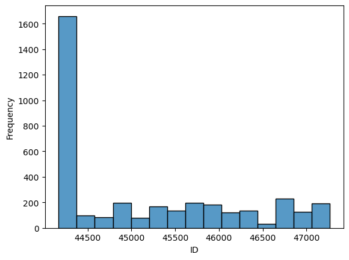
    


```python
### the first bin that gather some id have major part of data
sub_data.iloc[:, 0].dtype
```


    dtype('int64')


```python
### verifying strange frequency in ID ###
size = sub_data.groupby(["uniqueid"]).size()
np.sort(size)
```


    array([  3,   3,   3,   3,   3,   3,   3,   3,   3,   3,   3,   7,   7,
             8,   8,   8,  10,  10,  10,  10,  10,  10,  10,  10,  10,  10,
            10,  10,  10,  10,  10,  10,  10,  10,  10,  10,  10,  10,  10,
            10,  10,  10,  10,  10,  10,  10,  10,  10,  10,  10,  10,  10,
            10,  10,  10,  10,  10,  10,  10,  10,  10,  10,  10,  10,  10,
            10,  10,  10,  10,  10,  10,  10,  10,  10,  10,  10,  10,  10,
            10,  10,  10,  10,  13,  13,  14,  14,  14,  14,  14,  14,  14,
            14,  14,  14,  20,  20,  20,  20,  20,  20,  20,  20,  20,  20,
            20,  20,  20,  20,  20,  20,  20,  20,  20,  20,  20,  20,  20,
            20,  20,  20,  20,  20,  20,  20,  20,  20,  20,  20,  20,  20,
            20,  20,  20,  20,  20,  20,  20,  20,  20,  20,  20,  20,  20,
            20,  20,  20,  20,  20,  20,  20,  30, 123, 123, 123, 123, 123,
           123, 123, 123, 123, 123, 123, 123, 123], dtype=int64)


```python
sub_data.groupby(["model_complete"]).size()
```


    model_complete
    COMPLETE      3569
    INCOMPLETE      77
    dtype: int64


```python
second_column_exploration = sub_data.groupby(["model_complete"]).size()
second_column_exploration.plot.bar()
```


    <AxesSubplot:xlabel='model_complete'>


    
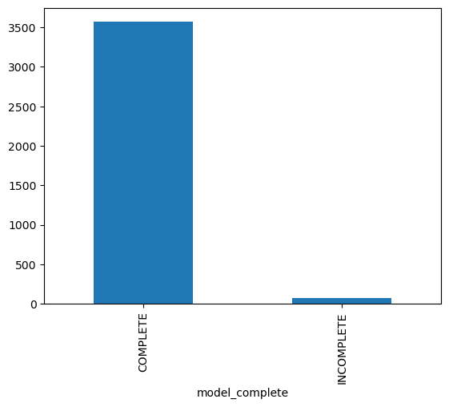
    


```python
sub_data.iloc[:, 1].dtype
```


    dtype('O')


```python
third_column = sub_data.groupby(["char_name"]).size()
third_column.plot.bar()
```


    <AxesSubplot:xlabel='char_name'>


    
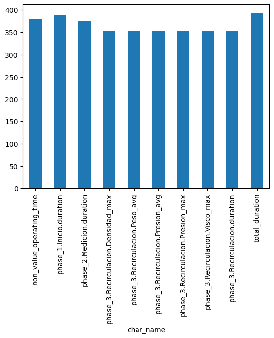
    


```python
sub_data.iloc[:, 2].dtype
```


    dtype('O')


```python
sns.histplot(sub_data.iloc[:, 4])
```


    <AxesSubplot:xlabel='char_value', ylabel='Count'>


    
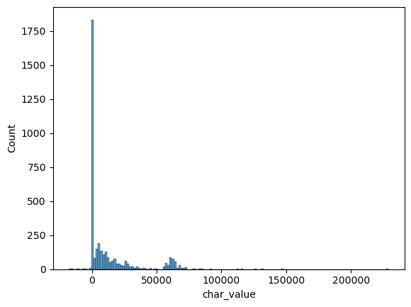
    


```python
### verifing outliers ###
sns.boxplot(sub_data.iloc[:, 4])
```

    C:\Users\emers\Anaconda3\lib\site-packages\seaborn\_decorators.py:36: FutureWarning: Pass the following variable as a keyword arg: x. From version 0.12, the only valid positional argument will be `data`, and passing other arguments without an explicit keyword will result in an error or misinterpretation.
      warnings.warn(
    


    <AxesSubplot:xlabel='char_value'>


    
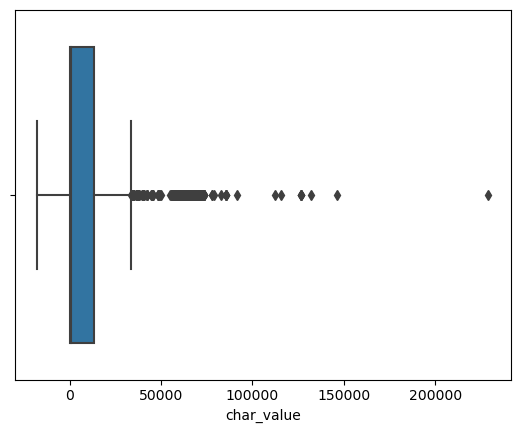
    


```python
fourth_column = sub_data.groupby(["char_value"]).size()
np.sort(fourth_column)[::-1]
```


    array([186,  76,  72, ...,   1,   1,   1], dtype=int64)


```python
fourth_column[fourth_column == max(fourth_column)]
```


    char_value
    0.0    186
    dtype: int64


```python
deviation = np.std(sub_data.iloc[:, 4])
sub_data.iloc[:, 4][sub_data.iloc[:, 4] >= (deviation * 2)]
```


    63      63897.484
    64      66975.870
    65      62665.250
    66      64876.690
    67      63586.004
              ...    
    3624    57997.430
    3626    58302.473
    3627    60995.625
    3640    57684.477
    3641    58287.598
    Name: char_value, Length: 410, dtype: float64


```python
sub_data['char_time'] = pd.to_datetime(sub_data['char_time'], format='%Y-%m-%d %H:%M:%S')
```


```python
sub_data['Day'] = sub_data['char_time'].dt.date
sub_data['Day'] = pd.to_datetime(sub_data['Day'])
```


```python
sub_data['Hour'] = sub_data['char_time'].dt.strftime('%H')
sub_data['Hour'] = sub_data['Hour'].astype(int)
sub_data['Hour']
```


    0       10
    1       20
    2        4
    3        7
    4       15
            ..
    3641    14
    3642    14
    3643    14
    3644    14
    3645    14
    Name: Hour, Length: 3646, dtype: int32


```python
sub_data['Minutes'] = sub_data['char_time'].dt.strftime('%M')
sub_data['Minutes'] = sub_data['Minutes'].astype(int)
sub_data['Minutes']
```


    0       19
    1       49
    2       28
    3       41
    4       19
            ..
    3641    27
    3642    27
    3643    27
    3644    27
    3645    32
    Name: Minutes, Length: 3646, dtype: int32


```python
sns.histplot(sub_data['Day'])
```


    <AxesSubplot:xlabel='Day', ylabel='Count'>


    
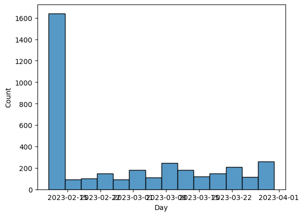
    


```python
sns.histplot(sub_data['Hour'])
```


    <AxesSubplot:xlabel='Hour', ylabel='Count'>


    
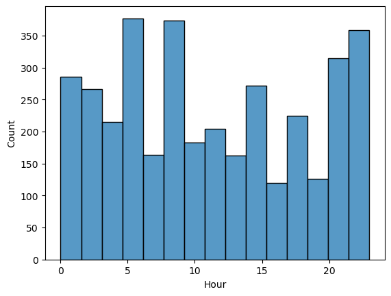
    


```python
sns.histplot(sub_data['Minutes'])
```


    <AxesSubplot:xlabel='Minutes', ylabel='Count'>


    
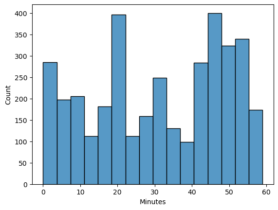
    


```python
sub_data[sub_data["model_complete"] == "COMPLETE"]
```


<div>
<style scoped>
    .dataframe tbody tr th:only-of-type {
        vertical-align: middle;
    }

    .dataframe tbody tr th {
        vertical-align: top;
    }

    .dataframe thead th {
        text-align: right;
    }
</style>
<table border="1" class="dataframe">
  <thead>
    <tr style="text-align: right;">
      <th></th>
      <th>uniqueid</th>
      <th>model_complete</th>
      <th>char_name</th>
      <th>char_time</th>
      <th>char_value</th>
      <th>Day</th>
      <th>Hour</th>
      <th>Minutes</th>
    </tr>
  </thead>
  <tbody>
    <tr>
      <th>0</th>
      <td>44168</td>
      <td>COMPLETE</td>
      <td>non_value_operating_time</td>
      <td>2023-02-11 10:19:25</td>
      <td>3560.000000</td>
      <td>2023-02-11</td>
      <td>10</td>
      <td>19</td>
    </tr>
    <tr>
      <th>1</th>
      <td>44168</td>
      <td>COMPLETE</td>
      <td>non_value_operating_time</td>
      <td>2023-02-11 20:49:30</td>
      <td>300.000000</td>
      <td>2023-02-11</td>
      <td>20</td>
      <td>49</td>
    </tr>
    <tr>
      <th>2</th>
      <td>44168</td>
      <td>COMPLETE</td>
      <td>non_value_operating_time</td>
      <td>2023-02-12 04:28:05</td>
      <td>190.000000</td>
      <td>2023-02-12</td>
      <td>4</td>
      <td>28</td>
    </tr>
    <tr>
      <th>3</th>
      <td>44168</td>
      <td>COMPLETE</td>
      <td>non_value_operating_time</td>
      <td>2023-02-12 07:41:10</td>
      <td>140.000000</td>
      <td>2023-02-12</td>
      <td>7</td>
      <td>41</td>
    </tr>
    <tr>
      <th>4</th>
      <td>44168</td>
      <td>COMPLETE</td>
      <td>non_value_operating_time</td>
      <td>2023-02-12 15:19:00</td>
      <td>640.000000</td>
      <td>2023-02-12</td>
      <td>15</td>
      <td>19</td>
    </tr>
    <tr>
      <th>...</th>
      <td>...</td>
      <td>...</td>
      <td>...</td>
      <td>...</td>
      <td>...</td>
      <td>...</td>
      <td>...</td>
      <td>...</td>
    </tr>
    <tr>
      <th>3641</th>
      <td>47268</td>
      <td>COMPLETE</td>
      <td>phase_3.Recirculacion.Densidad_max</td>
      <td>2023-03-31 14:27:10</td>
      <td>58287.598000</td>
      <td>2023-03-31</td>
      <td>14</td>
      <td>27</td>
    </tr>
    <tr>
      <th>3642</th>
      <td>47268</td>
      <td>COMPLETE</td>
      <td>phase_3.Recirculacion.Presion_avg</td>
      <td>2023-03-31 14:27:10</td>
      <td>2.977007</td>
      <td>2023-03-31</td>
      <td>14</td>
      <td>27</td>
    </tr>
    <tr>
      <th>3643</th>
      <td>47268</td>
      <td>COMPLETE</td>
      <td>phase_3.Recirculacion.Presion_max</td>
      <td>2023-03-31 14:27:10</td>
      <td>2.989005</td>
      <td>2023-03-31</td>
      <td>14</td>
      <td>27</td>
    </tr>
    <tr>
      <th>3644</th>
      <td>47268</td>
      <td>COMPLETE</td>
      <td>phase_3.Recirculacion.Visco_max</td>
      <td>2023-03-31 14:27:10</td>
      <td>0.000000</td>
      <td>2023-03-31</td>
      <td>14</td>
      <td>27</td>
    </tr>
    <tr>
      <th>3645</th>
      <td>47268</td>
      <td>COMPLETE</td>
      <td>total_duration</td>
      <td>2023-03-31 14:32:20</td>
      <td>10545.000000</td>
      <td>2023-03-31</td>
      <td>14</td>
      <td>32</td>
    </tr>
  </tbody>
</table>
<p>3569 rows × 8 columns</p>
</div>


### To conclude step one, now that I have explored the data, we need to rename and separate values for the machine learning run.


```python
sub_data.columns = ['Batch_ID', 'Model_State', 'Phase_Number_Name_Metric', 'Time', 'Values', 'Day', 'Hour', 'Minutes']
```


```python
sub_data.head()
```


<div>
<style scoped>
    .dataframe tbody tr th:only-of-type {
        vertical-align: middle;
    }

    .dataframe tbody tr th {
        vertical-align: top;
    }

    .dataframe thead th {
        text-align: right;
    }
</style>
<table border="1" class="dataframe">
  <thead>
    <tr style="text-align: right;">
      <th></th>
      <th>Batch_ID</th>
      <th>Model_State</th>
      <th>Phase_Number_Name_Metric</th>
      <th>Time</th>
      <th>Values</th>
      <th>Day</th>
      <th>Hour</th>
      <th>Minutes</th>
    </tr>
  </thead>
  <tbody>
    <tr>
      <th>0</th>
      <td>44168</td>
      <td>COMPLETE</td>
      <td>non_value_operating_time</td>
      <td>2023-02-11 10:19:25</td>
      <td>3560.0</td>
      <td>2023-02-11</td>
      <td>10</td>
      <td>19</td>
    </tr>
    <tr>
      <th>1</th>
      <td>44168</td>
      <td>COMPLETE</td>
      <td>non_value_operating_time</td>
      <td>2023-02-11 20:49:30</td>
      <td>300.0</td>
      <td>2023-02-11</td>
      <td>20</td>
      <td>49</td>
    </tr>
    <tr>
      <th>2</th>
      <td>44168</td>
      <td>COMPLETE</td>
      <td>non_value_operating_time</td>
      <td>2023-02-12 04:28:05</td>
      <td>190.0</td>
      <td>2023-02-12</td>
      <td>4</td>
      <td>28</td>
    </tr>
    <tr>
      <th>3</th>
      <td>44168</td>
      <td>COMPLETE</td>
      <td>non_value_operating_time</td>
      <td>2023-02-12 07:41:10</td>
      <td>140.0</td>
      <td>2023-02-12</td>
      <td>7</td>
      <td>41</td>
    </tr>
    <tr>
      <th>4</th>
      <td>44168</td>
      <td>COMPLETE</td>
      <td>non_value_operating_time</td>
      <td>2023-02-12 15:19:00</td>
      <td>640.0</td>
      <td>2023-02-12</td>
      <td>15</td>
      <td>19</td>
    </tr>
  </tbody>
</table>
</div>


## 2 - Supervised Regression Model for Predicting Density - Machine Learning

Know, we need prepare data for predicting Density, pivoting (organizing) the phase number to deal with it. 


```python
### we need only data complete to do predictions about density
sub_data = sub_data[sub_data["Model_State"] == "COMPLETE"]
sub_data_to_machine_learning = sub_data.loc[:, ["Batch_ID", "Phase_Number_Name_Metric", "Values", "Day", "Hour", "Minutes"]]
sub_data_to_machine_learning.head()
```


<div>
<style scoped>
    .dataframe tbody tr th:only-of-type {
        vertical-align: middle;
    }

    .dataframe tbody tr th {
        vertical-align: top;
    }

    .dataframe thead th {
        text-align: right;
    }
</style>
<table border="1" class="dataframe">
  <thead>
    <tr style="text-align: right;">
      <th></th>
      <th>Batch_ID</th>
      <th>Phase_Number_Name_Metric</th>
      <th>Values</th>
      <th>Day</th>
      <th>Hour</th>
      <th>Minutes</th>
    </tr>
  </thead>
  <tbody>
    <tr>
      <th>0</th>
      <td>44168</td>
      <td>non_value_operating_time</td>
      <td>3560.0</td>
      <td>2023-02-11</td>
      <td>10</td>
      <td>19</td>
    </tr>
    <tr>
      <th>1</th>
      <td>44168</td>
      <td>non_value_operating_time</td>
      <td>300.0</td>
      <td>2023-02-11</td>
      <td>20</td>
      <td>49</td>
    </tr>
    <tr>
      <th>2</th>
      <td>44168</td>
      <td>non_value_operating_time</td>
      <td>190.0</td>
      <td>2023-02-12</td>
      <td>4</td>
      <td>28</td>
    </tr>
    <tr>
      <th>3</th>
      <td>44168</td>
      <td>non_value_operating_time</td>
      <td>140.0</td>
      <td>2023-02-12</td>
      <td>7</td>
      <td>41</td>
    </tr>
    <tr>
      <th>4</th>
      <td>44168</td>
      <td>non_value_operating_time</td>
      <td>640.0</td>
      <td>2023-02-12</td>
      <td>15</td>
      <td>19</td>
    </tr>
  </tbody>
</table>
</div>


```python
# selecting hours
sub_data_to_machine_learning["Day_Right"] = sub_data_to_machine_learning["Day"].dt.day
sub_data_to_machine_learning["Month"] = sub_data_to_machine_learning["Day"].dt.month
sub_data_to_machine_learning = sub_data_to_machine_learning[['Batch_ID', 'Phase_Number_Name_Metric', 'Values', 'Hour', 'Minutes', 'Day_Right', 'Month']]
sub_data_to_machine_learning.head()
```


<div>
<style scoped>
    .dataframe tbody tr th:only-of-type {
        vertical-align: middle;
    }

    .dataframe tbody tr th {
        vertical-align: top;
    }

    .dataframe thead th {
        text-align: right;
    }
</style>
<table border="1" class="dataframe">
  <thead>
    <tr style="text-align: right;">
      <th></th>
      <th>Batch_ID</th>
      <th>Phase_Number_Name_Metric</th>
      <th>Values</th>
      <th>Hour</th>
      <th>Minutes</th>
      <th>Day_Right</th>
      <th>Month</th>
    </tr>
  </thead>
  <tbody>
    <tr>
      <th>0</th>
      <td>44168</td>
      <td>non_value_operating_time</td>
      <td>3560.0</td>
      <td>10</td>
      <td>19</td>
      <td>11</td>
      <td>2</td>
    </tr>
    <tr>
      <th>1</th>
      <td>44168</td>
      <td>non_value_operating_time</td>
      <td>300.0</td>
      <td>20</td>
      <td>49</td>
      <td>11</td>
      <td>2</td>
    </tr>
    <tr>
      <th>2</th>
      <td>44168</td>
      <td>non_value_operating_time</td>
      <td>190.0</td>
      <td>4</td>
      <td>28</td>
      <td>12</td>
      <td>2</td>
    </tr>
    <tr>
      <th>3</th>
      <td>44168</td>
      <td>non_value_operating_time</td>
      <td>140.0</td>
      <td>7</td>
      <td>41</td>
      <td>12</td>
      <td>2</td>
    </tr>
    <tr>
      <th>4</th>
      <td>44168</td>
      <td>non_value_operating_time</td>
      <td>640.0</td>
      <td>15</td>
      <td>19</td>
      <td>12</td>
      <td>2</td>
    </tr>
  </tbody>
</table>
</div>


```python
# organizing code, transform phase in columns to machine learning
sub_data_to_machine_learning = sub_data_to_machine_learning.groupby(["Batch_ID", "Phase_Number_Name_Metric"]).agg({'Values': 'mean', "Hour": "mean", "Minutes": "mean", "Day_Right":"median", "Month": "median"}).reset_index()
machine_pivoted = sub_data_to_machine_learning.pivot_table(index='Batch_ID', columns='Phase_Number_Name_Metric', values='Values', aggfunc=('first')).reset_index()
sub_time = sub_data_to_machine_learning.groupby("Batch_ID").agg({"Hour": "mean", "Minutes": "mean", "Day_Right":"median", "Month": "median"}).reset_index()
data_to_machine_final = pd.merge(machine_pivoted, sub_time, on="Batch_ID")
data_to_machine_final.head()
```


<div>
<style scoped>
    .dataframe tbody tr th:only-of-type {
        vertical-align: middle;
    }

    .dataframe tbody tr th {
        vertical-align: top;
    }

    .dataframe thead th {
        text-align: right;
    }
</style>
<table border="1" class="dataframe">
  <thead>
    <tr style="text-align: right;">
      <th></th>
      <th>Batch_ID</th>
      <th>non_value_operating_time</th>
      <th>phase_1.Inicio.duration</th>
      <th>phase_2.Medicion.duration</th>
      <th>phase_3.Recirculacion.Densidad_max</th>
      <th>phase_3.Recirculacion.Peso_avg</th>
      <th>phase_3.Recirculacion.Presion_avg</th>
      <th>phase_3.Recirculacion.Presion_max</th>
      <th>phase_3.Recirculacion.Visco_max</th>
      <th>phase_3.Recirculacion.duration</th>
      <th>total_duration</th>
      <th>Hour</th>
      <th>Minutes</th>
      <th>Day_Right</th>
      <th>Month</th>
    </tr>
  </thead>
  <tbody>
    <tr>
      <th>0</th>
      <td>44168</td>
      <td>2511.666667</td>
      <td>123.076923</td>
      <td>8841.153846</td>
      <td>55142.891667</td>
      <td>13136.436319</td>
      <td>1.325082</td>
      <td>2.560432</td>
      <td>1292.827154</td>
      <td>9726.666667</td>
      <td>17025.769231</td>
      <td>10.796795</td>
      <td>31.316667</td>
      <td>12.0</td>
      <td>2.0</td>
    </tr>
    <tr>
      <th>1</th>
      <td>44169</td>
      <td>2511.666667</td>
      <td>123.076923</td>
      <td>8841.153846</td>
      <td>55142.891667</td>
      <td>13136.436319</td>
      <td>1.325082</td>
      <td>2.560432</td>
      <td>1292.827154</td>
      <td>9726.666667</td>
      <td>17025.769231</td>
      <td>10.796795</td>
      <td>31.316667</td>
      <td>12.0</td>
      <td>2.0</td>
    </tr>
    <tr>
      <th>2</th>
      <td>44176</td>
      <td>2511.666667</td>
      <td>123.076923</td>
      <td>8841.153846</td>
      <td>55142.891667</td>
      <td>13136.436319</td>
      <td>1.325082</td>
      <td>2.560432</td>
      <td>1292.827154</td>
      <td>9726.666667</td>
      <td>17025.769231</td>
      <td>10.796795</td>
      <td>31.316667</td>
      <td>12.0</td>
      <td>2.0</td>
    </tr>
    <tr>
      <th>3</th>
      <td>44199</td>
      <td>2511.666667</td>
      <td>123.076923</td>
      <td>8841.153846</td>
      <td>55142.891667</td>
      <td>13136.436319</td>
      <td>1.325082</td>
      <td>2.560432</td>
      <td>1292.827154</td>
      <td>9726.666667</td>
      <td>17025.769231</td>
      <td>10.796795</td>
      <td>31.316667</td>
      <td>12.0</td>
      <td>2.0</td>
    </tr>
    <tr>
      <th>4</th>
      <td>44221</td>
      <td>2511.666667</td>
      <td>123.076923</td>
      <td>8841.153846</td>
      <td>55142.891667</td>
      <td>13136.436319</td>
      <td>1.325082</td>
      <td>2.560432</td>
      <td>1292.827154</td>
      <td>9726.666667</td>
      <td>17025.769231</td>
      <td>10.796795</td>
      <td>31.316667</td>
      <td>12.0</td>
      <td>2.0</td>
    </tr>
  </tbody>
</table>
</div>


```python
### renaming ###
data_to_machine_final = data_to_machine_final.iloc[:, 1:len(data_to_machine_final)]
```


```python
data_to_machine_final.columns
```


    Index(['non_value_operating_time', 'phase_1.Inicio.duration',
           'phase_2.Medicion.duration', 'phase_3.Recirculacion.Densidad_max',
           'phase_3.Recirculacion.Peso_avg', 'phase_3.Recirculacion.Presion_avg',
           'phase_3.Recirculacion.Presion_max', 'phase_3.Recirculacion.Visco_max',
           'phase_3.Recirculacion.duration', 'total_duration', 'Hour', 'Minutes',
           'Day_Right', 'Month'],
          dtype='object')


```python
data_to_machine_final.columns  = ["Non_Value_Operating_Time", 'Phase_1_Duration', 'Phase_2_Duration',
       'Phase_3_Density', 'Phase_3_Peso_avg', 'Phase_3_Presion_avg',
       'Phase_3_Presion_max', 'Phase_3_Visco_max',
       'Phase_3_duration', 'Total_duration', 'Hour', 'Minutes',
       'Day_Right', 'Month']
data_to_machine_final.head()
```


<div>
<style scoped>
    .dataframe tbody tr th:only-of-type {
        vertical-align: middle;
    }

    .dataframe tbody tr th {
        vertical-align: top;
    }

    .dataframe thead th {
        text-align: right;
    }
</style>
<table border="1" class="dataframe">
  <thead>
    <tr style="text-align: right;">
      <th></th>
      <th>Non_Value_Operating_Time</th>
      <th>Phase_1_Duration</th>
      <th>Phase_2_Duration</th>
      <th>Phase_3_Density</th>
      <th>Phase_3_Peso_avg</th>
      <th>Phase_3_Presion_avg</th>
      <th>Phase_3_Presion_max</th>
      <th>Phase_3_Visco_max</th>
      <th>Phase_3_duration</th>
      <th>Total_duration</th>
      <th>Hour</th>
      <th>Minutes</th>
      <th>Day_Right</th>
      <th>Month</th>
    </tr>
  </thead>
  <tbody>
    <tr>
      <th>0</th>
      <td>2511.666667</td>
      <td>123.076923</td>
      <td>8841.153846</td>
      <td>55142.891667</td>
      <td>13136.436319</td>
      <td>1.325082</td>
      <td>2.560432</td>
      <td>1292.827154</td>
      <td>9726.666667</td>
      <td>17025.769231</td>
      <td>10.796795</td>
      <td>31.316667</td>
      <td>12.0</td>
      <td>2.0</td>
    </tr>
    <tr>
      <th>1</th>
      <td>2511.666667</td>
      <td>123.076923</td>
      <td>8841.153846</td>
      <td>55142.891667</td>
      <td>13136.436319</td>
      <td>1.325082</td>
      <td>2.560432</td>
      <td>1292.827154</td>
      <td>9726.666667</td>
      <td>17025.769231</td>
      <td>10.796795</td>
      <td>31.316667</td>
      <td>12.0</td>
      <td>2.0</td>
    </tr>
    <tr>
      <th>2</th>
      <td>2511.666667</td>
      <td>123.076923</td>
      <td>8841.153846</td>
      <td>55142.891667</td>
      <td>13136.436319</td>
      <td>1.325082</td>
      <td>2.560432</td>
      <td>1292.827154</td>
      <td>9726.666667</td>
      <td>17025.769231</td>
      <td>10.796795</td>
      <td>31.316667</td>
      <td>12.0</td>
      <td>2.0</td>
    </tr>
    <tr>
      <th>3</th>
      <td>2511.666667</td>
      <td>123.076923</td>
      <td>8841.153846</td>
      <td>55142.891667</td>
      <td>13136.436319</td>
      <td>1.325082</td>
      <td>2.560432</td>
      <td>1292.827154</td>
      <td>9726.666667</td>
      <td>17025.769231</td>
      <td>10.796795</td>
      <td>31.316667</td>
      <td>12.0</td>
      <td>2.0</td>
    </tr>
    <tr>
      <th>4</th>
      <td>2511.666667</td>
      <td>123.076923</td>
      <td>8841.153846</td>
      <td>55142.891667</td>
      <td>13136.436319</td>
      <td>1.325082</td>
      <td>2.560432</td>
      <td>1292.827154</td>
      <td>9726.666667</td>
      <td>17025.769231</td>
      <td>10.796795</td>
      <td>31.316667</td>
      <td>12.0</td>
      <td>2.0</td>
    </tr>
  </tbody>
</table>
</div>


```python
data_to_machine_final.isna().sum()
data_to_machine_final = data_to_machine_final.dropna()
```


```python
### looking data to machine
data_to_machine_final.describe()
```


<div>
<style scoped>
    .dataframe tbody tr th:only-of-type {
        vertical-align: middle;
    }

    .dataframe tbody tr th {
        vertical-align: top;
    }

    .dataframe thead th {
        text-align: right;
    }
</style>
<table border="1" class="dataframe">
  <thead>
    <tr style="text-align: right;">
      <th></th>
      <th>Non_Value_Operating_Time</th>
      <th>Phase_1_Duration</th>
      <th>Phase_2_Duration</th>
      <th>Phase_3_Density</th>
      <th>Phase_3_Peso_avg</th>
      <th>Phase_3_Presion_avg</th>
      <th>Phase_3_Presion_max</th>
      <th>Phase_3_Visco_max</th>
      <th>Phase_3_duration</th>
      <th>Total_duration</th>
      <th>Hour</th>
      <th>Minutes</th>
      <th>Day_Right</th>
      <th>Month</th>
    </tr>
  </thead>
  <tbody>
    <tr>
      <th>count</th>
      <td>147.000000</td>
      <td>147.000000</td>
      <td>147.000000</td>
      <td>147.000000</td>
      <td>147.000000</td>
      <td>147.000000</td>
      <td>147.000000</td>
      <td>147.000000</td>
      <td>147.000000</td>
      <td>147.000000</td>
      <td>147.000000</td>
      <td>147.000000</td>
      <td>147.000000</td>
      <td>147.000000</td>
    </tr>
    <tr>
      <th>mean</th>
      <td>2715.056689</td>
      <td>162.091837</td>
      <td>15706.128118</td>
      <td>56248.861286</td>
      <td>25257.782692</td>
      <td>1.823121</td>
      <td>2.781084</td>
      <td>507.025104</td>
      <td>7704.824263</td>
      <td>23127.148526</td>
      <td>11.704025</td>
      <td>31.185488</td>
      <td>17.074830</td>
      <td>2.721088</td>
    </tr>
    <tr>
      <th>std</th>
      <td>4244.278375</td>
      <td>258.054810</td>
      <td>16766.187338</td>
      <td>14414.036762</td>
      <td>20122.598270</td>
      <td>0.735763</td>
      <td>0.592045</td>
      <td>455.617534</td>
      <td>14600.934429</td>
      <td>24260.946884</td>
      <td>4.809086</td>
      <td>10.877329</td>
      <td>8.459078</td>
      <td>0.449997</td>
    </tr>
    <tr>
      <th>min</th>
      <td>5.000000</td>
      <td>10.000000</td>
      <td>25.000000</td>
      <td>-9214.445000</td>
      <td>-11508.949000</td>
      <td>0.220505</td>
      <td>0.291976</td>
      <td>0.000000</td>
      <td>10.000000</td>
      <td>2070.000000</td>
      <td>2.400000</td>
      <td>7.200000</td>
      <td>1.000000</td>
      <td>2.000000</td>
    </tr>
    <tr>
      <th>25%</th>
      <td>197.500000</td>
      <td>80.000000</td>
      <td>7812.500000</td>
      <td>56894.678000</td>
      <td>10295.623500</td>
      <td>1.325082</td>
      <td>2.783565</td>
      <td>0.000000</td>
      <td>1417.500000</td>
      <td>12390.000000</td>
      <td>7.850000</td>
      <td>24.100000</td>
      <td>11.000000</td>
      <td>2.000000</td>
    </tr>
    <tr>
      <th>50%</th>
      <td>1345.000000</td>
      <td>115.000000</td>
      <td>10120.000000</td>
      <td>60594.560000</td>
      <td>20201.537000</td>
      <td>1.684571</td>
      <td>2.974193</td>
      <td>580.000000</td>
      <td>4210.000000</td>
      <td>16462.500000</td>
      <td>10.796795</td>
      <td>31.316667</td>
      <td>17.000000</td>
      <td>3.000000</td>
    </tr>
    <tr>
      <th>75%</th>
      <td>3443.750000</td>
      <td>130.000000</td>
      <td>17052.500000</td>
      <td>62704.885000</td>
      <td>37723.575000</td>
      <td>2.214284</td>
      <td>3.102336</td>
      <td>821.000000</td>
      <td>9726.666667</td>
      <td>22936.250000</td>
      <td>15.600000</td>
      <td>38.500000</td>
      <td>24.000000</td>
      <td>3.000000</td>
    </tr>
    <tr>
      <th>max</th>
      <td>28500.000000</td>
      <td>1670.000000</td>
      <td>112475.000000</td>
      <td>73009.960000</td>
      <td>60461.570000</td>
      <td>3.228009</td>
      <td>3.269676</td>
      <td>2281.717000</td>
      <td>146435.000000</td>
      <td>229025.000000</td>
      <td>21.400000</td>
      <td>54.000000</td>
      <td>31.000000</td>
      <td>3.000000</td>
    </tr>
  </tbody>
</table>
</div>


```python
### exploring data in right format to machine learning ###
sns.histplot(data_to_machine_final.iloc[:, 0])
```


    <AxesSubplot:xlabel='Non_Value_Operating_Time', ylabel='Count'>


    
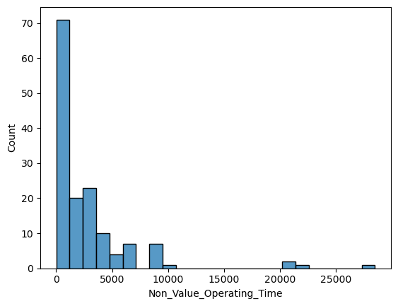
    


```python
sns.histplot(data_to_machine_final.iloc[:, 1])
```


    <AxesSubplot:xlabel='Phase_1_Duration', ylabel='Count'>


    
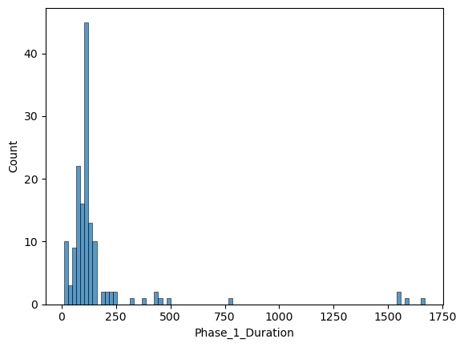
    


```python
sns.histplot(data_to_machine_final.iloc[:, 2])
```


    <AxesSubplot:xlabel='Phase_2_Duration', ylabel='Count'>


    
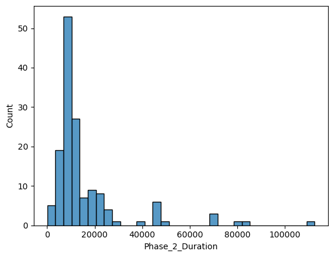
    


```python
sns.histplot(data_to_machine_final.iloc[:, 3])
```


    <AxesSubplot:xlabel='Phase_3_Density', ylabel='Count'>


    
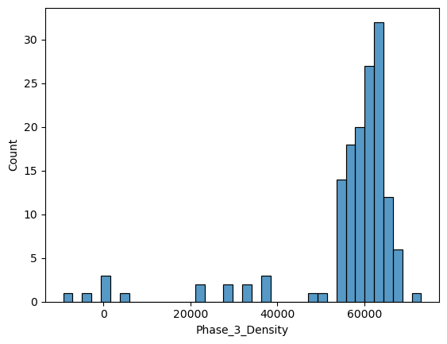
    


```python
sns.histplot(data_to_machine_final.iloc[:, 4])
```


    <AxesSubplot:xlabel='Phase_3_Peso_avg', ylabel='Count'>


    
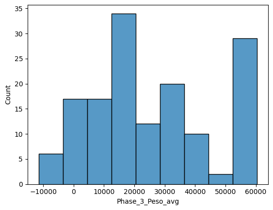
    


```python
sns.histplot(data_to_machine_final.iloc[:, 5])
```


    <AxesSubplot:xlabel='Phase_3_Presion_avg', ylabel='Count'>


    
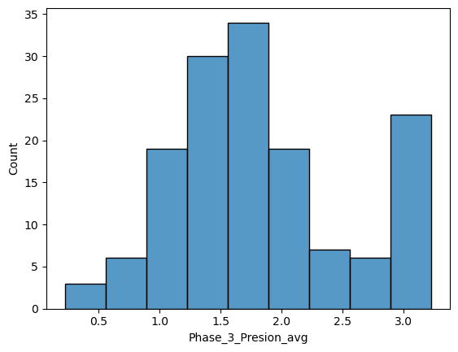
    


```python
sns.histplot(data_to_machine_final.iloc[:, 6])
```


    <AxesSubplot:xlabel='Phase_3_Presion_max', ylabel='Count'>


    
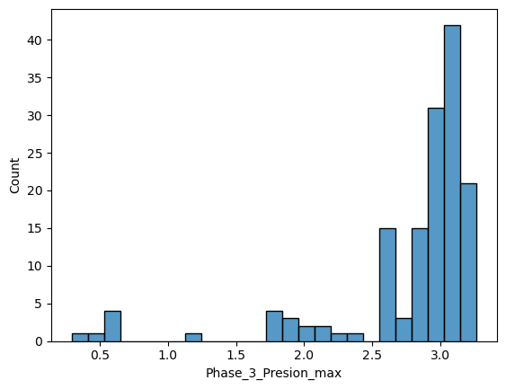
    


```python
sns.histplot(data_to_machine_final.iloc[:, 7])
```


    <AxesSubplot:xlabel='Phase_3_Visco_max', ylabel='Count'>


    
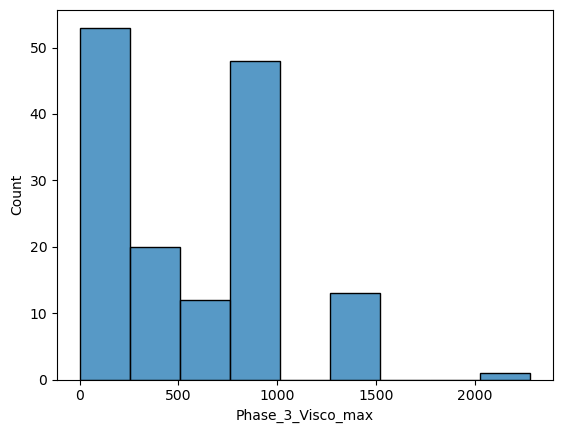
    


```python
sns.histplot(data_to_machine_final.iloc[:, 8])
```


    <AxesSubplot:xlabel='Phase_3_duration', ylabel='Count'>


    
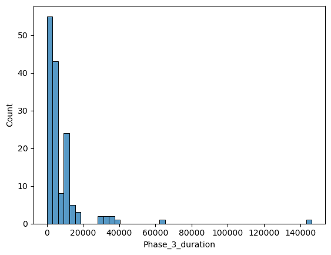
    


```python
sns.histplot(data_to_machine_final.iloc[:, 9])
```


    <AxesSubplot:xlabel='Total_duration', ylabel='Count'>


    
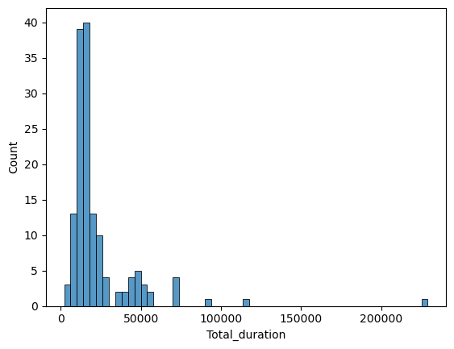
    


```python
sns.histplot(data_to_machine_final.iloc[:, 10])
```


    <AxesSubplot:xlabel='Hour', ylabel='Count'>


    
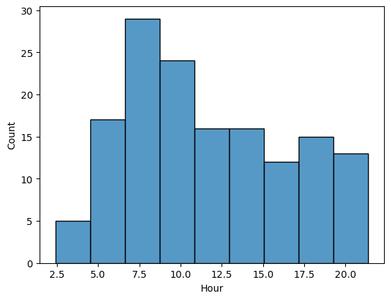
    


```python
sns.histplot(data_to_machine_final.iloc[:, 11])
```


    <AxesSubplot:xlabel='Minutes', ylabel='Count'>


    
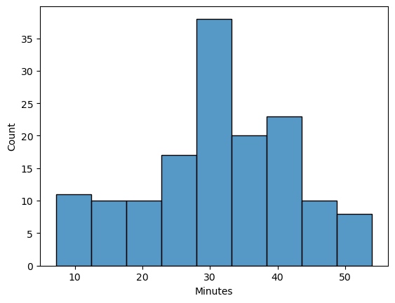
    


```python
sns.histplot(data_to_machine_final.iloc[:, 12])
```


    <AxesSubplot:xlabel='Day_Right', ylabel='Count'>


    
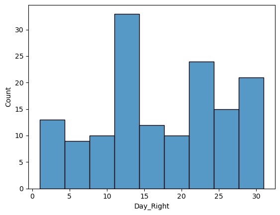
    


```python
sns.histplot(data_to_machine_final.iloc[:, 13])
```


    <AxesSubplot:xlabel='Month', ylabel='Count'>


    
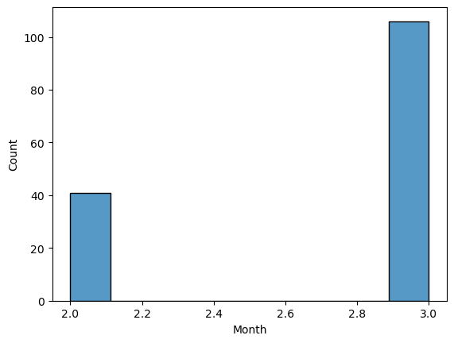
    


```python
X = data_to_machine_final.drop('Phase_3_Density', axis=1)
y = data_to_machine_final["Phase_3_Density"]
X_train, X_test_general, y_train, y_test_general = train_test_split(X, y, test_size=0.4, random_state=1)
X_val, X_test, y_val, y_test = train_test_split(X_test_general, y_test_general, test_size=0.5, random_state=1)

#scaler did not work well
#scaler = StandardScaler()
#scaler = MinMaxScaler()
#X_train_transformed = scaler.fit_transform(X_train)
#X_train = pd.DataFrame(X_train_transformed, columns=X.columns)
#X_train
```


```python
correlation_matrix = X.corr()

# Plot a heatmap of the correlation matrix
plt.figure(figsize=(8, 6))
sns.heatmap(correlation_matrix, annot=True, cmap='coolwarm', fmt=".2f", linewidths=.5)
plt.title('Correlation Matrix')
plt.show()
```


    
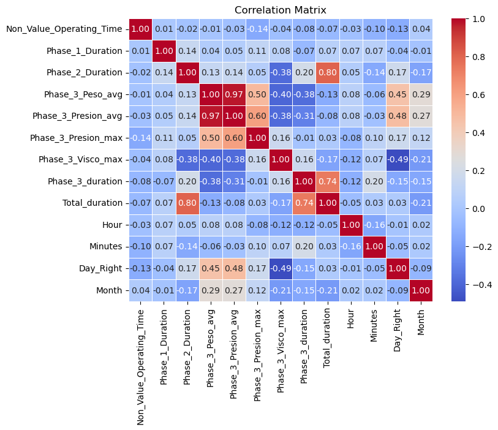
    


```python
### feature engineering ###
#Phase 2 Duration and Total Duration is correlated
#Phase 3 Duration Total Duration is correlated
#Presion avg and Max is correlated
#did not work well#
#X_train["all_duration"] = (X_train["Total_duration"].abs() + X_train["Phase_2_Duration"].abs() + X_train["Phase_3_duration"].abs()) / 3
```


```python
### pca explanation reduction to explore
pca = PCA()
X_pca = pca.fit_transform(X_train)
loadings = pca.components_
loadings_pca1 = pd.DataFrame(loadings[0], index=X_train.columns, columns=['Loading_PCA1'])
loadings_pca2 = pd.DataFrame(loadings[1], index=X_train.columns, columns=['Loading_PCA2'])
loadings_pca1
```


<div>
<style scoped>
    .dataframe tbody tr th:only-of-type {
        vertical-align: middle;
    }

    .dataframe tbody tr th {
        vertical-align: top;
    }

    .dataframe thead th {
        text-align: right;
    }
</style>
<table border="1" class="dataframe">
  <thead>
    <tr style="text-align: right;">
      <th></th>
      <th>Loading_PCA1</th>
    </tr>
  </thead>
  <tbody>
    <tr>
      <th>Non_Value_Operating_Time</th>
      <td>-0.005525</td>
    </tr>
    <tr>
      <th>Phase_1_Duration</th>
      <td>-0.000601</td>
    </tr>
    <tr>
      <th>Phase_2_Duration</th>
      <td>0.336286</td>
    </tr>
    <tr>
      <th>Phase_3_Peso_avg</th>
      <td>-0.280579</td>
    </tr>
    <tr>
      <th>Phase_3_Presion_avg</th>
      <td>-0.000009</td>
    </tr>
    <tr>
      <th>Phase_3_Presion_max</th>
      <td>-0.000001</td>
    </tr>
    <tr>
      <th>Phase_3_Visco_max</th>
      <td>-0.000484</td>
    </tr>
    <tr>
      <th>Phase_3_duration</th>
      <td>0.445443</td>
    </tr>
    <tr>
      <th>Total_duration</th>
      <td>0.780856</td>
    </tr>
    <tr>
      <th>Hour</th>
      <td>-0.000018</td>
    </tr>
    <tr>
      <th>Minutes</th>
      <td>0.000027</td>
    </tr>
    <tr>
      <th>Day_Right</th>
      <td>-0.000027</td>
    </tr>
    <tr>
      <th>Month</th>
      <td>-0.000004</td>
    </tr>
  </tbody>
</table>
</div>


```python
#### first machine model ####
### way one - all variables important ###
model_regression1 = LinearRegression()
model_regression1.fit(X_train, y_train)

y_predict = model_regression1.predict(X_val)
y_predict2 = model_regression1.predict(X_train)

### fitting ####
print(r2_score(y_val, y_predict))
print(mean_squared_error(y_val, y_predict))

### veryfing underfitting ###
print(r2_score(y_train, y_predict2))
print(mean_squared_error(y_train, y_predict2))
```

    0.872271250687971
    50760911.040497534
    0.8665934036154005
    20051907.86658231
    


```python
feature_importances = pd.Series(model_regression1.coef_, index=X.columns).abs().sort_values(ascending=False)
feature_importances
```


    Phase_3_Presion_max         28174.705013
    Phase_3_Presion_avg         24989.194471
    Month                        1709.324240
    Day_Right                     144.871264
    Minutes                       106.633508
    Hour                           80.255020
    Phase_3_Visco_max               2.101270
    Phase_3_duration                1.514574
    Total_duration                  1.393663
    Phase_2_Duration                1.245914
    Phase_3_Peso_avg                0.767287
    Non_Value_Operating_Time        0.350720
    Phase_1_Duration                0.214421
    dtype: float64


```python
### way 2 - more important variables ###
sub_variables = feature_importances.index[0:2]
model_regression2 = LinearRegression()
model_regression2.fit(X_train[sub_variables], y_train)

y_predict = model_regression2.predict(X_val[sub_variables])
y_predict2 = model_regression2.predict(X_train[sub_variables])

### fitting ####
print(r2_score(y_val, y_predict))
print(mean_squared_error(y_val, y_predict))

### veryfing underfitting ###
print(r2_score(y_train, y_predict2))
print(mean_squared_error(y_train, y_predict2))
```

    0.8986542462620845
    40275997.51450803
    0.7360193681611974
    39678062.79184044
    


```python
### second machine model ###
best_model_r2 = []
best_model_mse = []
best_model_r22 = []
best_model_mse2 = []

array = np.array([1, 2, 3, 4, 5, 10, 50, 100, 200, 500])

for i in range(0, len(array)):
    model2 = RandomForestRegressor(n_estimators=array[i], random_state=1)
    model2.fit(X_train, y_train)
    prediction2 = model2.predict(X_val)
    prediction_under = model2.predict(X_train)
    r22 = r2_score(y_val, prediction2)
    mse2 = mean_squared_error(y_val, prediction2)
    mse3 = mean_squared_error(y_train, prediction_under)
    r2_3 = r2_score(y_train, prediction_under)
    best_model_r2.append(r22)
    best_model_mse.append(mse2)
    best_model_r22.append(r2_3)
    best_model_mse2.append(mse3)
    print(array[i], best_model_r2)

model2 = RandomForestRegressor(n_estimators=5, random_state=1)
model2.fit(X_train, y_train)
prediction2 = model2.predict(X_val)
prediction_under = model2.predict(X_train)

mse2 = mean_squared_error(y_val, prediction2)
r2_2 = r2_score(y_val, prediction2)
mse3 = mean_squared_error(y_train, prediction_under)
r2_3 = r2_score(y_train, prediction_under)

### fitting ####
print(r2_score(y_val, prediction2))
print(mean_squared_error(y_val, prediction2))

### veryfing underfitting ###
print(r2_score(y_train, prediction_under))
print(mean_squared_error(y_train, prediction_under))
```

    1 [0.766738815254171]
    2 [0.766738815254171, 0.6874746529359623]
    3 [0.766738815254171, 0.6874746529359623, 0.7239673950012437]
    4 [0.766738815254171, 0.6874746529359623, 0.7239673950012437, 0.8333678810593462]
    5 [0.766738815254171, 0.6874746529359623, 0.7239673950012437, 0.8333678810593462, 0.8762267393134486]
    10 [0.766738815254171, 0.6874746529359623, 0.7239673950012437, 0.8333678810593462, 0.8762267393134486, 0.8600201332063345]
    50 [0.766738815254171, 0.6874746529359623, 0.7239673950012437, 0.8333678810593462, 0.8762267393134486, 0.8600201332063345, 0.8224415009192697]
    100 [0.766738815254171, 0.6874746529359623, 0.7239673950012437, 0.8333678810593462, 0.8762267393134486, 0.8600201332063345, 0.8224415009192697, 0.8258885160598866]
    200 [0.766738815254171, 0.6874746529359623, 0.7239673950012437, 0.8333678810593462, 0.8762267393134486, 0.8600201332063345, 0.8224415009192697, 0.8258885160598866, 0.7931573237323771]
    500 [0.766738815254171, 0.6874746529359623, 0.7239673950012437, 0.8333678810593462, 0.8762267393134486, 0.8600201332063345, 0.8224415009192697, 0.8258885160598866, 0.7931573237323771, 0.7857561126646102]
    0.8762267393134486
    49188953.22112615
    0.9739342503700005
    3917857.319044002
    


```python
## loking to take the best combination - Val data more high fit and good training data - n_estimators=5
time = np.arange(1, len(best_model_r2) + 1)
sns.scatterplot(time, best_model_r2, label='Val Data')
sns.scatterplot(time, best_model_r22, label='Training Data')
```

    C:\Users\emers\Anaconda3\lib\site-packages\seaborn\_decorators.py:36: FutureWarning: Pass the following variables as keyword args: x, y. From version 0.12, the only valid positional argument will be `data`, and passing other arguments without an explicit keyword will result in an error or misinterpretation.
      warnings.warn(
    C:\Users\emers\Anaconda3\lib\site-packages\seaborn\_decorators.py:36: FutureWarning: Pass the following variables as keyword args: x, y. From version 0.12, the only valid positional argument will be `data`, and passing other arguments without an explicit keyword will result in an error or misinterpretation.
      warnings.warn(
    


    <AxesSubplot:>


    
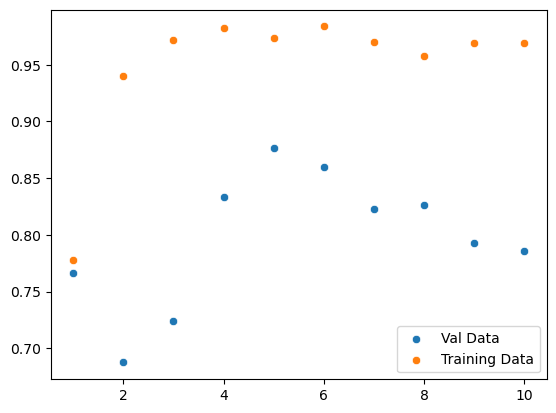
    


```python
importances = model2.feature_importances_
feature_importances = pd.Series(importances, index=X.columns).abs().sort_values(ascending=False)
feature_importances
```


    Phase_3_Presion_max         0.680965
    Phase_3_Peso_avg            0.173310
    Phase_3_duration            0.047679
    Minutes                     0.030299
    Phase_2_Duration            0.025589
    Phase_3_Visco_max           0.013076
    Non_Value_Operating_Time    0.010799
    Phase_3_Presion_avg         0.009731
    Phase_1_Duration            0.005358
    Total_duration              0.001505
    Day_Right                   0.001483
    Hour                        0.000132
    Month                       0.000072
    dtype: float64


```python
### way 2 ###
sub_variables = feature_importances.index[0:1]
best_model_r2 = []
best_model_mse = []
best_model_r22 = []
best_model_mse2 = []

array = np.array([1, 2, 3, 4, 5, 10, 50, 100, 200, 500])

for i in range(0, len(array)):
    model2 = RandomForestRegressor(n_estimators=array[i], random_state=1)
    model2.fit(X_train[sub_variables], y_train)
    prediction2 = model2.predict(X_val[sub_variables])
    prediction_under = model2.predict(X_train[sub_variables])
    r22 = r2_score(y_val, prediction2)
    mse2 = mean_squared_error(y_val, prediction2)
    mse3 = mean_squared_error(y_train, prediction_under)
    r2_3 = r2_score(y_train, prediction_under)
    best_model_r2.append(r22)
    best_model_mse.append(mse2)
    best_model_r22.append(r2_3)
    best_model_mse2.append(mse3)
    print(array[i], best_model_r2)

model2 = RandomForestRegressor(n_estimators=50, random_state=1)
model2.fit(X_train[sub_variables], y_train)
prediction2 = model2.predict(X_val[sub_variables])
prediction_under = model2.predict(X_train[sub_variables])

mse2 = mean_squared_error(y_val, prediction2)
r2_2 = r2_score(y_val, prediction2)
mse3 = mean_squared_error(y_train, prediction_under)
r2_3 = r2_score(y_train, prediction_under)

### fitting ####
print(r2_score(y_val, prediction2))
print(mean_squared_error(y_val, prediction2))

### veryfing underfitting ###
print(r2_score(y_train, prediction_under))
print(mean_squared_error(y_train, prediction_under))
```

    1 [0.8799124491574706]
    2 [0.8799124491574706, 0.8829607037677843]
    3 [0.8799124491574706, 0.8829607037677843, 0.8832199688397496]
    4 [0.8799124491574706, 0.8829607037677843, 0.8832199688397496, 0.882906299400065]
    5 [0.8799124491574706, 0.8829607037677843, 0.8832199688397496, 0.882906299400065, 0.88676955653788]
    10 [0.8799124491574706, 0.8829607037677843, 0.8832199688397496, 0.882906299400065, 0.88676955653788, 0.8861626368489013]
    50 [0.8799124491574706, 0.8829607037677843, 0.8832199688397496, 0.882906299400065, 0.88676955653788, 0.8861626368489013, 0.8963478186086207]
    100 [0.8799124491574706, 0.8829607037677843, 0.8832199688397496, 0.882906299400065, 0.88676955653788, 0.8861626368489013, 0.8963478186086207, 0.8871222787588247]
    200 [0.8799124491574706, 0.8829607037677843, 0.8832199688397496, 0.882906299400065, 0.88676955653788, 0.8861626368489013, 0.8963478186086207, 0.8871222787588247, 0.884722707095447]
    500 [0.8799124491574706, 0.8829607037677843, 0.8832199688397496, 0.882906299400065, 0.88676955653788, 0.8861626368489013, 0.8963478186086207, 0.8871222787588247, 0.884722707095447, 0.8807337526571114]
    0.8963478186086207
    41192599.05933968
    0.9711450185993049
    4337097.596513439
    


```python
## loking to take the best combination - Val data more high fit and good training data - n_estimators=50
time = np.arange(1, len(best_model_r2) + 1)
sns.scatterplot(time, best_model_r2, label='Val Data')
sns.scatterplot(time, best_model_r22, label='Training Data')
```

    C:\Users\emers\Anaconda3\lib\site-packages\seaborn\_decorators.py:36: FutureWarning: Pass the following variables as keyword args: x, y. From version 0.12, the only valid positional argument will be `data`, and passing other arguments without an explicit keyword will result in an error or misinterpretation.
      warnings.warn(
    C:\Users\emers\Anaconda3\lib\site-packages\seaborn\_decorators.py:36: FutureWarning: Pass the following variables as keyword args: x, y. From version 0.12, the only valid positional argument will be `data`, and passing other arguments without an explicit keyword will result in an error or misinterpretation.
      warnings.warn(
    


    <AxesSubplot:>


    
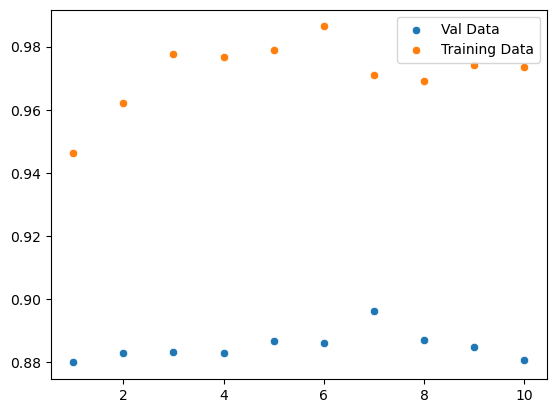
    


```python
### third machine model ###
best_model_r2 = []
best_model_mse = []
best_model_r22 = []
best_model_mse2 = []

array = np.array([1, 2, 3, 4, 5, 10, 50, 100, 500])
array2 = np.array([1, 2, 5, 20])
time = 0

for i in range(0, len(array)):
    for j in range(0, len(array2)):
        time = time + 1
        model4 = GradientBoostingRegressor(n_estimators=array[i], max_depth=array2[j], random_state=1)
        model4.fit(X_train, y_train)
        prediction4 = model4.predict(X_val)
        prediction_under = model4.predict(X_train)
        r22 = r2_score(y_val, prediction4)
        mse2 = mean_squared_error(y_val, prediction4)
        mse3 = mean_squared_error(y_train, prediction_under)
        r2_3 = r2_score(y_train, prediction_under)
        best_model_r2.append(r22)
        best_model_mse.append(mse2)
        best_model_r22.append(r2_3)
        best_model_mse2.append(mse3)
        print(array[i], array2[j], time, best_model_r2)
        

model4 = GradientBoostingRegressor(n_estimators=500, max_depth=1, random_state=1)
model4.fit(X_train, y_train)
prediction4 = model4.predict(X_val)
prediction4_two = model4.predict(X_train)

mse2 = mean_squared_error(y_val, prediction4)
r2_2 = r2_score(y_val, prediction4)
mse3 = mean_squared_error(y_train, prediction4_two)
r2_3 = r2_score(y_train, prediction4_two)

### fitting ####
print(mse2)
print(r2_2)

### veryfing underfitting ###
print(mse3)
print(r2_3)
```

    1 1 1 [0.07247920773510719]
    1 2 2 [0.07247920773510719, 0.12398278959980114]
    1 5 3 [0.07247920773510719, 0.12398278959980114, 0.11296298512851077]
    1 20 4 [0.07247920773510719, 0.12398278959980114, 0.11296298512851077, 0.11216638287321556]
    2 1 5 [0.07247920773510719, 0.12398278959980114, 0.11296298512851077, 0.11216638287321556, 0.1626834407464195]
    2 2 6 [0.07247920773510719, 0.12398278959980114, 0.11296298512851077, 0.11216638287321556, 0.1626834407464195, 0.1951643004101129]
    2 5 7 [0.07247920773510719, 0.12398278959980114, 0.11296298512851077, 0.11216638287321556, 0.1626834407464195, 0.1951643004101129, 0.13998298011642774]
    2 20 8 [0.07247920773510719, 0.12398278959980114, 0.11296298512851077, 0.11216638287321556, 0.1626834407464195, 0.1951643004101129, 0.13998298011642774, 0.1390370317673304]
    3 1 9 [0.07247920773510719, 0.12398278959980114, 0.11296298512851077, 0.11216638287321556, 0.1626834407464195, 0.1951643004101129, 0.13998298011642774, 0.1390370317673304, 0.2374849081070901]
    3 2 10 [0.07247920773510719, 0.12398278959980114, 0.11296298512851077, 0.11216638287321556, 0.1626834407464195, 0.1951643004101129, 0.13998298011642774, 0.1390370317673304, 0.2374849081070901, 0.2523952163773837]
    3 5 11 [0.07247920773510719, 0.12398278959980114, 0.11296298512851077, 0.11216638287321556, 0.1626834407464195, 0.1951643004101129, 0.13998298011642774, 0.1390370317673304, 0.2374849081070901, 0.2523952163773837, 0.18496334652003277]
    3 20 12 [0.07247920773510719, 0.12398278959980114, 0.11296298512851077, 0.11216638287321556, 0.1626834407464195, 0.1951643004101129, 0.13998298011642774, 0.1390370317673304, 0.2374849081070901, 0.2523952163773837, 0.18496334652003277, 0.1831024917581091]
    4 1 13 [0.07247920773510719, 0.12398278959980114, 0.11296298512851077, 0.11216638287321556, 0.1626834407464195, 0.1951643004101129, 0.13998298011642774, 0.1390370317673304, 0.2374849081070901, 0.2523952163773837, 0.18496334652003277, 0.1831024917581091, 0.2996365314285899]
    4 2 14 [0.07247920773510719, 0.12398278959980114, 0.11296298512851077, 0.11216638287321556, 0.1626834407464195, 0.1951643004101129, 0.13998298011642774, 0.1390370317673304, 0.2374849081070901, 0.2523952163773837, 0.18496334652003277, 0.1831024917581091, 0.2996365314285899, 0.36247791205788527]
    4 5 15 [0.07247920773510719, 0.12398278959980114, 0.11296298512851077, 0.11216638287321556, 0.1626834407464195, 0.1951643004101129, 0.13998298011642774, 0.1390370317673304, 0.2374849081070901, 0.2523952163773837, 0.18496334652003277, 0.1831024917581091, 0.2996365314285899, 0.36247791205788527, 0.2987322176806064]
    4 20 16 [0.07247920773510719, 0.12398278959980114, 0.11296298512851077, 0.11216638287321556, 0.1626834407464195, 0.1951643004101129, 0.13998298011642774, 0.1390370317673304, 0.2374849081070901, 0.2523952163773837, 0.18496334652003277, 0.1831024917581091, 0.2996365314285899, 0.36247791205788527, 0.2987322176806064, 0.29709944718464]
    5 1 17 [0.07247920773510719, 0.12398278959980114, 0.11296298512851077, 0.11216638287321556, 0.1626834407464195, 0.1951643004101129, 0.13998298011642774, 0.1390370317673304, 0.2374849081070901, 0.2523952163773837, 0.18496334652003277, 0.1831024917581091, 0.2996365314285899, 0.36247791205788527, 0.2987322176806064, 0.29709944718464, 0.3513855376024255]
    5 2 18 [0.07247920773510719, 0.12398278959980114, 0.11296298512851077, 0.11216638287321556, 0.1626834407464195, 0.1951643004101129, 0.13998298011642774, 0.1390370317673304, 0.2374849081070901, 0.2523952163773837, 0.18496334652003277, 0.1831024917581091, 0.2996365314285899, 0.36247791205788527, 0.2987322176806064, 0.29709944718464, 0.3513855376024255, 0.4526065330647231]
    5 5 19 [0.07247920773510719, 0.12398278959980114, 0.11296298512851077, 0.11216638287321556, 0.1626834407464195, 0.1951643004101129, 0.13998298011642774, 0.1390370317673304, 0.2374849081070901, 0.2523952163773837, 0.18496334652003277, 0.1831024917581091, 0.2996365314285899, 0.36247791205788527, 0.2987322176806064, 0.29709944718464, 0.3513855376024255, 0.4526065330647231, 0.3928166753716674]
    5 20 20 [0.07247920773510719, 0.12398278959980114, 0.11296298512851077, 0.11216638287321556, 0.1626834407464195, 0.1951643004101129, 0.13998298011642774, 0.1390370317673304, 0.2374849081070901, 0.2523952163773837, 0.18496334652003277, 0.1831024917581091, 0.2996365314285899, 0.36247791205788527, 0.2987322176806064, 0.29709944718464, 0.3513855376024255, 0.4526065330647231, 0.3928166753716674, 0.3919301247450443]
    10 1 21 [0.07247920773510719, 0.12398278959980114, 0.11296298512851077, 0.11216638287321556, 0.1626834407464195, 0.1951643004101129, 0.13998298011642774, 0.1390370317673304, 0.2374849081070901, 0.2523952163773837, 0.18496334652003277, 0.1831024917581091, 0.2996365314285899, 0.36247791205788527, 0.2987322176806064, 0.29709944718464, 0.3513855376024255, 0.4526065330647231, 0.3928166753716674, 0.3919301247450443, 0.6620602717542801]
    10 2 22 [0.07247920773510719, 0.12398278959980114, 0.11296298512851077, 0.11216638287321556, 0.1626834407464195, 0.1951643004101129, 0.13998298011642774, 0.1390370317673304, 0.2374849081070901, 0.2523952163773837, 0.18496334652003277, 0.1831024917581091, 0.2996365314285899, 0.36247791205788527, 0.2987322176806064, 0.29709944718464, 0.3513855376024255, 0.4526065330647231, 0.3928166753716674, 0.3919301247450443, 0.6620602717542801, 0.623185925820745]
    10 5 23 [0.07247920773510719, 0.12398278959980114, 0.11296298512851077, 0.11216638287321556, 0.1626834407464195, 0.1951643004101129, 0.13998298011642774, 0.1390370317673304, 0.2374849081070901, 0.2523952163773837, 0.18496334652003277, 0.1831024917581091, 0.2996365314285899, 0.36247791205788527, 0.2987322176806064, 0.29709944718464, 0.3513855376024255, 0.4526065330647231, 0.3928166753716674, 0.3919301247450443, 0.6620602717542801, 0.623185925820745, 0.6052019320750984]
    10 20 24 [0.07247920773510719, 0.12398278959980114, 0.11296298512851077, 0.11216638287321556, 0.1626834407464195, 0.1951643004101129, 0.13998298011642774, 0.1390370317673304, 0.2374849081070901, 0.2523952163773837, 0.18496334652003277, 0.1831024917581091, 0.2996365314285899, 0.36247791205788527, 0.2987322176806064, 0.29709944718464, 0.3513855376024255, 0.4526065330647231, 0.3928166753716674, 0.3919301247450443, 0.6620602717542801, 0.623185925820745, 0.6052019320750984, 0.6029229827533946]
    50 1 25 [0.07247920773510719, 0.12398278959980114, 0.11296298512851077, 0.11216638287321556, 0.1626834407464195, 0.1951643004101129, 0.13998298011642774, 0.1390370317673304, 0.2374849081070901, 0.2523952163773837, 0.18496334652003277, 0.1831024917581091, 0.2996365314285899, 0.36247791205788527, 0.2987322176806064, 0.29709944718464, 0.3513855376024255, 0.4526065330647231, 0.3928166753716674, 0.3919301247450443, 0.6620602717542801, 0.623185925820745, 0.6052019320750984, 0.6029229827533946, 0.8696342438047084]
    50 2 26 [0.07247920773510719, 0.12398278959980114, 0.11296298512851077, 0.11216638287321556, 0.1626834407464195, 0.1951643004101129, 0.13998298011642774, 0.1390370317673304, 0.2374849081070901, 0.2523952163773837, 0.18496334652003277, 0.1831024917581091, 0.2996365314285899, 0.36247791205788527, 0.2987322176806064, 0.29709944718464, 0.3513855376024255, 0.4526065330647231, 0.3928166753716674, 0.3919301247450443, 0.6620602717542801, 0.623185925820745, 0.6052019320750984, 0.6029229827533946, 0.8696342438047084, 0.7992897800263702]
    50 5 27 [0.07247920773510719, 0.12398278959980114, 0.11296298512851077, 0.11216638287321556, 0.1626834407464195, 0.1951643004101129, 0.13998298011642774, 0.1390370317673304, 0.2374849081070901, 0.2523952163773837, 0.18496334652003277, 0.1831024917581091, 0.2996365314285899, 0.36247791205788527, 0.2987322176806064, 0.29709944718464, 0.3513855376024255, 0.4526065330647231, 0.3928166753716674, 0.3919301247450443, 0.6620602717542801, 0.623185925820745, 0.6052019320750984, 0.6029229827533946, 0.8696342438047084, 0.7992897800263702, 0.7532846142616606]
    50 20 28 [0.07247920773510719, 0.12398278959980114, 0.11296298512851077, 0.11216638287321556, 0.1626834407464195, 0.1951643004101129, 0.13998298011642774, 0.1390370317673304, 0.2374849081070901, 0.2523952163773837, 0.18496334652003277, 0.1831024917581091, 0.2996365314285899, 0.36247791205788527, 0.2987322176806064, 0.29709944718464, 0.3513855376024255, 0.4526065330647231, 0.3928166753716674, 0.3919301247450443, 0.6620602717542801, 0.623185925820745, 0.6052019320750984, 0.6029229827533946, 0.8696342438047084, 0.7992897800263702, 0.7532846142616606, 0.7498449653349618]
    100 1 29 [0.07247920773510719, 0.12398278959980114, 0.11296298512851077, 0.11216638287321556, 0.1626834407464195, 0.1951643004101129, 0.13998298011642774, 0.1390370317673304, 0.2374849081070901, 0.2523952163773837, 0.18496334652003277, 0.1831024917581091, 0.2996365314285899, 0.36247791205788527, 0.2987322176806064, 0.29709944718464, 0.3513855376024255, 0.4526065330647231, 0.3928166753716674, 0.3919301247450443, 0.6620602717542801, 0.623185925820745, 0.6052019320750984, 0.6029229827533946, 0.8696342438047084, 0.7992897800263702, 0.7532846142616606, 0.7498449653349618, 0.8809414014705139]
    100 2 30 [0.07247920773510719, 0.12398278959980114, 0.11296298512851077, 0.11216638287321556, 0.1626834407464195, 0.1951643004101129, 0.13998298011642774, 0.1390370317673304, 0.2374849081070901, 0.2523952163773837, 0.18496334652003277, 0.1831024917581091, 0.2996365314285899, 0.36247791205788527, 0.2987322176806064, 0.29709944718464, 0.3513855376024255, 0.4526065330647231, 0.3928166753716674, 0.3919301247450443, 0.6620602717542801, 0.623185925820745, 0.6052019320750984, 0.6029229827533946, 0.8696342438047084, 0.7992897800263702, 0.7532846142616606, 0.7498449653349618, 0.8809414014705139, 0.8037415027155889]
    100 5 31 [0.07247920773510719, 0.12398278959980114, 0.11296298512851077, 0.11216638287321556, 0.1626834407464195, 0.1951643004101129, 0.13998298011642774, 0.1390370317673304, 0.2374849081070901, 0.2523952163773837, 0.18496334652003277, 0.1831024917581091, 0.2996365314285899, 0.36247791205788527, 0.2987322176806064, 0.29709944718464, 0.3513855376024255, 0.4526065330647231, 0.3928166753716674, 0.3919301247450443, 0.6620602717542801, 0.623185925820745, 0.6052019320750984, 0.6029229827533946, 0.8696342438047084, 0.7992897800263702, 0.7532846142616606, 0.7498449653349618, 0.8809414014705139, 0.8037415027155889, 0.7544021998995614]
    100 20 32 [0.07247920773510719, 0.12398278959980114, 0.11296298512851077, 0.11216638287321556, 0.1626834407464195, 0.1951643004101129, 0.13998298011642774, 0.1390370317673304, 0.2374849081070901, 0.2523952163773837, 0.18496334652003277, 0.1831024917581091, 0.2996365314285899, 0.36247791205788527, 0.2987322176806064, 0.29709944718464, 0.3513855376024255, 0.4526065330647231, 0.3928166753716674, 0.3919301247450443, 0.6620602717542801, 0.623185925820745, 0.6052019320750984, 0.6029229827533946, 0.8696342438047084, 0.7992897800263702, 0.7532846142616606, 0.7498449653349618, 0.8809414014705139, 0.8037415027155889, 0.7544021998995614, 0.7502573542035247]
    500 1 33 [0.07247920773510719, 0.12398278959980114, 0.11296298512851077, 0.11216638287321556, 0.1626834407464195, 0.1951643004101129, 0.13998298011642774, 0.1390370317673304, 0.2374849081070901, 0.2523952163773837, 0.18496334652003277, 0.1831024917581091, 0.2996365314285899, 0.36247791205788527, 0.2987322176806064, 0.29709944718464, 0.3513855376024255, 0.4526065330647231, 0.3928166753716674, 0.3919301247450443, 0.6620602717542801, 0.623185925820745, 0.6052019320750984, 0.6029229827533946, 0.8696342438047084, 0.7992897800263702, 0.7532846142616606, 0.7498449653349618, 0.8809414014705139, 0.8037415027155889, 0.7544021998995614, 0.7502573542035247, 0.899248813106904]
    500 2 34 [0.07247920773510719, 0.12398278959980114, 0.11296298512851077, 0.11216638287321556, 0.1626834407464195, 0.1951643004101129, 0.13998298011642774, 0.1390370317673304, 0.2374849081070901, 0.2523952163773837, 0.18496334652003277, 0.1831024917581091, 0.2996365314285899, 0.36247791205788527, 0.2987322176806064, 0.29709944718464, 0.3513855376024255, 0.4526065330647231, 0.3928166753716674, 0.3919301247450443, 0.6620602717542801, 0.623185925820745, 0.6052019320750984, 0.6029229827533946, 0.8696342438047084, 0.7992897800263702, 0.7532846142616606, 0.7498449653349618, 0.8809414014705139, 0.8037415027155889, 0.7544021998995614, 0.7502573542035247, 0.899248813106904, 0.8136347147123268]
    500 5 35 [0.07247920773510719, 0.12398278959980114, 0.11296298512851077, 0.11216638287321556, 0.1626834407464195, 0.1951643004101129, 0.13998298011642774, 0.1390370317673304, 0.2374849081070901, 0.2523952163773837, 0.18496334652003277, 0.1831024917581091, 0.2996365314285899, 0.36247791205788527, 0.2987322176806064, 0.29709944718464, 0.3513855376024255, 0.4526065330647231, 0.3928166753716674, 0.3919301247450443, 0.6620602717542801, 0.623185925820745, 0.6052019320750984, 0.6029229827533946, 0.8696342438047084, 0.7992897800263702, 0.7532846142616606, 0.7498449653349618, 0.8809414014705139, 0.8037415027155889, 0.7544021998995614, 0.7502573542035247, 0.899248813106904, 0.8136347147123268, 0.7544134457533667]
    500 20 36 [0.07247920773510719, 0.12398278959980114, 0.11296298512851077, 0.11216638287321556, 0.1626834407464195, 0.1951643004101129, 0.13998298011642774, 0.1390370317673304, 0.2374849081070901, 0.2523952163773837, 0.18496334652003277, 0.1831024917581091, 0.2996365314285899, 0.36247791205788527, 0.2987322176806064, 0.29709944718464, 0.3513855376024255, 0.4526065330647231, 0.3928166753716674, 0.3919301247450443, 0.6620602717542801, 0.623185925820745, 0.6052019320750984, 0.6029229827533946, 0.8696342438047084, 0.7992897800263702, 0.7532846142616606, 0.7498449653349618, 0.8809414014705139, 0.8037415027155889, 0.7544021998995614, 0.7502573542035247, 0.899248813106904, 0.8136347147123268, 0.7544134457533667, 0.7502626864624619]
    40039709.63977295
    0.899248813106904
    241242.55465628003
    0.998394998204961
    


```python
## loking to take the best combination - Val data more high fit and good training data - n_estimators=500, max_depth=1
# you need consult list created before
time = np.arange(1, len(best_model_r2) + 1)
sns.scatterplot(time, best_model_r2, label='Val Data')
sns.scatterplot(time, best_model_r22, label='Training Data')
```

    C:\Users\emers\Anaconda3\lib\site-packages\seaborn\_decorators.py:36: FutureWarning: Pass the following variables as keyword args: x, y. From version 0.12, the only valid positional argument will be `data`, and passing other arguments without an explicit keyword will result in an error or misinterpretation.
      warnings.warn(
    C:\Users\emers\Anaconda3\lib\site-packages\seaborn\_decorators.py:36: FutureWarning: Pass the following variables as keyword args: x, y. From version 0.12, the only valid positional argument will be `data`, and passing other arguments without an explicit keyword will result in an error or misinterpretation.
      warnings.warn(
    


    <AxesSubplot:>


    
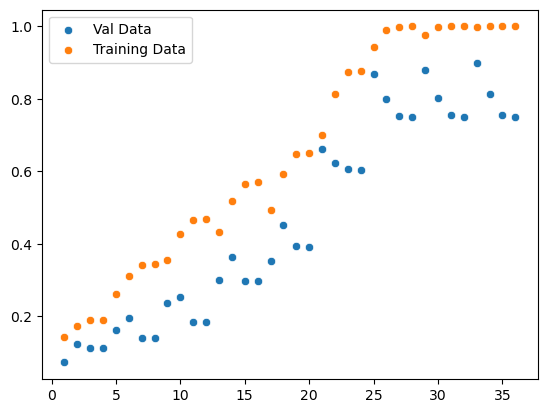
    


```python
importances = model4.feature_importances_
feature_importances = pd.Series(importances, index=X.columns).abs().sort_values(ascending=False)
feature_importances
```


    Phase_3_Presion_max         0.802841
    Phase_3_Presion_avg         0.065486
    Total_duration              0.050408
    Phase_3_Peso_avg            0.031786
    Phase_3_duration            0.026266
    Non_Value_Operating_Time    0.011948
    Day_Right                   0.007902
    Phase_2_Duration            0.001576
    Month                       0.001177
    Phase_1_Duration            0.000287
    Minutes                     0.000271
    Hour                        0.000051
    Phase_3_Visco_max           0.000000
    dtype: float64


```python
### way two###
feature_importances2 = feature_importances.index[0:2]
best_model_r2 = []
best_model_mse = []
best_model_r22 = []
best_model_mse2 = []

array = np.array([1, 2, 3, 4, 5, 10, 50, 100, 500])
array2 = np.array([1, 2, 5, 20])
time = 0

for i in range(0, len(array)):
    for j in range(0, len(array2)):
        time = time + 1
        model4 = GradientBoostingRegressor(n_estimators=array[i], max_depth=array2[j], random_state=1)
        model4.fit(X_train[feature_importances2], y_train)
        prediction4 = model4.predict(X_val[feature_importances2])
        prediction_under = model4.predict(X_train[feature_importances2])
        r22 = r2_score(y_val, prediction4)
        mse2 = mean_squared_error(y_val, prediction4)
        mse3 = mean_squared_error(y_train, prediction_under)
        r2_3 = r2_score(y_train, prediction_under)
        best_model_r2.append(r22)
        best_model_mse.append(mse2)
        best_model_r22.append(r2_3)
        best_model_mse2.append(mse3)
        print(array[i], array2[j], time, best_model_r2)
        

model4 = GradientBoostingRegressor(n_estimators=50, max_depth=2, random_state=1)
model4.fit(X_train[feature_importances2], y_train)
prediction4 = model4.predict(X_val[feature_importances2])
prediction4_two = model4.predict(X_train[feature_importances2])

mse2 = mean_squared_error(y_val, prediction4)
r2_2 = r2_score(y_val, prediction4)
mae = mean_absolute_error(y_val, prediction4)
mse3 = mean_squared_error(y_train, prediction4_two)
r2_3 = r2_score(y_train, prediction4_two)

### fitting ####
print(mse2)
print(r2_2)

### veryfing underfitting ###
print(mse3)
print(r2_3)
print(mae)
```

    1 1 1 [0.07247920773510719]
    1 2 2 [0.07247920773510719, 0.1460470635757315]
    1 5 3 [0.07247920773510719, 0.1460470635757315, 0.1464650285090221]
    1 20 4 [0.07247920773510719, 0.1460470635757315, 0.1464650285090221, 0.1477884587078655]
    2 1 5 [0.07247920773510719, 0.1460470635757315, 0.1464650285090221, 0.1477884587078655, 0.1626834407464195]
    2 2 6 [0.07247920773510719, 0.1460470635757315, 0.1464650285090221, 0.1477884587078655, 0.1626834407464195, 0.2936056222417237]
    2 5 7 [0.07247920773510719, 0.1460470635757315, 0.1464650285090221, 0.1477884587078655, 0.1626834407464195, 0.2936056222417237, 0.29409903728241804]
    2 20 8 [0.07247920773510719, 0.1460470635757315, 0.1464650285090221, 0.1477884587078655, 0.1626834407464195, 0.2936056222417237, 0.29409903728241804, 0.2960963298465017]
    3 1 9 [0.07247920773510719, 0.1460470635757315, 0.1464650285090221, 0.1477884587078655, 0.1626834407464195, 0.2936056222417237, 0.29409903728241804, 0.2960963298465017, 0.2374849081070901]
    3 2 10 [0.07247920773510719, 0.1460470635757315, 0.1464650285090221, 0.1477884587078655, 0.1626834407464195, 0.2936056222417237, 0.29409903728241804, 0.2960963298465017, 0.2374849081070901, 0.4128191461911016]
    3 5 11 [0.07247920773510719, 0.1460470635757315, 0.1464650285090221, 0.1477884587078655, 0.1626834407464195, 0.2936056222417237, 0.29409903728241804, 0.2960963298465017, 0.2374849081070901, 0.4128191461911016, 0.41436366791612855]
    3 20 12 [0.07247920773510719, 0.1460470635757315, 0.1464650285090221, 0.1477884587078655, 0.1626834407464195, 0.2936056222417237, 0.29409903728241804, 0.2960963298465017, 0.2374849081070901, 0.4128191461911016, 0.41436366791612855, 0.41564721508437497]
    4 1 13 [0.07247920773510719, 0.1460470635757315, 0.1464650285090221, 0.1477884587078655, 0.1626834407464195, 0.2936056222417237, 0.29409903728241804, 0.2960963298465017, 0.2374849081070901, 0.4128191461911016, 0.41436366791612855, 0.41564721508437497, 0.2996365314285899]
    4 2 14 [0.07247920773510719, 0.1460470635757315, 0.1464650285090221, 0.1477884587078655, 0.1626834407464195, 0.2936056222417237, 0.29409903728241804, 0.2960963298465017, 0.2374849081070901, 0.4128191461911016, 0.41436366791612855, 0.41564721508437497, 0.2996365314285899, 0.5091041360139351]
    4 5 15 [0.07247920773510719, 0.1460470635757315, 0.1464650285090221, 0.1477884587078655, 0.1626834407464195, 0.2936056222417237, 0.29409903728241804, 0.2960963298465017, 0.2374849081070901, 0.4128191461911016, 0.41436366791612855, 0.41564721508437497, 0.2996365314285899, 0.5091041360139351, 0.5122420083448003]
    4 20 16 [0.07247920773510719, 0.1460470635757315, 0.1464650285090221, 0.1477884587078655, 0.1626834407464195, 0.2936056222417237, 0.29409903728241804, 0.2960963298465017, 0.2374849081070901, 0.4128191461911016, 0.41436366791612855, 0.41564721508437497, 0.2996365314285899, 0.5091041360139351, 0.5122420083448003, 0.5116098628419998]
    5 1 17 [0.07247920773510719, 0.1460470635757315, 0.1464650285090221, 0.1477884587078655, 0.1626834407464195, 0.2936056222417237, 0.29409903728241804, 0.2960963298465017, 0.2374849081070901, 0.4128191461911016, 0.41436366791612855, 0.41564721508437497, 0.2996365314285899, 0.5091041360139351, 0.5122420083448003, 0.5116098628419998, 0.3513855376024255]
    5 2 18 [0.07247920773510719, 0.1460470635757315, 0.1464650285090221, 0.1477884587078655, 0.1626834407464195, 0.2936056222417237, 0.29409903728241804, 0.2960963298465017, 0.2374849081070901, 0.4128191461911016, 0.41436366791612855, 0.41564721508437497, 0.2996365314285899, 0.5091041360139351, 0.5122420083448003, 0.5116098628419998, 0.3513855376024255, 0.5864874113746612]
    5 5 19 [0.07247920773510719, 0.1460470635757315, 0.1464650285090221, 0.1477884587078655, 0.1626834407464195, 0.2936056222417237, 0.29409903728241804, 0.2960963298465017, 0.2374849081070901, 0.4128191461911016, 0.41436366791612855, 0.41564721508437497, 0.2996365314285899, 0.5091041360139351, 0.5122420083448003, 0.5116098628419998, 0.3513855376024255, 0.5864874113746612, 0.5894630270691312]
    5 20 20 [0.07247920773510719, 0.1460470635757315, 0.1464650285090221, 0.1477884587078655, 0.1626834407464195, 0.2936056222417237, 0.29409903728241804, 0.2960963298465017, 0.2374849081070901, 0.4128191461911016, 0.41436366791612855, 0.41564721508437497, 0.2996365314285899, 0.5091041360139351, 0.5122420083448003, 0.5116098628419998, 0.3513855376024255, 0.5864874113746612, 0.5894630270691312, 0.5887589907682659]
    10 1 21 [0.07247920773510719, 0.1460470635757315, 0.1464650285090221, 0.1477884587078655, 0.1626834407464195, 0.2936056222417237, 0.29409903728241804, 0.2960963298465017, 0.2374849081070901, 0.4128191461911016, 0.41436366791612855, 0.41564721508437497, 0.2996365314285899, 0.5091041360139351, 0.5122420083448003, 0.5116098628419998, 0.3513855376024255, 0.5864874113746612, 0.5894630270691312, 0.5887589907682659, 0.6620602717542801]
    10 2 22 [0.07247920773510719, 0.1460470635757315, 0.1464650285090221, 0.1477884587078655, 0.1626834407464195, 0.2936056222417237, 0.29409903728241804, 0.2960963298465017, 0.2374849081070901, 0.4128191461911016, 0.41436366791612855, 0.41564721508437497, 0.2996365314285899, 0.5091041360139351, 0.5122420083448003, 0.5116098628419998, 0.3513855376024255, 0.5864874113746612, 0.5894630270691312, 0.5887589907682659, 0.6620602717542801, 0.744936295180054]
    10 5 23 [0.07247920773510719, 0.1460470635757315, 0.1464650285090221, 0.1477884587078655, 0.1626834407464195, 0.2936056222417237, 0.29409903728241804, 0.2960963298465017, 0.2374849081070901, 0.4128191461911016, 0.41436366791612855, 0.41564721508437497, 0.2996365314285899, 0.5091041360139351, 0.5122420083448003, 0.5116098628419998, 0.3513855376024255, 0.5864874113746612, 0.5894630270691312, 0.5887589907682659, 0.6620602717542801, 0.744936295180054, 0.8072832416135735]
    10 20 24 [0.07247920773510719, 0.1460470635757315, 0.1464650285090221, 0.1477884587078655, 0.1626834407464195, 0.2936056222417237, 0.29409903728241804, 0.2960963298465017, 0.2374849081070901, 0.4128191461911016, 0.41436366791612855, 0.41564721508437497, 0.2996365314285899, 0.5091041360139351, 0.5122420083448003, 0.5116098628419998, 0.3513855376024255, 0.5864874113746612, 0.5894630270691312, 0.5887589907682659, 0.6620602717542801, 0.744936295180054, 0.8072832416135735, 0.797044947367071]
    50 1 25 [0.07247920773510719, 0.1460470635757315, 0.1464650285090221, 0.1477884587078655, 0.1626834407464195, 0.2936056222417237, 0.29409903728241804, 0.2960963298465017, 0.2374849081070901, 0.4128191461911016, 0.41436366791612855, 0.41564721508437497, 0.2996365314285899, 0.5091041360139351, 0.5122420083448003, 0.5116098628419998, 0.3513855376024255, 0.5864874113746612, 0.5894630270691312, 0.5887589907682659, 0.6620602717542801, 0.744936295180054, 0.8072832416135735, 0.797044947367071, 0.8996366992177413]
    50 2 26 [0.07247920773510719, 0.1460470635757315, 0.1464650285090221, 0.1477884587078655, 0.1626834407464195, 0.2936056222417237, 0.29409903728241804, 0.2960963298465017, 0.2374849081070901, 0.4128191461911016, 0.41436366791612855, 0.41564721508437497, 0.2996365314285899, 0.5091041360139351, 0.5122420083448003, 0.5116098628419998, 0.3513855376024255, 0.5864874113746612, 0.5894630270691312, 0.5887589907682659, 0.6620602717542801, 0.744936295180054, 0.8072832416135735, 0.797044947367071, 0.8996366992177413, 0.8980819506887716]
    50 5 27 [0.07247920773510719, 0.1460470635757315, 0.1464650285090221, 0.1477884587078655, 0.1626834407464195, 0.2936056222417237, 0.29409903728241804, 0.2960963298465017, 0.2374849081070901, 0.4128191461911016, 0.41436366791612855, 0.41564721508437497, 0.2996365314285899, 0.5091041360139351, 0.5122420083448003, 0.5116098628419998, 0.3513855376024255, 0.5864874113746612, 0.5894630270691312, 0.5887589907682659, 0.6620602717542801, 0.744936295180054, 0.8072832416135735, 0.797044947367071, 0.8996366992177413, 0.8980819506887716, 0.9179238955713733]
    50 20 28 [0.07247920773510719, 0.1460470635757315, 0.1464650285090221, 0.1477884587078655, 0.1626834407464195, 0.2936056222417237, 0.29409903728241804, 0.2960963298465017, 0.2374849081070901, 0.4128191461911016, 0.41436366791612855, 0.41564721508437497, 0.2996365314285899, 0.5091041360139351, 0.5122420083448003, 0.5116098628419998, 0.3513855376024255, 0.5864874113746612, 0.5894630270691312, 0.5887589907682659, 0.6620602717542801, 0.744936295180054, 0.8072832416135735, 0.797044947367071, 0.8996366992177413, 0.8980819506887716, 0.9179238955713733, 0.8874087926716957]
    100 1 29 [0.07247920773510719, 0.1460470635757315, 0.1464650285090221, 0.1477884587078655, 0.1626834407464195, 0.2936056222417237, 0.29409903728241804, 0.2960963298465017, 0.2374849081070901, 0.4128191461911016, 0.41436366791612855, 0.41564721508437497, 0.2996365314285899, 0.5091041360139351, 0.5122420083448003, 0.5116098628419998, 0.3513855376024255, 0.5864874113746612, 0.5894630270691312, 0.5887589907682659, 0.6620602717542801, 0.744936295180054, 0.8072832416135735, 0.797044947367071, 0.8996366992177413, 0.8980819506887716, 0.9179238955713733, 0.8874087926716957, 0.9037456346611344]
    100 2 30 [0.07247920773510719, 0.1460470635757315, 0.1464650285090221, 0.1477884587078655, 0.1626834407464195, 0.2936056222417237, 0.29409903728241804, 0.2960963298465017, 0.2374849081070901, 0.4128191461911016, 0.41436366791612855, 0.41564721508437497, 0.2996365314285899, 0.5091041360139351, 0.5122420083448003, 0.5116098628419998, 0.3513855376024255, 0.5864874113746612, 0.5894630270691312, 0.5887589907682659, 0.6620602717542801, 0.744936295180054, 0.8072832416135735, 0.797044947367071, 0.8996366992177413, 0.8980819506887716, 0.9179238955713733, 0.8874087926716957, 0.9037456346611344, 0.9001922318926375]
    100 5 31 [0.07247920773510719, 0.1460470635757315, 0.1464650285090221, 0.1477884587078655, 0.1626834407464195, 0.2936056222417237, 0.29409903728241804, 0.2960963298465017, 0.2374849081070901, 0.4128191461911016, 0.41436366791612855, 0.41564721508437497, 0.2996365314285899, 0.5091041360139351, 0.5122420083448003, 0.5116098628419998, 0.3513855376024255, 0.5864874113746612, 0.5894630270691312, 0.5887589907682659, 0.6620602717542801, 0.744936295180054, 0.8072832416135735, 0.797044947367071, 0.8996366992177413, 0.8980819506887716, 0.9179238955713733, 0.8874087926716957, 0.9037456346611344, 0.9001922318926375, 0.9173515415905272]
    100 20 32 [0.07247920773510719, 0.1460470635757315, 0.1464650285090221, 0.1477884587078655, 0.1626834407464195, 0.2936056222417237, 0.29409903728241804, 0.2960963298465017, 0.2374849081070901, 0.4128191461911016, 0.41436366791612855, 0.41564721508437497, 0.2996365314285899, 0.5091041360139351, 0.5122420083448003, 0.5116098628419998, 0.3513855376024255, 0.5864874113746612, 0.5894630270691312, 0.5887589907682659, 0.6620602717542801, 0.744936295180054, 0.8072832416135735, 0.797044947367071, 0.8996366992177413, 0.8980819506887716, 0.9179238955713733, 0.8874087926716957, 0.9037456346611344, 0.9001922318926375, 0.9173515415905272, 0.8869284303685658]
    500 1 33 [0.07247920773510719, 0.1460470635757315, 0.1464650285090221, 0.1477884587078655, 0.1626834407464195, 0.2936056222417237, 0.29409903728241804, 0.2960963298465017, 0.2374849081070901, 0.4128191461911016, 0.41436366791612855, 0.41564721508437497, 0.2996365314285899, 0.5091041360139351, 0.5122420083448003, 0.5116098628419998, 0.3513855376024255, 0.5864874113746612, 0.5894630270691312, 0.5887589907682659, 0.6620602717542801, 0.744936295180054, 0.8072832416135735, 0.797044947367071, 0.8996366992177413, 0.8980819506887716, 0.9179238955713733, 0.8874087926716957, 0.9037456346611344, 0.9001922318926375, 0.9173515415905272, 0.8869284303685658, 0.901035688421883]
    500 2 34 [0.07247920773510719, 0.1460470635757315, 0.1464650285090221, 0.1477884587078655, 0.1626834407464195, 0.2936056222417237, 0.29409903728241804, 0.2960963298465017, 0.2374849081070901, 0.4128191461911016, 0.41436366791612855, 0.41564721508437497, 0.2996365314285899, 0.5091041360139351, 0.5122420083448003, 0.5116098628419998, 0.3513855376024255, 0.5864874113746612, 0.5894630270691312, 0.5887589907682659, 0.6620602717542801, 0.744936295180054, 0.8072832416135735, 0.797044947367071, 0.8996366992177413, 0.8980819506887716, 0.9179238955713733, 0.8874087926716957, 0.9037456346611344, 0.9001922318926375, 0.9173515415905272, 0.8869284303685658, 0.901035688421883, 0.9005779869379269]
    500 5 35 [0.07247920773510719, 0.1460470635757315, 0.1464650285090221, 0.1477884587078655, 0.1626834407464195, 0.2936056222417237, 0.29409903728241804, 0.2960963298465017, 0.2374849081070901, 0.4128191461911016, 0.41436366791612855, 0.41564721508437497, 0.2996365314285899, 0.5091041360139351, 0.5122420083448003, 0.5116098628419998, 0.3513855376024255, 0.5864874113746612, 0.5894630270691312, 0.5887589907682659, 0.6620602717542801, 0.744936295180054, 0.8072832416135735, 0.797044947367071, 0.8996366992177413, 0.8980819506887716, 0.9179238955713733, 0.8874087926716957, 0.9037456346611344, 0.9001922318926375, 0.9173515415905272, 0.8869284303685658, 0.901035688421883, 0.9005779869379269, 0.9172068255448067]
    500 20 36 [0.07247920773510719, 0.1460470635757315, 0.1464650285090221, 0.1477884587078655, 0.1626834407464195, 0.2936056222417237, 0.29409903728241804, 0.2960963298465017, 0.2374849081070901, 0.4128191461911016, 0.41436366791612855, 0.41564721508437497, 0.2996365314285899, 0.5091041360139351, 0.5122420083448003, 0.5116098628419998, 0.3513855376024255, 0.5864874113746612, 0.5894630270691312, 0.5887589907682659, 0.6620602717542801, 0.744936295180054, 0.8072832416135735, 0.797044947367071, 0.8996366992177413, 0.8980819506887716, 0.9179238955713733, 0.8874087926716957, 0.9037456346611344, 0.9001922318926375, 0.9173515415905272, 0.8869284303685658, 0.901035688421883, 0.9005779869379269, 0.9172068255448067, 0.8869257983794098]
    40503434.52334335
    0.8980819506887716
    2827995.155609903
    0.9811851714653645
    3343.81328489349
    


```python
## loking to take the best combination - Val data more high fit and good training data - n_estimators=50, max_depth=2
# you need consult list created before
time = np.arange(1, len(best_model_r2) + 1)
sns.scatterplot(time, best_model_r2, label='Val Data')
sns.scatterplot(time, best_model_r22, label='Training Data')
```

    C:\Users\emers\Anaconda3\lib\site-packages\seaborn\_decorators.py:36: FutureWarning: Pass the following variables as keyword args: x, y. From version 0.12, the only valid positional argument will be `data`, and passing other arguments without an explicit keyword will result in an error or misinterpretation.
      warnings.warn(
    C:\Users\emers\Anaconda3\lib\site-packages\seaborn\_decorators.py:36: FutureWarning: Pass the following variables as keyword args: x, y. From version 0.12, the only valid positional argument will be `data`, and passing other arguments without an explicit keyword will result in an error or misinterpretation.
      warnings.warn(
    


    <AxesSubplot:>


    
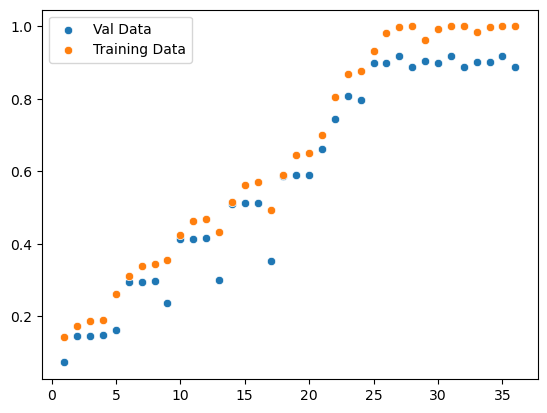
    


```python
### neural network - testing ###
#scaler = StandardScaler()
#scaler = MinMaxScaler()
#X_train_transformed = scaler.fit_transform(X_train)
#X_train = pd.DataFrame(X_train_transformed, columns=X.columns)
#X_train

model = Sequential([
    Dense(units=1024, input_dim=X_train.shape[1], activation='relu'),
    Dropout(0.2),
    Dense(units=512, activation='relu', kernel_regularizer=regularizers.l2(0.01)),
    Dropout(0.2),
    Dense(units=256, activation='relu', kernel_regularizer=regularizers.l2(0.01)),
    Dropout(0.2),
    Dense(units=64, activation='relu', kernel_regularizer=regularizers.l2(0.01)),
    Dense(units=1, activation='linear')
])

model.compile(optimizer=Adam(lr=0.001), loss='mean_squared_error', metrics=['mean_absolute_error'])

history = model.fit(X_train, y_train, epochs=100, batch_size=32, validation_data=(X_val, y_val))
```

    Epoch 1/100
    

    C:\Users\emers\Anaconda3\lib\site-packages\keras\optimizers\legacy\adam.py:117: UserWarning: The `lr` argument is deprecated, use `learning_rate` instead.
      super().__init__(name, **kwargs)
    

    3/3 [==============================] - 1s 182ms/step - loss: 2285501696.0000 - mean_absolute_error: 45312.0000 - val_loss: 736342528.0000 - val_mean_absolute_error: 23970.0156
    Epoch 2/100
    3/3 [==============================] - 0s 63ms/step - loss: 2497787648.0000 - mean_absolute_error: 28209.2793 - val_loss: 826622144.0000 - val_mean_absolute_error: 23287.9434
    Epoch 3/100
    3/3 [==============================] - 0s 38ms/step - loss: 1100388224.0000 - mean_absolute_error: 25908.0293 - val_loss: 665568320.0000 - val_mean_absolute_error: 22471.2168
    Epoch 4/100
    3/3 [==============================] - 0s 38ms/step - loss: 1037684352.0000 - mean_absolute_error: 27714.0059 - val_loss: 754251712.0000 - val_mean_absolute_error: 23781.2441
    Epoch 5/100
    3/3 [==============================] - 0s 34ms/step - loss: 893220096.0000 - mean_absolute_error: 26545.2832 - val_loss: 584307072.0000 - val_mean_absolute_error: 20068.9609
    Epoch 6/100
    3/3 [==============================] - 0s 27ms/step - loss: 843191040.0000 - mean_absolute_error: 24992.3047 - val_loss: 609522112.0000 - val_mean_absolute_error: 20697.2031
    Epoch 7/100
    3/3 [==============================] - 0s 30ms/step - loss: 709371328.0000 - mean_absolute_error: 22284.2188 - val_loss: 559752320.0000 - val_mean_absolute_error: 19796.1328
    Epoch 8/100
    3/3 [==============================] - 0s 32ms/step - loss: 628393024.0000 - mean_absolute_error: 21698.5176 - val_loss: 540811776.0000 - val_mean_absolute_error: 19690.8711
    Epoch 9/100
    3/3 [==============================] - 0s 33ms/step - loss: 581759744.0000 - mean_absolute_error: 21014.6758 - val_loss: 538516288.0000 - val_mean_absolute_error: 19801.0059
    Epoch 10/100
    3/3 [==============================] - 0s 24ms/step - loss: 506327872.0000 - mean_absolute_error: 18593.2793 - val_loss: 615323200.0000 - val_mean_absolute_error: 19656.9180
    Epoch 11/100
    3/3 [==============================] - 0s 31ms/step - loss: 526547680.0000 - mean_absolute_error: 16772.7676 - val_loss: 619293120.0000 - val_mean_absolute_error: 19314.8418
    Epoch 12/100
    3/3 [==============================] - 0s 34ms/step - loss: 417400640.0000 - mean_absolute_error: 15600.8320 - val_loss: 541412800.0000 - val_mean_absolute_error: 19468.2285
    Epoch 13/100
    3/3 [==============================] - 0s 33ms/step - loss: 393137888.0000 - mean_absolute_error: 16057.2842 - val_loss: 592248000.0000 - val_mean_absolute_error: 18413.8672
    Epoch 14/100
    3/3 [==============================] - 0s 29ms/step - loss: 346245120.0000 - mean_absolute_error: 14147.8438 - val_loss: 763443392.0000 - val_mean_absolute_error: 19057.3887
    Epoch 15/100
    3/3 [==============================] - 0s 32ms/step - loss: 338251296.0000 - mean_absolute_error: 13055.1904 - val_loss: 638573440.0000 - val_mean_absolute_error: 18544.6738
    Epoch 16/100
    3/3 [==============================] - 0s 32ms/step - loss: 351440416.0000 - mean_absolute_error: 14427.4287 - val_loss: 639692352.0000 - val_mean_absolute_error: 18361.3965
    Epoch 17/100
    3/3 [==============================] - 0s 30ms/step - loss: 277369312.0000 - mean_absolute_error: 12123.5244 - val_loss: 832057792.0000 - val_mean_absolute_error: 18250.9668
    Epoch 18/100
    3/3 [==============================] - 0s 32ms/step - loss: 289600832.0000 - mean_absolute_error: 12127.6885 - val_loss: 608569728.0000 - val_mean_absolute_error: 16585.0684
    Epoch 19/100
    3/3 [==============================] - 0s 35ms/step - loss: 252381584.0000 - mean_absolute_error: 11851.3633 - val_loss: 571222912.0000 - val_mean_absolute_error: 16708.8457
    Epoch 20/100
    3/3 [==============================] - 0s 31ms/step - loss: 213850512.0000 - mean_absolute_error: 11096.5459 - val_loss: 631663168.0000 - val_mean_absolute_error: 15833.2373
    Epoch 21/100
    3/3 [==============================] - 0s 30ms/step - loss: 195624704.0000 - mean_absolute_error: 10348.0342 - val_loss: 776281856.0000 - val_mean_absolute_error: 16209.0830
    Epoch 22/100
    3/3 [==============================] - 0s 33ms/step - loss: 176917664.0000 - mean_absolute_error: 10120.3594 - val_loss: 652858624.0000 - val_mean_absolute_error: 16411.1113
    Epoch 23/100
    3/3 [==============================] - 0s 34ms/step - loss: 180840640.0000 - mean_absolute_error: 10576.1689 - val_loss: 734411136.0000 - val_mean_absolute_error: 16287.1523
    Epoch 24/100
    3/3 [==============================] - 0s 36ms/step - loss: 195740912.0000 - mean_absolute_error: 10735.9434 - val_loss: 802370368.0000 - val_mean_absolute_error: 15246.8721
    Epoch 25/100
    3/3 [==============================] - 0s 28ms/step - loss: 240411376.0000 - mean_absolute_error: 11233.6211 - val_loss: 555632768.0000 - val_mean_absolute_error: 16101.6641
    Epoch 26/100
    3/3 [==============================] - 0s 32ms/step - loss: 189159824.0000 - mean_absolute_error: 11028.0645 - val_loss: 584573376.0000 - val_mean_absolute_error: 14196.8350
    Epoch 27/100
    3/3 [==============================] - 0s 33ms/step - loss: 196127984.0000 - mean_absolute_error: 10431.6621 - val_loss: 613245568.0000 - val_mean_absolute_error: 14687.7842
    Epoch 28/100
    3/3 [==============================] - 0s 32ms/step - loss: 179592912.0000 - mean_absolute_error: 10762.0596 - val_loss: 525573152.0000 - val_mean_absolute_error: 14525.9580
    Epoch 29/100
    3/3 [==============================] - 0s 30ms/step - loss: 152193984.0000 - mean_absolute_error: 9360.6338 - val_loss: 599247424.0000 - val_mean_absolute_error: 14492.2998
    Epoch 30/100
    3/3 [==============================] - 0s 35ms/step - loss: 153413952.0000 - mean_absolute_error: 9330.2354 - val_loss: 740493888.0000 - val_mean_absolute_error: 14269.6494
    Epoch 31/100
    3/3 [==============================] - 0s 28ms/step - loss: 180905744.0000 - mean_absolute_error: 10327.6719 - val_loss: 600345216.0000 - val_mean_absolute_error: 14877.1084
    Epoch 32/100
    3/3 [==============================] - 0s 33ms/step - loss: 179380560.0000 - mean_absolute_error: 10107.6055 - val_loss: 567012800.0000 - val_mean_absolute_error: 14708.4893
    Epoch 33/100
    3/3 [==============================] - 0s 31ms/step - loss: 159059216.0000 - mean_absolute_error: 9573.6094 - val_loss: 640812800.0000 - val_mean_absolute_error: 14173.3027
    Epoch 34/100
    3/3 [==============================] - 0s 36ms/step - loss: 174267840.0000 - mean_absolute_error: 10060.7803 - val_loss: 541082752.0000 - val_mean_absolute_error: 14116.1260
    Epoch 35/100
    3/3 [==============================] - 0s 29ms/step - loss: 143160480.0000 - mean_absolute_error: 9226.5684 - val_loss: 555968768.0000 - val_mean_absolute_error: 14491.2422
    Epoch 36/100
    3/3 [==============================] - 0s 30ms/step - loss: 161856704.0000 - mean_absolute_error: 9631.8623 - val_loss: 766890432.0000 - val_mean_absolute_error: 15298.3330
    Epoch 37/100
    3/3 [==============================] - 0s 26ms/step - loss: 160960224.0000 - mean_absolute_error: 9345.8779 - val_loss: 581789312.0000 - val_mean_absolute_error: 14652.7432
    Epoch 38/100
    3/3 [==============================] - 0s 26ms/step - loss: 158803360.0000 - mean_absolute_error: 9779.7041 - val_loss: 603863680.0000 - val_mean_absolute_error: 14866.1309
    Epoch 39/100
    3/3 [==============================] - 0s 26ms/step - loss: 146918800.0000 - mean_absolute_error: 9148.0938 - val_loss: 761343488.0000 - val_mean_absolute_error: 14520.2480
    Epoch 40/100
    3/3 [==============================] - 0s 27ms/step - loss: 144172448.0000 - mean_absolute_error: 9139.8896 - val_loss: 626589184.0000 - val_mean_absolute_error: 14348.0029
    Epoch 41/100
    3/3 [==============================] - 0s 27ms/step - loss: 151361168.0000 - mean_absolute_error: 9520.1445 - val_loss: 623265216.0000 - val_mean_absolute_error: 14358.8779
    Epoch 42/100
    3/3 [==============================] - 0s 27ms/step - loss: 153002736.0000 - mean_absolute_error: 9223.8135 - val_loss: 540984256.0000 - val_mean_absolute_error: 14497.7197
    Epoch 43/100
    3/3 [==============================] - 0s 29ms/step - loss: 134654864.0000 - mean_absolute_error: 8508.0303 - val_loss: 593403712.0000 - val_mean_absolute_error: 14199.5801
    Epoch 44/100
    3/3 [==============================] - 0s 34ms/step - loss: 145205808.0000 - mean_absolute_error: 8935.1475 - val_loss: 580249472.0000 - val_mean_absolute_error: 14328.1992
    Epoch 45/100
    3/3 [==============================] - 0s 27ms/step - loss: 147761168.0000 - mean_absolute_error: 8985.3301 - val_loss: 610477696.0000 - val_mean_absolute_error: 14391.2148
    Epoch 46/100
    3/3 [==============================] - 0s 26ms/step - loss: 141932368.0000 - mean_absolute_error: 9049.2939 - val_loss: 577451520.0000 - val_mean_absolute_error: 14578.8408
    Epoch 47/100
    3/3 [==============================] - 0s 25ms/step - loss: 141494592.0000 - mean_absolute_error: 8624.6104 - val_loss: 620213440.0000 - val_mean_absolute_error: 13801.3652
    Epoch 48/100
    3/3 [==============================] - 0s 26ms/step - loss: 119515440.0000 - mean_absolute_error: 8426.1162 - val_loss: 587826112.0000 - val_mean_absolute_error: 13580.2998
    Epoch 49/100
    3/3 [==============================] - 0s 26ms/step - loss: 120721384.0000 - mean_absolute_error: 8060.9546 - val_loss: 592967168.0000 - val_mean_absolute_error: 13667.3301
    Epoch 50/100
    3/3 [==============================] - 0s 26ms/step - loss: 128091344.0000 - mean_absolute_error: 8808.1035 - val_loss: 685652544.0000 - val_mean_absolute_error: 14202.9443
    Epoch 51/100
    3/3 [==============================] - 0s 27ms/step - loss: 126786144.0000 - mean_absolute_error: 8655.1006 - val_loss: 649712512.0000 - val_mean_absolute_error: 14376.4473
    Epoch 52/100
    3/3 [==============================] - 0s 27ms/step - loss: 142672480.0000 - mean_absolute_error: 9134.1992 - val_loss: 598013376.0000 - val_mean_absolute_error: 14593.9395
    Epoch 53/100
    3/3 [==============================] - 0s 27ms/step - loss: 110574048.0000 - mean_absolute_error: 8090.5171 - val_loss: 656917696.0000 - val_mean_absolute_error: 13972.1553
    Epoch 54/100
    3/3 [==============================] - 0s 27ms/step - loss: 127381728.0000 - mean_absolute_error: 8716.3965 - val_loss: 609467584.0000 - val_mean_absolute_error: 13812.2148
    Epoch 55/100
    3/3 [==============================] - 0s 26ms/step - loss: 107737608.0000 - mean_absolute_error: 7963.7402 - val_loss: 654360768.0000 - val_mean_absolute_error: 14216.1387
    Epoch 56/100
    3/3 [==============================] - 0s 26ms/step - loss: 103164160.0000 - mean_absolute_error: 7832.1748 - val_loss: 679174272.0000 - val_mean_absolute_error: 14445.4570
    Epoch 57/100
    3/3 [==============================] - 0s 27ms/step - loss: 107022216.0000 - mean_absolute_error: 7542.2310 - val_loss: 598306560.0000 - val_mean_absolute_error: 15135.1494
    Epoch 58/100
    3/3 [==============================] - 0s 28ms/step - loss: 126711224.0000 - mean_absolute_error: 8715.4717 - val_loss: 673716416.0000 - val_mean_absolute_error: 14131.7617
    Epoch 59/100
    3/3 [==============================] - 0s 26ms/step - loss: 140651840.0000 - mean_absolute_error: 9083.0518 - val_loss: 690152896.0000 - val_mean_absolute_error: 14032.4971
    Epoch 60/100
    3/3 [==============================] - 0s 27ms/step - loss: 112588152.0000 - mean_absolute_error: 8306.9307 - val_loss: 503089600.0000 - val_mean_absolute_error: 15290.9717
    Epoch 61/100
    3/3 [==============================] - 0s 25ms/step - loss: 113508248.0000 - mean_absolute_error: 7618.6099 - val_loss: 647296256.0000 - val_mean_absolute_error: 13905.2432
    Epoch 62/100
    3/3 [==============================] - 0s 29ms/step - loss: 120732384.0000 - mean_absolute_error: 8160.4902 - val_loss: 687088832.0000 - val_mean_absolute_error: 14448.9170
    Epoch 63/100
    3/3 [==============================] - 0s 26ms/step - loss: 131057592.0000 - mean_absolute_error: 8775.9775 - val_loss: 613977600.0000 - val_mean_absolute_error: 15603.2109
    Epoch 64/100
    3/3 [==============================] - 0s 32ms/step - loss: 108221048.0000 - mean_absolute_error: 7835.5356 - val_loss: 711007552.0000 - val_mean_absolute_error: 14493.4355
    Epoch 65/100
    3/3 [==============================] - 0s 29ms/step - loss: 117514360.0000 - mean_absolute_error: 8221.8994 - val_loss: 577083968.0000 - val_mean_absolute_error: 14089.8613
    Epoch 66/100
    3/3 [==============================] - 0s 26ms/step - loss: 125020296.0000 - mean_absolute_error: 8047.9434 - val_loss: 571749696.0000 - val_mean_absolute_error: 13973.4609
    Epoch 67/100
    3/3 [==============================] - 0s 26ms/step - loss: 112066144.0000 - mean_absolute_error: 7817.2261 - val_loss: 626769408.0000 - val_mean_absolute_error: 14201.1309
    Epoch 68/100
    3/3 [==============================] - 0s 26ms/step - loss: 114609872.0000 - mean_absolute_error: 8190.3394 - val_loss: 815031360.0000 - val_mean_absolute_error: 15273.3428
    Epoch 69/100
    3/3 [==============================] - 0s 27ms/step - loss: 153264672.0000 - mean_absolute_error: 9374.0303 - val_loss: 587447424.0000 - val_mean_absolute_error: 16205.1357
    Epoch 70/100
    3/3 [==============================] - 0s 28ms/step - loss: 149014976.0000 - mean_absolute_error: 9781.2129 - val_loss: 529162528.0000 - val_mean_absolute_error: 15104.2012
    Epoch 71/100
    3/3 [==============================] - 0s 27ms/step - loss: 135318080.0000 - mean_absolute_error: 8732.0352 - val_loss: 845253376.0000 - val_mean_absolute_error: 17482.6074
    Epoch 72/100
    3/3 [==============================] - 0s 30ms/step - loss: 151478288.0000 - mean_absolute_error: 9040.0957 - val_loss: 574165888.0000 - val_mean_absolute_error: 15511.9561
    Epoch 73/100
    3/3 [==============================] - 0s 28ms/step - loss: 118118152.0000 - mean_absolute_error: 8391.0938 - val_loss: 599998656.0000 - val_mean_absolute_error: 15985.7109
    Epoch 74/100
    3/3 [==============================] - 0s 26ms/step - loss: 116492592.0000 - mean_absolute_error: 8495.1133 - val_loss: 825371712.0000 - val_mean_absolute_error: 15298.9443
    Epoch 75/100
    3/3 [==============================] - 0s 26ms/step - loss: 122865992.0000 - mean_absolute_error: 8470.7744 - val_loss: 608401984.0000 - val_mean_absolute_error: 15502.5654
    Epoch 76/100
    3/3 [==============================] - 0s 27ms/step - loss: 118592024.0000 - mean_absolute_error: 8080.3169 - val_loss: 629882368.0000 - val_mean_absolute_error: 15091.5713
    Epoch 77/100
    3/3 [==============================] - 0s 27ms/step - loss: 104458600.0000 - mean_absolute_error: 7924.7114 - val_loss: 691322496.0000 - val_mean_absolute_error: 14625.4873
    Epoch 78/100
    3/3 [==============================] - 0s 26ms/step - loss: 101322832.0000 - mean_absolute_error: 7679.8750 - val_loss: 582446528.0000 - val_mean_absolute_error: 15306.9062
    Epoch 79/100
    3/3 [==============================] - 0s 27ms/step - loss: 103802624.0000 - mean_absolute_error: 7958.8174 - val_loss: 702240640.0000 - val_mean_absolute_error: 14747.4609
    Epoch 80/100
    3/3 [==============================] - 0s 25ms/step - loss: 98157728.0000 - mean_absolute_error: 7359.4238 - val_loss: 788472576.0000 - val_mean_absolute_error: 15575.0039
    Epoch 81/100
    3/3 [==============================] - 0s 26ms/step - loss: 114532888.0000 - mean_absolute_error: 7990.7686 - val_loss: 579247616.0000 - val_mean_absolute_error: 16199.6543
    Epoch 82/100
    3/3 [==============================] - 0s 25ms/step - loss: 129464424.0000 - mean_absolute_error: 9324.1396 - val_loss: 634686592.0000 - val_mean_absolute_error: 15348.4805
    Epoch 83/100
    3/3 [==============================] - 0s 25ms/step - loss: 87245152.0000 - mean_absolute_error: 6813.3779 - val_loss: 873981376.0000 - val_mean_absolute_error: 16043.7070
    Epoch 84/100
    3/3 [==============================] - 0s 26ms/step - loss: 88214520.0000 - mean_absolute_error: 7127.8208 - val_loss: 599737024.0000 - val_mean_absolute_error: 15853.1484
    Epoch 85/100
    3/3 [==============================] - 0s 26ms/step - loss: 118881584.0000 - mean_absolute_error: 8543.3506 - val_loss: 580988800.0000 - val_mean_absolute_error: 16475.1230
    Epoch 86/100
    3/3 [==============================] - 0s 29ms/step - loss: 80155552.0000 - mean_absolute_error: 7045.5830 - val_loss: 797188288.0000 - val_mean_absolute_error: 15093.0928
    Epoch 87/100
    3/3 [==============================] - 0s 31ms/step - loss: 84449400.0000 - mean_absolute_error: 7437.7036 - val_loss: 702735744.0000 - val_mean_absolute_error: 14563.1777
    Epoch 88/100
    3/3 [==============================] - 0s 26ms/step - loss: 106396880.0000 - mean_absolute_error: 8081.9561 - val_loss: 554971648.0000 - val_mean_absolute_error: 16037.6387
    Epoch 89/100
    3/3 [==============================] - 0s 27ms/step - loss: 83888008.0000 - mean_absolute_error: 7076.0610 - val_loss: 796271680.0000 - val_mean_absolute_error: 15398.5791
    Epoch 90/100
    3/3 [==============================] - 0s 33ms/step - loss: 103460320.0000 - mean_absolute_error: 7682.5547 - val_loss: 771029632.0000 - val_mean_absolute_error: 15565.3691
    Epoch 91/100
    3/3 [==============================] - 0s 30ms/step - loss: 103914160.0000 - mean_absolute_error: 8372.2959 - val_loss: 637435456.0000 - val_mean_absolute_error: 15878.2412
    Epoch 92/100
    3/3 [==============================] - 0s 30ms/step - loss: 84201488.0000 - mean_absolute_error: 6941.3823 - val_loss: 794832960.0000 - val_mean_absolute_error: 15632.0703
    Epoch 93/100
    3/3 [==============================] - 0s 27ms/step - loss: 97746080.0000 - mean_absolute_error: 7725.5327 - val_loss: 820916736.0000 - val_mean_absolute_error: 16029.3271
    Epoch 94/100
    3/3 [==============================] - 0s 26ms/step - loss: 104901240.0000 - mean_absolute_error: 7862.6704 - val_loss: 747398272.0000 - val_mean_absolute_error: 16321.5713
    Epoch 95/100
    3/3 [==============================] - 0s 26ms/step - loss: 109345328.0000 - mean_absolute_error: 8341.2305 - val_loss: 705152960.0000 - val_mean_absolute_error: 15007.9199
    Epoch 96/100
    3/3 [==============================] - 0s 26ms/step - loss: 86633352.0000 - mean_absolute_error: 7502.7061 - val_loss: 605878080.0000 - val_mean_absolute_error: 14375.7979
    Epoch 97/100
    3/3 [==============================] - 0s 26ms/step - loss: 95949800.0000 - mean_absolute_error: 7607.3511 - val_loss: 563005248.0000 - val_mean_absolute_error: 14415.4619
    Epoch 98/100
    3/3 [==============================] - 0s 26ms/step - loss: 100400760.0000 - mean_absolute_error: 7726.2246 - val_loss: 639339200.0000 - val_mean_absolute_error: 14457.3105
    Epoch 99/100
    3/3 [==============================] - 0s 26ms/step - loss: 89359176.0000 - mean_absolute_error: 6940.3936 - val_loss: 614802624.0000 - val_mean_absolute_error: 14888.7949
    Epoch 100/100
    3/3 [==============================] - 0s 30ms/step - loss: 87571664.0000 - mean_absolute_error: 7607.5435 - val_loss: 718398400.0000 - val_mean_absolute_error: 15229.3574
    


```python
plt.plot(history.history['loss'], label='Train Loss')
plt.plot(history.history['val_loss'], label='Validation Loss')
plt.xlabel('Epochs')
plt.ylabel('Loss')
plt.legend()
plt.show()
```


    
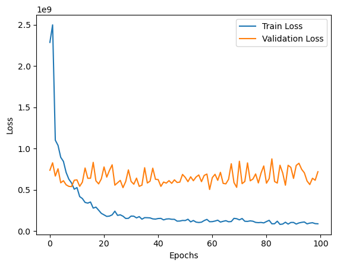
    


```python
#### we chose a best model - best accuracy and mse, but without having much variables (parsimony principle)
# 98% of r2 and low mse / mae, good job!
feature_importances_final = ['Phase_3_Presion_max', 'Phase_3_Presion_avg']

X_train_val = pd.concat([X_train, X_val], axis=0)
y_train_val = pd.concat([y_train, y_val], axis=0)

model_final = GradientBoostingRegressor(n_estimators=50, max_depth=2, random_state=1)
model_final.fit(X_train_val[feature_importances_final], y_train_val)
prediction_final = model_final.predict(X_test[feature_importances_final])

mse = mean_squared_error(y_test, prediction_final)
r2 = r2_score(y_test, prediction_final)
mae = mean_absolute_error(y_test, prediction_final)

print(mse)
print(r2)
print(mae)

#joblib.dump(model_final, 'model_final.joblib') #send to prodution
```

    3435853.20398245
    0.9804202492339659
    1328.810782421315
    

## 3 - Organizing data to be used by data analyst: Analysis of Batch Cycle Time


```python
#### first way using original data ####
## daling with datetime and excluing one variable
variables_major_than_one = unique[unique > 1].index.tolist()
variables_equal_than_one = unique[unique == 1].index.tolist()
sub_data_general = data.loc[:, variables_major_than_one]
sub_data_general.columns = ["Batch_ID", "Model_State", "Phase_Number_Name_Metric", "Day_Time", "Phase_Values"]
sub_data_general['Day_Time'] = pd.to_datetime(sub_data_general['Day_Time'], format='%Y-%m-%d %H:%M:%S')
sub_data_general['Day'] = sub_data_general['Day_Time'].dt.date
sub_data_general['Day'] = pd.to_datetime(sub_data_general['Day'])
sub_data_general['Hour'] = sub_data_general['Day_Time'].dt.strftime('%H')
sub_data_general = sub_data_general.drop(columns="Model_State")
sub_data_general
```


<div>
<style scoped>
    .dataframe tbody tr th:only-of-type {
        vertical-align: middle;
    }

    .dataframe tbody tr th {
        vertical-align: top;
    }

    .dataframe thead th {
        text-align: right;
    }
</style>
<table border="1" class="dataframe">
  <thead>
    <tr style="text-align: right;">
      <th></th>
      <th>Batch_ID</th>
      <th>Phase_Number_Name_Metric</th>
      <th>Day_Time</th>
      <th>Phase_Values</th>
      <th>Day</th>
      <th>Hour</th>
    </tr>
  </thead>
  <tbody>
    <tr>
      <th>0</th>
      <td>44168</td>
      <td>non_value_operating_time</td>
      <td>2023-02-11 10:19:25</td>
      <td>3560.000000</td>
      <td>2023-02-11</td>
      <td>10</td>
    </tr>
    <tr>
      <th>1</th>
      <td>44168</td>
      <td>non_value_operating_time</td>
      <td>2023-02-11 20:49:30</td>
      <td>300.000000</td>
      <td>2023-02-11</td>
      <td>20</td>
    </tr>
    <tr>
      <th>2</th>
      <td>44168</td>
      <td>non_value_operating_time</td>
      <td>2023-02-12 04:28:05</td>
      <td>190.000000</td>
      <td>2023-02-12</td>
      <td>04</td>
    </tr>
    <tr>
      <th>3</th>
      <td>44168</td>
      <td>non_value_operating_time</td>
      <td>2023-02-12 07:41:10</td>
      <td>140.000000</td>
      <td>2023-02-12</td>
      <td>07</td>
    </tr>
    <tr>
      <th>4</th>
      <td>44168</td>
      <td>non_value_operating_time</td>
      <td>2023-02-12 15:19:00</td>
      <td>640.000000</td>
      <td>2023-02-12</td>
      <td>15</td>
    </tr>
    <tr>
      <th>...</th>
      <td>...</td>
      <td>...</td>
      <td>...</td>
      <td>...</td>
      <td>...</td>
      <td>...</td>
    </tr>
    <tr>
      <th>3641</th>
      <td>47268</td>
      <td>phase_3.Recirculacion.Densidad_max</td>
      <td>2023-03-31 14:27:10</td>
      <td>58287.598000</td>
      <td>2023-03-31</td>
      <td>14</td>
    </tr>
    <tr>
      <th>3642</th>
      <td>47268</td>
      <td>phase_3.Recirculacion.Presion_avg</td>
      <td>2023-03-31 14:27:10</td>
      <td>2.977007</td>
      <td>2023-03-31</td>
      <td>14</td>
    </tr>
    <tr>
      <th>3643</th>
      <td>47268</td>
      <td>phase_3.Recirculacion.Presion_max</td>
      <td>2023-03-31 14:27:10</td>
      <td>2.989005</td>
      <td>2023-03-31</td>
      <td>14</td>
    </tr>
    <tr>
      <th>3644</th>
      <td>47268</td>
      <td>phase_3.Recirculacion.Visco_max</td>
      <td>2023-03-31 14:27:10</td>
      <td>0.000000</td>
      <td>2023-03-31</td>
      <td>14</td>
    </tr>
    <tr>
      <th>3645</th>
      <td>47268</td>
      <td>total_duration</td>
      <td>2023-03-31 14:32:20</td>
      <td>10545.000000</td>
      <td>2023-03-31</td>
      <td>14</td>
    </tr>
  </tbody>
</table>
<p>3646 rows × 6 columns</p>
</div>


```python
### changing factor levels or classes from phase column ###
sub_data_general.loc[sub_data_general["Phase_Number_Name_Metric"] == "non_value_operating_time", "Phase_Number_Name_Metric"] = "Phase_0_Duration_OperatingTime"
sub_data_general.loc[sub_data_general["Phase_Number_Name_Metric"] == "phase_1.Inicio.duration", "Phase_Number_Name_Metric"] = "Phase_1_Duration_Inicio"
sub_data_general.loc[sub_data_general["Phase_Number_Name_Metric"] == "phase_2.Medicion.duration", "Phase_Number_Name_Metric"] = "Phase_2_Duration_Medicion"
sub_data_general.loc[sub_data_general["Phase_Number_Name_Metric"] == "phase_3.Recirculacion.duration", "Phase_Number_Name_Metric"] = "Phase_3_Duration_Recirculacion"
sub_data_general.loc[sub_data_general["Phase_Number_Name_Metric"] == "total_duration", "Phase_Number_Name_Metric"] = "Phase_0123_Duration_Global"
```


```python
### only duration classes ###
data_information_only_time = sub_data_general[sub_data_general['Phase_Number_Name_Metric'].str.contains("Duration", regex=True)]
data_information_only_time
```


<div>
<style scoped>
    .dataframe tbody tr th:only-of-type {
        vertical-align: middle;
    }

    .dataframe tbody tr th {
        vertical-align: top;
    }

    .dataframe thead th {
        text-align: right;
    }
</style>
<table border="1" class="dataframe">
  <thead>
    <tr style="text-align: right;">
      <th></th>
      <th>Batch_ID</th>
      <th>Phase_Number_Name_Metric</th>
      <th>Day_Time</th>
      <th>Phase_Values</th>
      <th>Day</th>
      <th>Hour</th>
    </tr>
  </thead>
  <tbody>
    <tr>
      <th>0</th>
      <td>44168</td>
      <td>Phase_0_Duration_OperatingTime</td>
      <td>2023-02-11 10:19:25</td>
      <td>3560.0</td>
      <td>2023-02-11</td>
      <td>10</td>
    </tr>
    <tr>
      <th>1</th>
      <td>44168</td>
      <td>Phase_0_Duration_OperatingTime</td>
      <td>2023-02-11 20:49:30</td>
      <td>300.0</td>
      <td>2023-02-11</td>
      <td>20</td>
    </tr>
    <tr>
      <th>2</th>
      <td>44168</td>
      <td>Phase_0_Duration_OperatingTime</td>
      <td>2023-02-12 04:28:05</td>
      <td>190.0</td>
      <td>2023-02-12</td>
      <td>04</td>
    </tr>
    <tr>
      <th>3</th>
      <td>44168</td>
      <td>Phase_0_Duration_OperatingTime</td>
      <td>2023-02-12 07:41:10</td>
      <td>140.0</td>
      <td>2023-02-12</td>
      <td>07</td>
    </tr>
    <tr>
      <th>4</th>
      <td>44168</td>
      <td>Phase_0_Duration_OperatingTime</td>
      <td>2023-02-12 15:19:00</td>
      <td>640.0</td>
      <td>2023-02-12</td>
      <td>15</td>
    </tr>
    <tr>
      <th>...</th>
      <td>...</td>
      <td>...</td>
      <td>...</td>
      <td>...</td>
      <td>...</td>
      <td>...</td>
    </tr>
    <tr>
      <th>3636</th>
      <td>47268</td>
      <td>Phase_0_Duration_OperatingTime</td>
      <td>2023-03-31 11:34:00</td>
      <td>155.0</td>
      <td>2023-03-31</td>
      <td>11</td>
    </tr>
    <tr>
      <th>3637</th>
      <td>47268</td>
      <td>Phase_1_Duration_Inicio</td>
      <td>2023-03-31 11:36:35</td>
      <td>115.0</td>
      <td>2023-03-31</td>
      <td>11</td>
    </tr>
    <tr>
      <th>3638</th>
      <td>47268</td>
      <td>Phase_2_Duration_Medicion</td>
      <td>2023-03-31 11:38:30</td>
      <td>10120.0</td>
      <td>2023-03-31</td>
      <td>11</td>
    </tr>
    <tr>
      <th>3639</th>
      <td>47268</td>
      <td>Phase_3_Duration_Recirculacion</td>
      <td>2023-03-31 14:27:10</td>
      <td>310.0</td>
      <td>2023-03-31</td>
      <td>14</td>
    </tr>
    <tr>
      <th>3645</th>
      <td>47268</td>
      <td>Phase_0123_Duration_Global</td>
      <td>2023-03-31 14:32:20</td>
      <td>10545.0</td>
      <td>2023-03-31</td>
      <td>14</td>
    </tr>
  </tbody>
</table>
<p>1886 rows × 6 columns</p>
</div>


```python
### creating new columns with new informations ###
regex_pattern1 = r'(\d+)'
regex_pattern2 = r'([^_]+$)'

data_information_only_time["Number_of_Phase"] = data_information_only_time['Phase_Number_Name_Metric'].str.extract(regex_pattern1)
data_information_only_time["Name_of_Phase"] = data_information_only_time['Phase_Number_Name_Metric'].str.extract(regex_pattern2)
data_information_only_time["Phase_Values_in_Minutes"] = data_information_only_time["Phase_Values"] / 60
data_information_only_time.rename(columns={'Phase_Values': 'Phase_Values_in_Seconds'}, inplace=True)
data_information_only_time
```

    C:\Users\emers\AppData\Local\Temp\ipykernel_10580\3286650092.py:5: SettingWithCopyWarning: 
    A value is trying to be set on a copy of a slice from a DataFrame.
    Try using .loc[row_indexer,col_indexer] = value instead
    
    See the caveats in the documentation: https://pandas.pydata.org/pandas-docs/stable/user_guide/indexing.html#returning-a-view-versus-a-copy
      data_information_only_time["Number_of_Phase"] = data_information_only_time['Phase_Number_Name_Metric'].str.extract(regex_pattern1)
    C:\Users\emers\AppData\Local\Temp\ipykernel_10580\3286650092.py:6: SettingWithCopyWarning: 
    A value is trying to be set on a copy of a slice from a DataFrame.
    Try using .loc[row_indexer,col_indexer] = value instead
    
    See the caveats in the documentation: https://pandas.pydata.org/pandas-docs/stable/user_guide/indexing.html#returning-a-view-versus-a-copy
      data_information_only_time["Name_of_Phase"] = data_information_only_time['Phase_Number_Name_Metric'].str.extract(regex_pattern2)
    C:\Users\emers\AppData\Local\Temp\ipykernel_10580\3286650092.py:7: SettingWithCopyWarning: 
    A value is trying to be set on a copy of a slice from a DataFrame.
    Try using .loc[row_indexer,col_indexer] = value instead
    
    See the caveats in the documentation: https://pandas.pydata.org/pandas-docs/stable/user_guide/indexing.html#returning-a-view-versus-a-copy
      data_information_only_time["Phase_Values_in_Minutes"] = data_information_only_time["Phase_Values"] / 60
    C:\Users\emers\AppData\Local\Temp\ipykernel_10580\3286650092.py:8: SettingWithCopyWarning: 
    A value is trying to be set on a copy of a slice from a DataFrame
    
    See the caveats in the documentation: https://pandas.pydata.org/pandas-docs/stable/user_guide/indexing.html#returning-a-view-versus-a-copy
      data_information_only_time.rename(columns={'Phase_Values': 'Phase_Values_in_Seconds'}, inplace=True)
    


<div>
<style scoped>
    .dataframe tbody tr th:only-of-type {
        vertical-align: middle;
    }

    .dataframe tbody tr th {
        vertical-align: top;
    }

    .dataframe thead th {
        text-align: right;
    }
</style>
<table border="1" class="dataframe">
  <thead>
    <tr style="text-align: right;">
      <th></th>
      <th>Batch_ID</th>
      <th>Phase_Number_Name_Metric</th>
      <th>Day_Time</th>
      <th>Phase_Values_in_Seconds</th>
      <th>Day</th>
      <th>Hour</th>
      <th>Number_of_Phase</th>
      <th>Name_of_Phase</th>
      <th>Phase_Values_in_Minutes</th>
    </tr>
  </thead>
  <tbody>
    <tr>
      <th>0</th>
      <td>44168</td>
      <td>Phase_0_Duration_OperatingTime</td>
      <td>2023-02-11 10:19:25</td>
      <td>3560.0</td>
      <td>2023-02-11</td>
      <td>10</td>
      <td>0</td>
      <td>OperatingTime</td>
      <td>59.333333</td>
    </tr>
    <tr>
      <th>1</th>
      <td>44168</td>
      <td>Phase_0_Duration_OperatingTime</td>
      <td>2023-02-11 20:49:30</td>
      <td>300.0</td>
      <td>2023-02-11</td>
      <td>20</td>
      <td>0</td>
      <td>OperatingTime</td>
      <td>5.000000</td>
    </tr>
    <tr>
      <th>2</th>
      <td>44168</td>
      <td>Phase_0_Duration_OperatingTime</td>
      <td>2023-02-12 04:28:05</td>
      <td>190.0</td>
      <td>2023-02-12</td>
      <td>04</td>
      <td>0</td>
      <td>OperatingTime</td>
      <td>3.166667</td>
    </tr>
    <tr>
      <th>3</th>
      <td>44168</td>
      <td>Phase_0_Duration_OperatingTime</td>
      <td>2023-02-12 07:41:10</td>
      <td>140.0</td>
      <td>2023-02-12</td>
      <td>07</td>
      <td>0</td>
      <td>OperatingTime</td>
      <td>2.333333</td>
    </tr>
    <tr>
      <th>4</th>
      <td>44168</td>
      <td>Phase_0_Duration_OperatingTime</td>
      <td>2023-02-12 15:19:00</td>
      <td>640.0</td>
      <td>2023-02-12</td>
      <td>15</td>
      <td>0</td>
      <td>OperatingTime</td>
      <td>10.666667</td>
    </tr>
    <tr>
      <th>...</th>
      <td>...</td>
      <td>...</td>
      <td>...</td>
      <td>...</td>
      <td>...</td>
      <td>...</td>
      <td>...</td>
      <td>...</td>
      <td>...</td>
    </tr>
    <tr>
      <th>3636</th>
      <td>47268</td>
      <td>Phase_0_Duration_OperatingTime</td>
      <td>2023-03-31 11:34:00</td>
      <td>155.0</td>
      <td>2023-03-31</td>
      <td>11</td>
      <td>0</td>
      <td>OperatingTime</td>
      <td>2.583333</td>
    </tr>
    <tr>
      <th>3637</th>
      <td>47268</td>
      <td>Phase_1_Duration_Inicio</td>
      <td>2023-03-31 11:36:35</td>
      <td>115.0</td>
      <td>2023-03-31</td>
      <td>11</td>
      <td>1</td>
      <td>Inicio</td>
      <td>1.916667</td>
    </tr>
    <tr>
      <th>3638</th>
      <td>47268</td>
      <td>Phase_2_Duration_Medicion</td>
      <td>2023-03-31 11:38:30</td>
      <td>10120.0</td>
      <td>2023-03-31</td>
      <td>11</td>
      <td>2</td>
      <td>Medicion</td>
      <td>168.666667</td>
    </tr>
    <tr>
      <th>3639</th>
      <td>47268</td>
      <td>Phase_3_Duration_Recirculacion</td>
      <td>2023-03-31 14:27:10</td>
      <td>310.0</td>
      <td>2023-03-31</td>
      <td>14</td>
      <td>3</td>
      <td>Recirculacion</td>
      <td>5.166667</td>
    </tr>
    <tr>
      <th>3645</th>
      <td>47268</td>
      <td>Phase_0123_Duration_Global</td>
      <td>2023-03-31 14:32:20</td>
      <td>10545.0</td>
      <td>2023-03-31</td>
      <td>14</td>
      <td>0123</td>
      <td>Global</td>
      <td>175.750000</td>
    </tr>
  </tbody>
</table>
<p>1886 rows × 9 columns</p>
</div>


```python
### saving csv and testing ###
data_information_only_time.to_csv('data_cycle_time_to_analyst.csv', index=False)
pd.read_csv('data_cycle_time_to_analyst.csv')
```


<div>
<style scoped>
    .dataframe tbody tr th:only-of-type {
        vertical-align: middle;
    }

    .dataframe tbody tr th {
        vertical-align: top;
    }

    .dataframe thead th {
        text-align: right;
    }
</style>
<table border="1" class="dataframe">
  <thead>
    <tr style="text-align: right;">
      <th></th>
      <th>Batch_ID</th>
      <th>Phase_Number_Name_Metric</th>
      <th>Day_Time</th>
      <th>Phase_Values_in_Seconds</th>
      <th>Day</th>
      <th>Hour</th>
      <th>Number_of_Phase</th>
      <th>Name_of_Phase</th>
      <th>Phase_Values_in_Minutes</th>
    </tr>
  </thead>
  <tbody>
    <tr>
      <th>0</th>
      <td>44168</td>
      <td>Phase_0_Duration_OperatingTime</td>
      <td>2023-02-11 10:19:25</td>
      <td>3560.0</td>
      <td>2023-02-11</td>
      <td>10</td>
      <td>0</td>
      <td>OperatingTime</td>
      <td>59.333333</td>
    </tr>
    <tr>
      <th>1</th>
      <td>44168</td>
      <td>Phase_0_Duration_OperatingTime</td>
      <td>2023-02-11 20:49:30</td>
      <td>300.0</td>
      <td>2023-02-11</td>
      <td>20</td>
      <td>0</td>
      <td>OperatingTime</td>
      <td>5.000000</td>
    </tr>
    <tr>
      <th>2</th>
      <td>44168</td>
      <td>Phase_0_Duration_OperatingTime</td>
      <td>2023-02-12 04:28:05</td>
      <td>190.0</td>
      <td>2023-02-12</td>
      <td>4</td>
      <td>0</td>
      <td>OperatingTime</td>
      <td>3.166667</td>
    </tr>
    <tr>
      <th>3</th>
      <td>44168</td>
      <td>Phase_0_Duration_OperatingTime</td>
      <td>2023-02-12 07:41:10</td>
      <td>140.0</td>
      <td>2023-02-12</td>
      <td>7</td>
      <td>0</td>
      <td>OperatingTime</td>
      <td>2.333333</td>
    </tr>
    <tr>
      <th>4</th>
      <td>44168</td>
      <td>Phase_0_Duration_OperatingTime</td>
      <td>2023-02-12 15:19:00</td>
      <td>640.0</td>
      <td>2023-02-12</td>
      <td>15</td>
      <td>0</td>
      <td>OperatingTime</td>
      <td>10.666667</td>
    </tr>
    <tr>
      <th>...</th>
      <td>...</td>
      <td>...</td>
      <td>...</td>
      <td>...</td>
      <td>...</td>
      <td>...</td>
      <td>...</td>
      <td>...</td>
      <td>...</td>
    </tr>
    <tr>
      <th>1881</th>
      <td>47268</td>
      <td>Phase_0_Duration_OperatingTime</td>
      <td>2023-03-31 11:34:00</td>
      <td>155.0</td>
      <td>2023-03-31</td>
      <td>11</td>
      <td>0</td>
      <td>OperatingTime</td>
      <td>2.583333</td>
    </tr>
    <tr>
      <th>1882</th>
      <td>47268</td>
      <td>Phase_1_Duration_Inicio</td>
      <td>2023-03-31 11:36:35</td>
      <td>115.0</td>
      <td>2023-03-31</td>
      <td>11</td>
      <td>1</td>
      <td>Inicio</td>
      <td>1.916667</td>
    </tr>
    <tr>
      <th>1883</th>
      <td>47268</td>
      <td>Phase_2_Duration_Medicion</td>
      <td>2023-03-31 11:38:30</td>
      <td>10120.0</td>
      <td>2023-03-31</td>
      <td>11</td>
      <td>2</td>
      <td>Medicion</td>
      <td>168.666667</td>
    </tr>
    <tr>
      <th>1884</th>
      <td>47268</td>
      <td>Phase_3_Duration_Recirculacion</td>
      <td>2023-03-31 14:27:10</td>
      <td>310.0</td>
      <td>2023-03-31</td>
      <td>14</td>
      <td>3</td>
      <td>Recirculacion</td>
      <td>5.166667</td>
    </tr>
    <tr>
      <th>1885</th>
      <td>47268</td>
      <td>Phase_0123_Duration_Global</td>
      <td>2023-03-31 14:32:20</td>
      <td>10545.0</td>
      <td>2023-03-31</td>
      <td>14</td>
      <td>123</td>
      <td>Global</td>
      <td>175.750000</td>
    </tr>
  </tbody>
</table>
<p>1886 rows × 9 columns</p>
</div>


```python
#### second way with batch grouped ####
data_to_machine_final["Batch_ID"] = data_to_machine_final.reset_index().index
data_to_machine_final.columns = ['Phase_0_Duration_OperatingTime', 'Phase_1_Duration_Inicio', 'Phase_2_Duration_Medicion',
       'Phase_3_Density', 'Phase_3_Peso_avg', 'Phase_3_Presion_avg',
       'Phase_3_Presion_max', 'Phase_3_Visco_max', 'Phase_3_Duration_Recirculacion',
       'Phase_0123_Duration_Global', 'Hour', 'Minutes', 'Day_Right', 'Month', 'Batch_ID']
columns_melt = ['Phase_0_Duration_OperatingTime', 'Phase_1_Duration_Inicio', 'Phase_2_Duration_Medicion',
       'Phase_3_Density', 'Phase_3_Peso_avg', 'Phase_3_Presion_avg',
       'Phase_3_Presion_max', 'Phase_3_Visco_max', 'Phase_3_Duration_Recirculacion',
       'Phase_0123_Duration_Global']
data_ready_to_use = pd.melt(data_to_machine_final, id_vars=["Batch_ID", 'Hour', 'Minutes', 'Day_Right', 'Month'], value_vars=columns_melt, var_name="Phase_Number_Name_Metric", value_name="Phase_Values")
data_information_only_time = data_ready_to_use[data_ready_to_use['Phase_Number_Name_Metric'].str.contains("Duration", regex=True)]
regex_pattern1 = r'(\d+)'
regex_pattern2 = r'([^_]+$)'

data_information_only_time["Number_of_Phase"] = data_information_only_time['Phase_Number_Name_Metric'].str.extract(regex_pattern1)
data_information_only_time["Name_of_Phase"] = data_information_only_time['Phase_Number_Name_Metric'].str.extract(regex_pattern2)
data_information_only_time["Phase_Values_in_Minutes"] = data_information_only_time["Phase_Values"] / 60
data_information_only_time.rename(columns={'Phase_Values': 'Phase_Values_in_Seconds'}, inplace=True)
data_information_only_time
```

    C:\Users\emers\AppData\Local\Temp\ipykernel_10580\243489594.py:16: SettingWithCopyWarning: 
    A value is trying to be set on a copy of a slice from a DataFrame.
    Try using .loc[row_indexer,col_indexer] = value instead
    
    See the caveats in the documentation: https://pandas.pydata.org/pandas-docs/stable/user_guide/indexing.html#returning-a-view-versus-a-copy
      data_information_only_time["Number_of_Phase"] = data_information_only_time['Phase_Number_Name_Metric'].str.extract(regex_pattern1)
    C:\Users\emers\AppData\Local\Temp\ipykernel_10580\243489594.py:17: SettingWithCopyWarning: 
    A value is trying to be set on a copy of a slice from a DataFrame.
    Try using .loc[row_indexer,col_indexer] = value instead
    
    See the caveats in the documentation: https://pandas.pydata.org/pandas-docs/stable/user_guide/indexing.html#returning-a-view-versus-a-copy
      data_information_only_time["Name_of_Phase"] = data_information_only_time['Phase_Number_Name_Metric'].str.extract(regex_pattern2)
    C:\Users\emers\AppData\Local\Temp\ipykernel_10580\243489594.py:18: SettingWithCopyWarning: 
    A value is trying to be set on a copy of a slice from a DataFrame.
    Try using .loc[row_indexer,col_indexer] = value instead
    
    See the caveats in the documentation: https://pandas.pydata.org/pandas-docs/stable/user_guide/indexing.html#returning-a-view-versus-a-copy
      data_information_only_time["Phase_Values_in_Minutes"] = data_information_only_time["Phase_Values"] / 60
    C:\Users\emers\AppData\Local\Temp\ipykernel_10580\243489594.py:19: SettingWithCopyWarning: 
    A value is trying to be set on a copy of a slice from a DataFrame
    
    See the caveats in the documentation: https://pandas.pydata.org/pandas-docs/stable/user_guide/indexing.html#returning-a-view-versus-a-copy
      data_information_only_time.rename(columns={'Phase_Values': 'Phase_Values_in_Seconds'}, inplace=True)
    


<div>
<style scoped>
    .dataframe tbody tr th:only-of-type {
        vertical-align: middle;
    }

    .dataframe tbody tr th {
        vertical-align: top;
    }

    .dataframe thead th {
        text-align: right;
    }
</style>
<table border="1" class="dataframe">
  <thead>
    <tr style="text-align: right;">
      <th></th>
      <th>Batch_ID</th>
      <th>Hour</th>
      <th>Minutes</th>
      <th>Day_Right</th>
      <th>Month</th>
      <th>Phase_Number_Name_Metric</th>
      <th>Phase_Values_in_Seconds</th>
      <th>Number_of_Phase</th>
      <th>Name_of_Phase</th>
      <th>Phase_Values_in_Minutes</th>
    </tr>
  </thead>
  <tbody>
    <tr>
      <th>0</th>
      <td>0</td>
      <td>10.796795</td>
      <td>31.316667</td>
      <td>12.0</td>
      <td>2.0</td>
      <td>Phase_0_Duration_OperatingTime</td>
      <td>2511.666667</td>
      <td>0</td>
      <td>OperatingTime</td>
      <td>41.861111</td>
    </tr>
    <tr>
      <th>1</th>
      <td>1</td>
      <td>10.796795</td>
      <td>31.316667</td>
      <td>12.0</td>
      <td>2.0</td>
      <td>Phase_0_Duration_OperatingTime</td>
      <td>2511.666667</td>
      <td>0</td>
      <td>OperatingTime</td>
      <td>41.861111</td>
    </tr>
    <tr>
      <th>2</th>
      <td>2</td>
      <td>10.796795</td>
      <td>31.316667</td>
      <td>12.0</td>
      <td>2.0</td>
      <td>Phase_0_Duration_OperatingTime</td>
      <td>2511.666667</td>
      <td>0</td>
      <td>OperatingTime</td>
      <td>41.861111</td>
    </tr>
    <tr>
      <th>3</th>
      <td>3</td>
      <td>10.796795</td>
      <td>31.316667</td>
      <td>12.0</td>
      <td>2.0</td>
      <td>Phase_0_Duration_OperatingTime</td>
      <td>2511.666667</td>
      <td>0</td>
      <td>OperatingTime</td>
      <td>41.861111</td>
    </tr>
    <tr>
      <th>4</th>
      <td>4</td>
      <td>10.796795</td>
      <td>31.316667</td>
      <td>12.0</td>
      <td>2.0</td>
      <td>Phase_0_Duration_OperatingTime</td>
      <td>2511.666667</td>
      <td>0</td>
      <td>OperatingTime</td>
      <td>41.861111</td>
    </tr>
    <tr>
      <th>...</th>
      <td>...</td>
      <td>...</td>
      <td>...</td>
      <td>...</td>
      <td>...</td>
      <td>...</td>
      <td>...</td>
      <td>...</td>
      <td>...</td>
      <td>...</td>
    </tr>
    <tr>
      <th>1465</th>
      <td>142</td>
      <td>18.800000</td>
      <td>30.300000</td>
      <td>30.0</td>
      <td>3.0</td>
      <td>Phase_0123_Duration_Global</td>
      <td>18467.500000</td>
      <td>0123</td>
      <td>Global</td>
      <td>307.791667</td>
    </tr>
    <tr>
      <th>1466</th>
      <td>143</td>
      <td>7.400000</td>
      <td>43.200000</td>
      <td>31.0</td>
      <td>3.0</td>
      <td>Phase_0123_Duration_Global</td>
      <td>14945.000000</td>
      <td>0123</td>
      <td>Global</td>
      <td>249.083333</td>
    </tr>
    <tr>
      <th>1467</th>
      <td>144</td>
      <td>7.050000</td>
      <td>28.750000</td>
      <td>31.0</td>
      <td>3.0</td>
      <td>Phase_0123_Duration_Global</td>
      <td>13777.500000</td>
      <td>0123</td>
      <td>Global</td>
      <td>229.625000</td>
    </tr>
    <tr>
      <th>1468</th>
      <td>145</td>
      <td>7.050000</td>
      <td>28.750000</td>
      <td>31.0</td>
      <td>3.0</td>
      <td>Phase_0123_Duration_Global</td>
      <td>13777.500000</td>
      <td>0123</td>
      <td>Global</td>
      <td>229.625000</td>
    </tr>
    <tr>
      <th>1469</th>
      <td>146</td>
      <td>13.100000</td>
      <td>30.200000</td>
      <td>31.0</td>
      <td>3.0</td>
      <td>Phase_0123_Duration_Global</td>
      <td>10545.000000</td>
      <td>0123</td>
      <td>Global</td>
      <td>175.750000</td>
    </tr>
  </tbody>
</table>
<p>735 rows × 10 columns</p>
</div>


```python
### saving csv and testing ###
data_information_only_time.to_csv('data_cycle_time_to_analyst_grouped_data.csv', index=False)
pd.read_csv('data_cycle_time_to_analyst_grouped_data.csv')
```


<div>
<style scoped>
    .dataframe tbody tr th:only-of-type {
        vertical-align: middle;
    }

    .dataframe tbody tr th {
        vertical-align: top;
    }

    .dataframe thead th {
        text-align: right;
    }
</style>
<table border="1" class="dataframe">
  <thead>
    <tr style="text-align: right;">
      <th></th>
      <th>Batch_ID</th>
      <th>Hour</th>
      <th>Minutes</th>
      <th>Day_Right</th>
      <th>Month</th>
      <th>Phase_Number_Name_Metric</th>
      <th>Phase_Values_in_Seconds</th>
      <th>Number_of_Phase</th>
      <th>Name_of_Phase</th>
      <th>Phase_Values_in_Minutes</th>
    </tr>
  </thead>
  <tbody>
    <tr>
      <th>0</th>
      <td>0</td>
      <td>10.796795</td>
      <td>31.316667</td>
      <td>12.0</td>
      <td>2.0</td>
      <td>Phase_0_Duration_OperatingTime</td>
      <td>2511.666667</td>
      <td>0</td>
      <td>OperatingTime</td>
      <td>41.861111</td>
    </tr>
    <tr>
      <th>1</th>
      <td>1</td>
      <td>10.796795</td>
      <td>31.316667</td>
      <td>12.0</td>
      <td>2.0</td>
      <td>Phase_0_Duration_OperatingTime</td>
      <td>2511.666667</td>
      <td>0</td>
      <td>OperatingTime</td>
      <td>41.861111</td>
    </tr>
    <tr>
      <th>2</th>
      <td>2</td>
      <td>10.796795</td>
      <td>31.316667</td>
      <td>12.0</td>
      <td>2.0</td>
      <td>Phase_0_Duration_OperatingTime</td>
      <td>2511.666667</td>
      <td>0</td>
      <td>OperatingTime</td>
      <td>41.861111</td>
    </tr>
    <tr>
      <th>3</th>
      <td>3</td>
      <td>10.796795</td>
      <td>31.316667</td>
      <td>12.0</td>
      <td>2.0</td>
      <td>Phase_0_Duration_OperatingTime</td>
      <td>2511.666667</td>
      <td>0</td>
      <td>OperatingTime</td>
      <td>41.861111</td>
    </tr>
    <tr>
      <th>4</th>
      <td>4</td>
      <td>10.796795</td>
      <td>31.316667</td>
      <td>12.0</td>
      <td>2.0</td>
      <td>Phase_0_Duration_OperatingTime</td>
      <td>2511.666667</td>
      <td>0</td>
      <td>OperatingTime</td>
      <td>41.861111</td>
    </tr>
    <tr>
      <th>...</th>
      <td>...</td>
      <td>...</td>
      <td>...</td>
      <td>...</td>
      <td>...</td>
      <td>...</td>
      <td>...</td>
      <td>...</td>
      <td>...</td>
      <td>...</td>
    </tr>
    <tr>
      <th>730</th>
      <td>142</td>
      <td>18.800000</td>
      <td>30.300000</td>
      <td>30.0</td>
      <td>3.0</td>
      <td>Phase_0123_Duration_Global</td>
      <td>18467.500000</td>
      <td>123</td>
      <td>Global</td>
      <td>307.791667</td>
    </tr>
    <tr>
      <th>731</th>
      <td>143</td>
      <td>7.400000</td>
      <td>43.200000</td>
      <td>31.0</td>
      <td>3.0</td>
      <td>Phase_0123_Duration_Global</td>
      <td>14945.000000</td>
      <td>123</td>
      <td>Global</td>
      <td>249.083333</td>
    </tr>
    <tr>
      <th>732</th>
      <td>144</td>
      <td>7.050000</td>
      <td>28.750000</td>
      <td>31.0</td>
      <td>3.0</td>
      <td>Phase_0123_Duration_Global</td>
      <td>13777.500000</td>
      <td>123</td>
      <td>Global</td>
      <td>229.625000</td>
    </tr>
    <tr>
      <th>733</th>
      <td>145</td>
      <td>7.050000</td>
      <td>28.750000</td>
      <td>31.0</td>
      <td>3.0</td>
      <td>Phase_0123_Duration_Global</td>
      <td>13777.500000</td>
      <td>123</td>
      <td>Global</td>
      <td>229.625000</td>
    </tr>
    <tr>
      <th>734</th>
      <td>146</td>
      <td>13.100000</td>
      <td>30.200000</td>
      <td>31.0</td>
      <td>3.0</td>
      <td>Phase_0123_Duration_Global</td>
      <td>10545.000000</td>
      <td>123</td>
      <td>Global</td>
      <td>175.750000</td>
    </tr>
  </tbody>
</table>
<p>735 rows × 10 columns</p>
</div>


## Final Graphics


```python
data1 = pd.read_csv('data_cycle_time_to_analyst_grouped_data.csv')
data1
```


<div>
<style scoped>
    .dataframe tbody tr th:only-of-type {
        vertical-align: middle;
    }

    .dataframe tbody tr th {
        vertical-align: top;
    }

    .dataframe thead th {
        text-align: right;
    }
</style>
<table border="1" class="dataframe">
  <thead>
    <tr style="text-align: right;">
      <th></th>
      <th>Batch_ID</th>
      <th>Hour</th>
      <th>Minutes</th>
      <th>Day_Right</th>
      <th>Month</th>
      <th>Phase_Number_Name_Metric</th>
      <th>Phase_Values_in_Seconds</th>
      <th>Number_of_Phase</th>
      <th>Name_of_Phase</th>
      <th>Phase_Values_in_Minutes</th>
    </tr>
  </thead>
  <tbody>
    <tr>
      <th>0</th>
      <td>0</td>
      <td>10.796795</td>
      <td>31.316667</td>
      <td>12.0</td>
      <td>2.0</td>
      <td>Phase_0_Duration_OperatingTime</td>
      <td>2511.666667</td>
      <td>0</td>
      <td>OperatingTime</td>
      <td>41.861111</td>
    </tr>
    <tr>
      <th>1</th>
      <td>1</td>
      <td>10.796795</td>
      <td>31.316667</td>
      <td>12.0</td>
      <td>2.0</td>
      <td>Phase_0_Duration_OperatingTime</td>
      <td>2511.666667</td>
      <td>0</td>
      <td>OperatingTime</td>
      <td>41.861111</td>
    </tr>
    <tr>
      <th>2</th>
      <td>2</td>
      <td>10.796795</td>
      <td>31.316667</td>
      <td>12.0</td>
      <td>2.0</td>
      <td>Phase_0_Duration_OperatingTime</td>
      <td>2511.666667</td>
      <td>0</td>
      <td>OperatingTime</td>
      <td>41.861111</td>
    </tr>
    <tr>
      <th>3</th>
      <td>3</td>
      <td>10.796795</td>
      <td>31.316667</td>
      <td>12.0</td>
      <td>2.0</td>
      <td>Phase_0_Duration_OperatingTime</td>
      <td>2511.666667</td>
      <td>0</td>
      <td>OperatingTime</td>
      <td>41.861111</td>
    </tr>
    <tr>
      <th>4</th>
      <td>4</td>
      <td>10.796795</td>
      <td>31.316667</td>
      <td>12.0</td>
      <td>2.0</td>
      <td>Phase_0_Duration_OperatingTime</td>
      <td>2511.666667</td>
      <td>0</td>
      <td>OperatingTime</td>
      <td>41.861111</td>
    </tr>
    <tr>
      <th>...</th>
      <td>...</td>
      <td>...</td>
      <td>...</td>
      <td>...</td>
      <td>...</td>
      <td>...</td>
      <td>...</td>
      <td>...</td>
      <td>...</td>
      <td>...</td>
    </tr>
    <tr>
      <th>730</th>
      <td>142</td>
      <td>18.800000</td>
      <td>30.300000</td>
      <td>30.0</td>
      <td>3.0</td>
      <td>Phase_0123_Duration_Global</td>
      <td>18467.500000</td>
      <td>123</td>
      <td>Global</td>
      <td>307.791667</td>
    </tr>
    <tr>
      <th>731</th>
      <td>143</td>
      <td>7.400000</td>
      <td>43.200000</td>
      <td>31.0</td>
      <td>3.0</td>
      <td>Phase_0123_Duration_Global</td>
      <td>14945.000000</td>
      <td>123</td>
      <td>Global</td>
      <td>249.083333</td>
    </tr>
    <tr>
      <th>732</th>
      <td>144</td>
      <td>7.050000</td>
      <td>28.750000</td>
      <td>31.0</td>
      <td>3.0</td>
      <td>Phase_0123_Duration_Global</td>
      <td>13777.500000</td>
      <td>123</td>
      <td>Global</td>
      <td>229.625000</td>
    </tr>
    <tr>
      <th>733</th>
      <td>145</td>
      <td>7.050000</td>
      <td>28.750000</td>
      <td>31.0</td>
      <td>3.0</td>
      <td>Phase_0123_Duration_Global</td>
      <td>13777.500000</td>
      <td>123</td>
      <td>Global</td>
      <td>229.625000</td>
    </tr>
    <tr>
      <th>734</th>
      <td>146</td>
      <td>13.100000</td>
      <td>30.200000</td>
      <td>31.0</td>
      <td>3.0</td>
      <td>Phase_0123_Duration_Global</td>
      <td>10545.000000</td>
      <td>123</td>
      <td>Global</td>
      <td>175.750000</td>
    </tr>
  </tbody>
</table>
<p>735 rows × 10 columns</p>
</div>


```python
Q1 = data1["Phase_Values_in_Minutes"].quantile(0.25)
Q3 = data1["Phase_Values_in_Minutes"].quantile(0.75)
IQR = Q3 - Q1
lower_bound = Q1 - 1.5 * IQR
upper_bound = Q3 + 1.5 * IQR
filtered_df = data1[(data1["Phase_Values_in_Minutes"] >= lower_bound) & (data1["Phase_Values_in_Minutes"] <= upper_bound)]
filtered_df
```


<div>
<style scoped>
    .dataframe tbody tr th:only-of-type {
        vertical-align: middle;
    }

    .dataframe tbody tr th {
        vertical-align: top;
    }

    .dataframe thead th {
        text-align: right;
    }
</style>
<table border="1" class="dataframe">
  <thead>
    <tr style="text-align: right;">
      <th></th>
      <th>Batch_ID</th>
      <th>Hour</th>
      <th>Minutes</th>
      <th>Day_Right</th>
      <th>Month</th>
      <th>Phase_Number_Name_Metric</th>
      <th>Phase_Values_in_Seconds</th>
      <th>Number_of_Phase</th>
      <th>Name_of_Phase</th>
      <th>Phase_Values_in_Minutes</th>
    </tr>
  </thead>
  <tbody>
    <tr>
      <th>0</th>
      <td>0</td>
      <td>10.796795</td>
      <td>31.316667</td>
      <td>12.0</td>
      <td>2.0</td>
      <td>Phase_0_Duration_OperatingTime</td>
      <td>2511.666667</td>
      <td>0</td>
      <td>OperatingTime</td>
      <td>41.861111</td>
    </tr>
    <tr>
      <th>1</th>
      <td>1</td>
      <td>10.796795</td>
      <td>31.316667</td>
      <td>12.0</td>
      <td>2.0</td>
      <td>Phase_0_Duration_OperatingTime</td>
      <td>2511.666667</td>
      <td>0</td>
      <td>OperatingTime</td>
      <td>41.861111</td>
    </tr>
    <tr>
      <th>2</th>
      <td>2</td>
      <td>10.796795</td>
      <td>31.316667</td>
      <td>12.0</td>
      <td>2.0</td>
      <td>Phase_0_Duration_OperatingTime</td>
      <td>2511.666667</td>
      <td>0</td>
      <td>OperatingTime</td>
      <td>41.861111</td>
    </tr>
    <tr>
      <th>3</th>
      <td>3</td>
      <td>10.796795</td>
      <td>31.316667</td>
      <td>12.0</td>
      <td>2.0</td>
      <td>Phase_0_Duration_OperatingTime</td>
      <td>2511.666667</td>
      <td>0</td>
      <td>OperatingTime</td>
      <td>41.861111</td>
    </tr>
    <tr>
      <th>4</th>
      <td>4</td>
      <td>10.796795</td>
      <td>31.316667</td>
      <td>12.0</td>
      <td>2.0</td>
      <td>Phase_0_Duration_OperatingTime</td>
      <td>2511.666667</td>
      <td>0</td>
      <td>OperatingTime</td>
      <td>41.861111</td>
    </tr>
    <tr>
      <th>...</th>
      <td>...</td>
      <td>...</td>
      <td>...</td>
      <td>...</td>
      <td>...</td>
      <td>...</td>
      <td>...</td>
      <td>...</td>
      <td>...</td>
      <td>...</td>
    </tr>
    <tr>
      <th>730</th>
      <td>142</td>
      <td>18.800000</td>
      <td>30.300000</td>
      <td>30.0</td>
      <td>3.0</td>
      <td>Phase_0123_Duration_Global</td>
      <td>18467.500000</td>
      <td>123</td>
      <td>Global</td>
      <td>307.791667</td>
    </tr>
    <tr>
      <th>731</th>
      <td>143</td>
      <td>7.400000</td>
      <td>43.200000</td>
      <td>31.0</td>
      <td>3.0</td>
      <td>Phase_0123_Duration_Global</td>
      <td>14945.000000</td>
      <td>123</td>
      <td>Global</td>
      <td>249.083333</td>
    </tr>
    <tr>
      <th>732</th>
      <td>144</td>
      <td>7.050000</td>
      <td>28.750000</td>
      <td>31.0</td>
      <td>3.0</td>
      <td>Phase_0123_Duration_Global</td>
      <td>13777.500000</td>
      <td>123</td>
      <td>Global</td>
      <td>229.625000</td>
    </tr>
    <tr>
      <th>733</th>
      <td>145</td>
      <td>7.050000</td>
      <td>28.750000</td>
      <td>31.0</td>
      <td>3.0</td>
      <td>Phase_0123_Duration_Global</td>
      <td>13777.500000</td>
      <td>123</td>
      <td>Global</td>
      <td>229.625000</td>
    </tr>
    <tr>
      <th>734</th>
      <td>146</td>
      <td>13.100000</td>
      <td>30.200000</td>
      <td>31.0</td>
      <td>3.0</td>
      <td>Phase_0123_Duration_Global</td>
      <td>10545.000000</td>
      <td>123</td>
      <td>Global</td>
      <td>175.750000</td>
    </tr>
  </tbody>
</table>
<p>689 rows × 10 columns</p>
</div>


```python
sns.boxplot(data1["Name_of_Phase"], data1["Phase_Values_in_Minutes"])
plt.xlabel('Name of Phase')
plt.ylabel('Minutes')
plt.show()
```

    C:\Users\emers\Anaconda3\lib\site-packages\seaborn\_decorators.py:36: FutureWarning: Pass the following variables as keyword args: x, y. From version 0.12, the only valid positional argument will be `data`, and passing other arguments without an explicit keyword will result in an error or misinterpretation.
      warnings.warn(
    


    
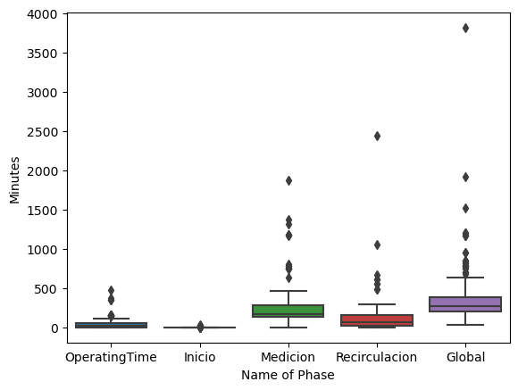
    


```python
sns.boxplot(filtered_df["Name_of_Phase"], filtered_df["Phase_Values_in_Minutes"])
plt.xlabel('Name of Phase')
plt.ylabel('Minutes')
plt.show()
```

    C:\Users\emers\Anaconda3\lib\site-packages\seaborn\_decorators.py:36: FutureWarning: Pass the following variables as keyword args: x, y. From version 0.12, the only valid positional argument will be `data`, and passing other arguments without an explicit keyword will result in an error or misinterpretation.
      warnings.warn(
    


    
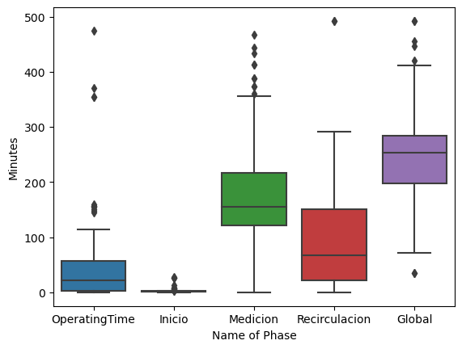
    


```python
sns.barplot(data1["Name_of_Phase"], data1["Phase_Values_in_Minutes"])
plt.xlabel('Name of Phase')
plt.ylabel('Minutes')
plt.show()
```

    C:\Users\emers\Anaconda3\lib\site-packages\seaborn\_decorators.py:36: FutureWarning: Pass the following variables as keyword args: x, y. From version 0.12, the only valid positional argument will be `data`, and passing other arguments without an explicit keyword will result in an error or misinterpretation.
      warnings.warn(
    


    
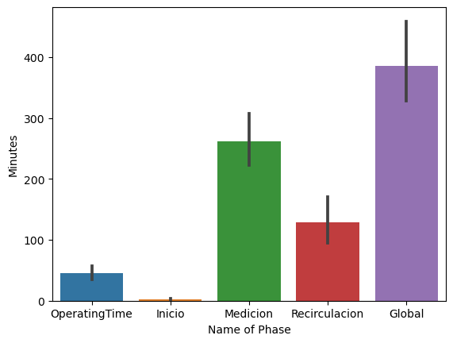
    


```python
sns.histplot(data1["Phase_Values_in_Minutes"])
plt.xlabel('Minutes')
plt.ylabel('Frequency')
plt.show()
```


    
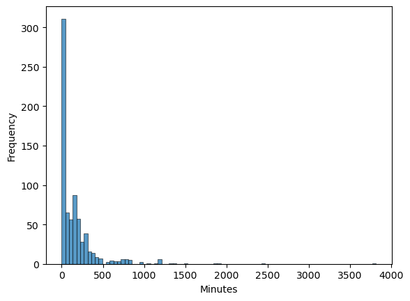
    


```python
data2 = pd.read_csv('data_cycle_time_to_analyst.csv')
data2
```


<div>
<style scoped>
    .dataframe tbody tr th:only-of-type {
        vertical-align: middle;
    }

    .dataframe tbody tr th {
        vertical-align: top;
    }

    .dataframe thead th {
        text-align: right;
    }
</style>
<table border="1" class="dataframe">
  <thead>
    <tr style="text-align: right;">
      <th></th>
      <th>Batch_ID</th>
      <th>Phase_Number_Name_Metric</th>
      <th>Day_Time</th>
      <th>Phase_Values_in_Seconds</th>
      <th>Day</th>
      <th>Hour</th>
      <th>Number_of_Phase</th>
      <th>Name_of_Phase</th>
      <th>Phase_Values_in_Minutes</th>
    </tr>
  </thead>
  <tbody>
    <tr>
      <th>0</th>
      <td>44168</td>
      <td>Phase_0_Duration_OperatingTime</td>
      <td>2023-02-11 10:19:25</td>
      <td>3560.0</td>
      <td>2023-02-11</td>
      <td>10</td>
      <td>0</td>
      <td>OperatingTime</td>
      <td>59.333333</td>
    </tr>
    <tr>
      <th>1</th>
      <td>44168</td>
      <td>Phase_0_Duration_OperatingTime</td>
      <td>2023-02-11 20:49:30</td>
      <td>300.0</td>
      <td>2023-02-11</td>
      <td>20</td>
      <td>0</td>
      <td>OperatingTime</td>
      <td>5.000000</td>
    </tr>
    <tr>
      <th>2</th>
      <td>44168</td>
      <td>Phase_0_Duration_OperatingTime</td>
      <td>2023-02-12 04:28:05</td>
      <td>190.0</td>
      <td>2023-02-12</td>
      <td>4</td>
      <td>0</td>
      <td>OperatingTime</td>
      <td>3.166667</td>
    </tr>
    <tr>
      <th>3</th>
      <td>44168</td>
      <td>Phase_0_Duration_OperatingTime</td>
      <td>2023-02-12 07:41:10</td>
      <td>140.0</td>
      <td>2023-02-12</td>
      <td>7</td>
      <td>0</td>
      <td>OperatingTime</td>
      <td>2.333333</td>
    </tr>
    <tr>
      <th>4</th>
      <td>44168</td>
      <td>Phase_0_Duration_OperatingTime</td>
      <td>2023-02-12 15:19:00</td>
      <td>640.0</td>
      <td>2023-02-12</td>
      <td>15</td>
      <td>0</td>
      <td>OperatingTime</td>
      <td>10.666667</td>
    </tr>
    <tr>
      <th>...</th>
      <td>...</td>
      <td>...</td>
      <td>...</td>
      <td>...</td>
      <td>...</td>
      <td>...</td>
      <td>...</td>
      <td>...</td>
      <td>...</td>
    </tr>
    <tr>
      <th>1881</th>
      <td>47268</td>
      <td>Phase_0_Duration_OperatingTime</td>
      <td>2023-03-31 11:34:00</td>
      <td>155.0</td>
      <td>2023-03-31</td>
      <td>11</td>
      <td>0</td>
      <td>OperatingTime</td>
      <td>2.583333</td>
    </tr>
    <tr>
      <th>1882</th>
      <td>47268</td>
      <td>Phase_1_Duration_Inicio</td>
      <td>2023-03-31 11:36:35</td>
      <td>115.0</td>
      <td>2023-03-31</td>
      <td>11</td>
      <td>1</td>
      <td>Inicio</td>
      <td>1.916667</td>
    </tr>
    <tr>
      <th>1883</th>
      <td>47268</td>
      <td>Phase_2_Duration_Medicion</td>
      <td>2023-03-31 11:38:30</td>
      <td>10120.0</td>
      <td>2023-03-31</td>
      <td>11</td>
      <td>2</td>
      <td>Medicion</td>
      <td>168.666667</td>
    </tr>
    <tr>
      <th>1884</th>
      <td>47268</td>
      <td>Phase_3_Duration_Recirculacion</td>
      <td>2023-03-31 14:27:10</td>
      <td>310.0</td>
      <td>2023-03-31</td>
      <td>14</td>
      <td>3</td>
      <td>Recirculacion</td>
      <td>5.166667</td>
    </tr>
    <tr>
      <th>1885</th>
      <td>47268</td>
      <td>Phase_0123_Duration_Global</td>
      <td>2023-03-31 14:32:20</td>
      <td>10545.0</td>
      <td>2023-03-31</td>
      <td>14</td>
      <td>123</td>
      <td>Global</td>
      <td>175.750000</td>
    </tr>
  </tbody>
</table>
<p>1886 rows × 9 columns</p>
</div>


```python
sns.lmplot(data = filtered_df, x= "Day_Right", y= "Phase_Values_in_Minutes", hue="Name_of_Phase")
plt.xlabel('Day')
plt.ylabel('Minutes')
plt.show()
```


    
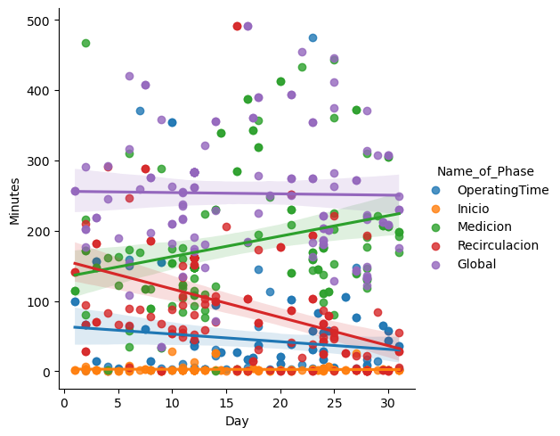
    


```python
sns.lmplot(data = filtered_df, x= "Hour", y= "Phase_Values_in_Minutes", hue="Name_of_Phase")
plt.xlabel('Hour')
plt.ylabel('Minutes')
plt.show()
```


    
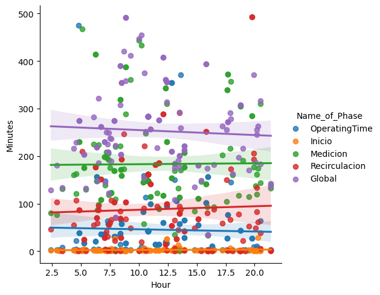
    


```python
batch_distribution_time = data1.groupby(["Batch_ID"])["Phase_Values_in_Minutes"].mean().reset_index()
batch_distribution_time 
```


<div>
<style scoped>
    .dataframe tbody tr th:only-of-type {
        vertical-align: middle;
    }

    .dataframe tbody tr th {
        vertical-align: top;
    }

    .dataframe thead th {
        text-align: right;
    }
</style>
<table border="1" class="dataframe">
  <thead>
    <tr style="text-align: right;">
      <th></th>
      <th>Batch_ID</th>
      <th>Phase_Values_in_Minutes</th>
    </tr>
  </thead>
  <tbody>
    <tr>
      <th>0</th>
      <td>0</td>
      <td>127.427778</td>
    </tr>
    <tr>
      <th>1</th>
      <td>1</td>
      <td>127.427778</td>
    </tr>
    <tr>
      <th>2</th>
      <td>2</td>
      <td>127.427778</td>
    </tr>
    <tr>
      <th>3</th>
      <td>3</td>
      <td>127.427778</td>
    </tr>
    <tr>
      <th>4</th>
      <td>4</td>
      <td>127.427778</td>
    </tr>
    <tr>
      <th>...</th>
      <td>...</td>
      <td>...</td>
    </tr>
    <tr>
      <th>142</th>
      <td>142</td>
      <td>131.766667</td>
    </tr>
    <tr>
      <th>143</th>
      <td>143</td>
      <td>100.133333</td>
    </tr>
    <tr>
      <th>144</th>
      <td>144</td>
      <td>98.975000</td>
    </tr>
    <tr>
      <th>145</th>
      <td>145</td>
      <td>98.975000</td>
    </tr>
    <tr>
      <th>146</th>
      <td>146</td>
      <td>70.816667</td>
    </tr>
  </tbody>
</table>
<p>147 rows × 2 columns</p>
</div>


```python
sns.scatterplot(batch_distribution_time["Batch_ID"], batch_distribution_time["Phase_Values_in_Minutes"])
plt.xlabel('Batch')
plt.ylabel('Minutes')
plt.show()
```

    C:\Users\emers\Anaconda3\lib\site-packages\seaborn\_decorators.py:36: FutureWarning: Pass the following variables as keyword args: x, y. From version 0.12, the only valid positional argument will be `data`, and passing other arguments without an explicit keyword will result in an error or misinterpretation.
      warnings.warn(
    


    
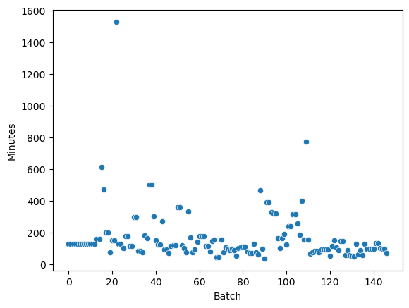
    


```python

```
